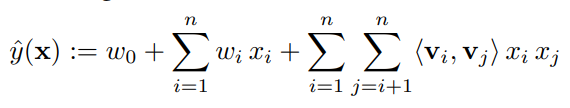
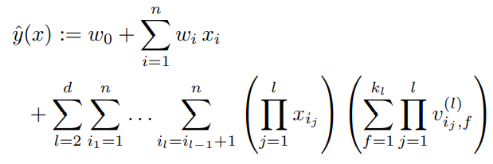

<!-- TOC -->

- [00 A Short Introduction to Learning to Rank](#00-a-short-introduction-to-learning-to-rank)
- [01 Deep Metric Learning: A Survey](#01-deep-metric-learning-a-survey)
- [02 Deep Learning for Click-Through Rate Estimation](#02-deep-learning-for-click-through-rate-estimation)
- [03 Factorization Machines](#03-factorization-machines)
- [04 Graph Attention Networks](#04-graph-attention-networks)
- [05 Prototypical Networks for Few-shot Learning](#05-prototypical-networks-for-few-shot-learning)

<!-- /TOC -->

## [00 A Short Introduction to Learning to Rank](A%20Short%20Introduction%20to%20Learning%20to%20Rank.pdf)
- Hang LI./2011/IEICE/352
- Ranking is nothing but to select a **permutation** $π_i$ ∈ $Π_i$ for the given query qi and the associated documents $D_i$ using the scores given by the ranking model f(qi, di).
- Relevance judgments are usually conducted at five levels, for example, *perfect, excellent, good, fair, and bad*.
- **Ordinal classification** (also known as ordinal regression)：The goal of learning is to construct a model which can assign a grade label y to a given feature vector x. The model mainly consists of a scoring function f(x). In ranking, one cares more about accurate ordering of objects, while in ordinal classification, one cares more about accurate ordered-categorization of objects. 
- In the **pointwise** approach, the ranking problem (ranking creation) is transformed to classification, regression, or ordinal classification. The group structure of ranking is ignored in this approach.
- In the **pairwise** approach, ranking is transformed into pairwise classification or pairwise regression. In the formercase, a classifier for classifying the ranking orders of document pairs is created and is employed in the ranking of documents. In the pairwise approach, the group structure of ranking is also ignored.
- The **listwise** approach addresses the ranking problem in a more straightforward way. Specifically, it takes ranking lists as instances in both learning and prediction. The group structure of ranking is maintained and ranking evaluation measures can be more directly incorporated into the loss functions in learning.
- 

## [01 Deep Metric Learning: A Survey](Deep%20Metric%20Learning%20A%20Survey.pdf)
- Mahmut KAYA, Hasan ¸Sakir B˙ILGE./2019/MDPI/180
- Metric learning is an approach based directly on a distance metric that aims to **establish similarity or dissimilarity between objects**. While metric learning aims to reduce the distance between similar objects, it also aims to increase the distance between dissimilar objects.
- 
- Deep metric learning consists of three main parts, which are **informative input samples**, **the structure of the network model**, and a **metric loss function**.  Informative samples are one of the most substantial elements that increase the success of deep metric learning.
- 
- e
- The Siamese network, as a metric learning approach, receives pair images, including positive and negative samples to train a network model. The distance between these pair images is calculated via a loss function.
- Triplet network inspired by Siamese network contains three objects, which are formed positive,negative and anchor samples. Triplet networks provide a higher discrimination power while using both in-class and inter-class relations.
- 
- 

## [02 Deep Learning for Click-Through Rate Estimation](Deep%20Learning%20for%20Click-Through%20Rate%20Estimation.pdf)
- Zhang W, Qin J, Guo W, et al./2021/arXiv/12
- From Shallow to Deep CTR Models: Logistic Regression(LR) -> POLY2 -> GBDT -> Factorization Machine(FM) -> FFM/GBFM/FwFM -> SNN/FNN/W&D/DeepCross/DeepFM.
- Feature Interaction: There are multiple operators developed for explicitly feature interaction learning, which can be mainly classified into three categories, **product operators** (PNN/NFM/Cross Network/CIN/KPNN), **convolutional operators** (CCPM/FGCNN/FiCNN) and **attention operators** (AFM/BiBiNET/SENET).
- 
- 
- User Behavior Modeling algorithms could be categorized into three classes, **attention based models** (DIN/DIEN/BST/DSIN), **memory network based models** (HPMN/UIC/MIMN) and **retrieval based models** (UBR4CTR/SIM/).
- 
- Automated Architecture Search which can be categorized into three classes: (1) automatic design of flexible and adaptable embedding dimensions for individual features(**Embedding Dimension Search**); (2) automatic selection or generation of effective feature interactions;(**Feature Interaction Search**) (3) automatic design of network architectures (**Whole Architecture Search**).

## [03 Factorization Machines](./Factorization%20Machines.pdf)
- Rendle S./2010/ICDM/2167
- SVM predictors are not successful in these tasks is that they cannot learn reliable parameters (‘hyperplanes’) in **complex kernel**(non-linear) spaces under very **sparse data**.
- the Factorization Machine (FM), that is a general predictor like SVMs but is also able to **estimate reliable parameters under very high sparsity**. FM uses a factorized parametrization instead of a dense parametrization like in SVMs and can be computed in **linear time** and that it depends only on a **linear number of parameters**.
- *The 2-way Model Equation:* 
- *The d-way Model Equation:* 
- FMs model all possible interactions between values in the feature vector x using **factorized interactions** instead of full parametrized ones. This has two main advantages: *1)* The interactions between values can be estimated even under high sparsity. Especially, it is possible to generalize to **unobserved interactions**. *2)* The number of parameters as well as the time for prediction and learning is **linear**. This makes direct optimization using SGD feasible and allows optimizing against a variety of loss functions.

## [04 Graph Attention Networks](./Graph%20Attention%20Networks.pdf)
- Veličković P, Cucurull G, Casanova A, et al./2018/ICLR/3363
- Graph Attention Networks (GATs), novel convolution-style neural networks that operate on graph-structured data, leveraging **masked self-attentional layers**. 
- **Advantage**: 1) does not require costly matrix operations; 2) parallelizable across all nodes in the graph; 3) allows for (implicitly) assigning different importances to different nodes within a neighborhood while dealing with different sized neighborhoods; 4) does not depend on knowing the entire graph structure.
- 
- The attention mechanism formulation 
- Concate multi-head attention 
- Average multi-head attention 

## [05 Prototypical Networks for Few-shot Learning](./Prototypical%20Networks%20for%20Few-shot%20Learning.pdf)
- Snell J, Swersky K, Zemel R./NIPS/2017/4230.
- Prototypical Networks learn a **metric space** in which classification can be performed by **computing distances(cosin similarity)** to prototype representations of each class.
- 
- 
