<!-- TOC -->

- [00 Generative Adversarial Nets](#00-generative-adversarial-nets)
- [01 Self-supervised Visual Feature Learning with Deep Neural Networks: A Survey](#01-self-supervised-visual-feature-learning-with-deep-neural-networks-a-survey)
- [02 An Image is Worth 16x16 Words: Transformers for Image Recognition at Scale](#02-an-image-is-worth-16x16-words-transformers-for-image-recognition-at-scale)
- [03 Swin Transformer Hierarchical Vision Transformer using Shifted Windows](#03-swin-transformer-hierarchical-vision-transformer-using-shifted-windows)
- [04 Learning Transferable Visual Models From Natural Language Supervision](#04-learning-transferable-visual-models-from-natural-language-supervision)
- [05 Masked Autoencoders Are Scalable Vision Learners](#05-masked-autoencoders-are-scalable-vision-learners)
- [06 Momentum Contrast for Unsupervised Visual Representation Learning](#06-momentum-contrast-for-unsupervised-visual-representation-learning)
- [07 A Simple Framework for Contrastive Learning of Visual Representations](#07-a-simple-framework-for-contrastive-learning-of-visual-representations)
- [08 Dynamic Convolution: Attention over Convolution Kernels](#08-dynamic-convolution-attention-over-convolution-kernels)
- [09 Squeeze-and-Excitation Networks](#09-squeeze-and-excitation-networks)
- [10 Deformable Convolutional Networks](#10-deformable-convolutional-networks)
- [11 Focal Loss for Dense Object Detection](#11-focal-loss-for-dense-object-detection)
- [12 BEIT: BERT Pre-Training of Image Transformers](#12-beit-bert-pre-training-of-image-transformers)
- [13 Context Autoencoder for Self-Supervised Representation Learning](#13-context-autoencoder-for-self-supervised-representation-learning)
- [14 Selective Kernel Networks](#14-selective-kernel-networks)
- [15 Deep High-Resolution Representation Learning for Visual Recognition](#15-deep-high-resolution-representation-learning-for-visual-recognition)
- [16 Batch Normalization: Accelerating Deep Network Training by Reducing Internal Covariate Shift](#16-batch-normalization-accelerating-deep-network-training-by-reducing-internal-covariate-shift)
- [17 Interleaved Group Convolutions for Deep Neural Networks](#17-interleaved-group-convolutions-for-deep-neural-networks)

<!-- /TOC -->

## [00 Generative Adversarial Nets](./Generative%20Adversarial%20Nets.pdf)
- Goodfellow I, Pouget-Abadie J, Mirza M, et al./NIPS/2014/44268
- We propose a new framework for estimating generative models via an **adversarial** process, in which we simultaneously train two models: a **generative model G** that captures the data distribution, and a **discriminative model D** that estimates the probability that a sample came from the training data rather than G. The training procedure for G is to **maximize the probability of D making a mistake**.
- We train D to **maximize** the probability of assigning the correct label to both training examples and samples from G. We simultaneously train G to **minimize** log(1 − D(G(z))). In other words, D and G play the following **two-player minimax game** with value function V (G, D): 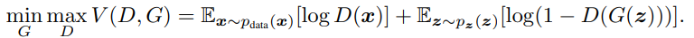
- Optimizing D to completion in the inner loop of training is computationally prohibitive, and on finite datasets would result in overfitting. Instead, we alternate between k steps of optimizing D and one step of optimizing G. This results in D being maintained near its optimal solution, so long as G changes slowly enough. 
- 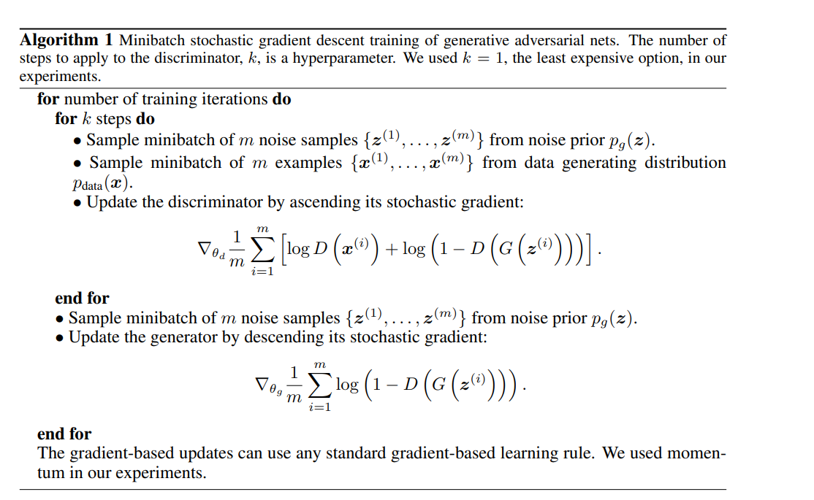
- The hyperparameter *k* is important for training D model & G model. If the D model is weak, the G model will generate poor result and get the bad estimating of p_x. If the D model is strong, the update of G model will be very slow and we can't train a good G model. In a word, it's important to set a suitable value of *k* to **keep G model & D model training synchronously**.
- 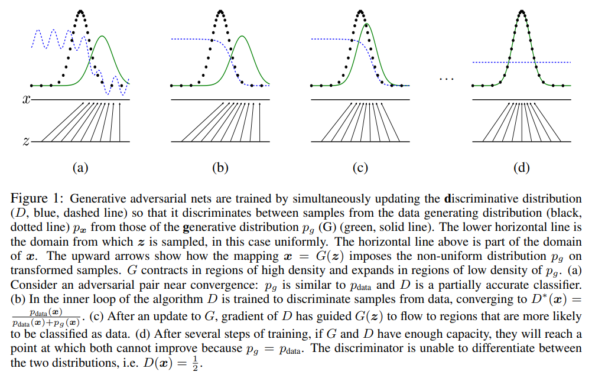
- In practice, equation 1 may not provide sufficient gradient for G to learn well. Early in learning, when G is poor, D can reject samples with high confidence because they are clearly different from the training data. In this case, log(1 − D(G(z))) saturates. Rather than training G to minimize log(1 − D(G(z))) we can train G to **maximize** log D(G(z)). This objective function results in the same fixed point of the dynamics of G and D but provides much stronger gradients early in learning. (**New problem**: D(G(z)) might close to zero and log D(G(z)) close to infinit)

 
 ## [01 Self-supervised Visual Feature Learning with Deep Neural Networks: A Survey](./Self-supervised%20Visual%20Feature%20Learning%20with%20Deep%20Neural%20Networks%20A%20Survey.pdf)
 - Jing L, Tian Y./2019/Pattern Analysis and Machine Intelligence/752.
 - 
 - The pre-trained models and fine-tuned for other tasks for two main reasons: (1) the parameters learned from large-scale diverse datasets provide a good starting point, therefore, networks training on other tasks can **converge faster**, (2) the network trained on large-scale datasets already learned the hierarchy features which can help to **reduce over-fitting problem** during the training of other tasks, especially when datasets of other tasks are **small or training labels are scarce**.
- The pretext tasks share two common properties: (1) visual features of images or videos need to **be captured by ConvNets** to solve the pretext tasks, (2) pseudo labels for the pretext task can be **automatically generated** based on the attributes of images or videos. After the training on the pretext task is finished, **ConvNet models** that can capture visual **features** for images or videos are obtained.
- 
- **Some Important Definition:**
    1. Supervised Learning: Supervised learning indicates learning methods using data with **fine-grained human-annotated labels** to train networks.
    2. Semi-supervised Learning: Semi-supervised learning refers to learning methods using a **small amount of labeled data** in conjunction with a **large amount of unlabeled data**.
    3. Weakly-supervised Learning: Weakly supervised learning refers to learning methods to learn with **coarse-grained labels or inaccurate labels**. The cost of obtaining weak supervision labels is generally **much cheaper** than fine-grained labels for supervised methods.
    4. **Unsupervised Learning**: Unsupervised learning refers to learning methods without using any human-annotated labels.(K-means, KNN)
    5. **Self-supervised Learning**: Self-supervised learning is a **subset of** unsupervised learning methods. Self-supervised learning refers to learning methods in which ConvNets are explicitly trained with **automatically generated labels**(Pseudo Lable).
- 
- Generation-based Image Feature Learning:
    1. Image Generation with GAN: The discriminator is required to capture **the semantic features** from images to accomplish the discriminate task(**real data distribution or generated data distribution**). The **parameters of the discriminator** can server as the pre-trained model for other computer vision tasks. 
    2. Image Generation with Inpainting:
    3. Image Generation with Colorization:
- Context-Based Image Feature Learning:
    1. Learning with Context Similarity:
    2. Learning with Spatial Context Structure:
- Free Semantic Label-based Image Feature Learning:
    1. Learning with Labels Generated by Game Engines: One problem needed to solve is how to bridge the domain gap between synthetic data and real-world data.
    2. Learning with Labels Generated by Hard-code programs: This type of methods generally has two steps: (1) label generation by employing hard-code programs on images or videos to obtain labels, (2) train ConvNets with the generated labels. Compared to other self-supervised learning methods, the supervision signal in these pretext tasks is **semantic labels(But very noisy)** which can directly drive the ConvNet to learn semantic features.

## [02 An Image is Worth 16x16 Words: Transformers for Image Recognition at Scale](./An%20Image%20is%20Worth%2016x16%20Words%20Transformers%20for%20Image%20Recognition%20at%20Scale.pdf)
- Dosovitskiy A, Beyer L, Kolesnikov A, et al./2021/ICLR/4852
- We show that this reliance on CNNs is not necessary and a **pure** transformer applied **directly** to sequences of image patches can perform **very** well on image classification tasks. Besides using patch to reduce the input number of Transformer, As an alternative to raw image patches, the input sequence can be formed from **feature maps** of a CNN.
- Inspired by the Transformer scaling successes in NLP, we experiment with applying a standard Transformer directly to images, **with the fewest possible modifications**. Image patches are treated the same way as tokens (words) in an NLP application.
- 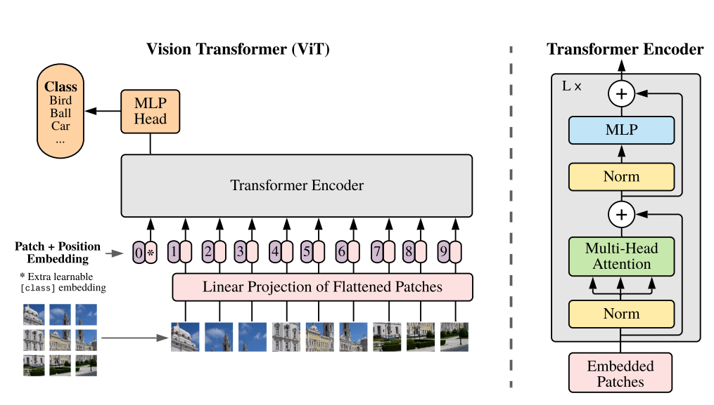
- 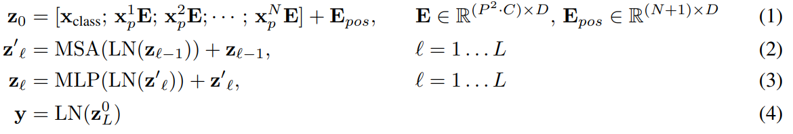
- Position embeddings are added to the patch embeddings to retain positional information. We use standard learnable 1D position embeddings, since we have not observed significant performance gains from using more advanced 2D-aware position embeddings.

## [03 Swin Transformer Hierarchical Vision Transformer using Shifted Windows](./Swin%20Transformer%20Hierarchical%20Vision%20Transformer%20using%20Shifted%20Windows.pdf)
- Liu Z, Lin Y, Cao Y, et al./2021/ICCV/1752
- Challenges in adapting Transformer from language to vision arise from differences between the two domains, such as **large variations in the scale** of visual entities and the **high resolution of pixels** in images compared to words in text. In this paper, we seek to expand the applicability of Transformer such that it can serve as a **general-purpose backbone** for computer vision, as it does for NLP and as CNNs do in vision.
- 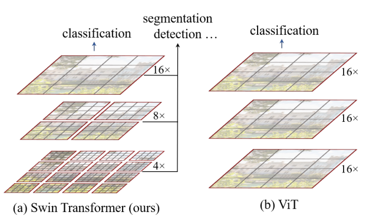
- A key design element of Swin Transformer is its shift of the window partition between consecutive self-attention layers.  The shifted windows bridge the windows of the preceding layer, **providing connections among them that significantly enhance modeling power**. This strategy is also efficient in regards to real-world latency: all query patches within a window share the same key set, which **facilitates memory access in hardware**.
- 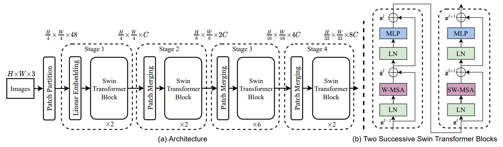
- 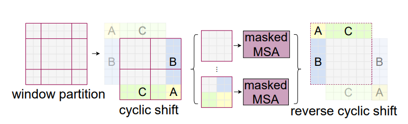

## [04 Learning Transferable Visual Models From Natural Language Supervision](./Learning%20Transferable%20Visual%20Models%20From%20Natural%20Language%20Supervision.pdf)
- Radford A, Kim J W, Hallacy C, et al./2021/PMLR/1279
- State-of-the-art computer vision systems are trained to predict a **fixed set of predetermined object categories**. This restricted form of supervision limits their **generality and usability** since **additional labeled data is needed to specify any other visual concept**. Learning directly from **raw text about images** (Image, Text) pair is a promising alternative which leverages a much broader source of supervision.
- Summary of **CLIP**. While standard image models jointly train an **image feature extractor** and a **linear classifier** to predict some label, CLIP jointly trains an **image encoder** and a **text encoder** to predict the correct pairings of a batch of (image, text) training examples. At test time the learned text encoder synthesizes a zero-shot linear classifier by embedding the names or descriptions of the target dataset’s classes.
- 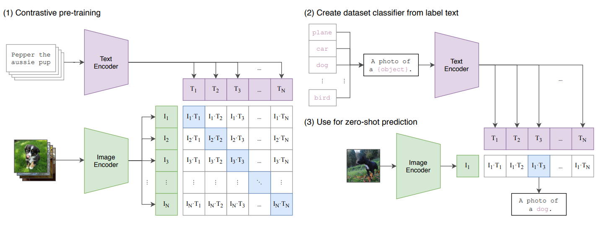
- 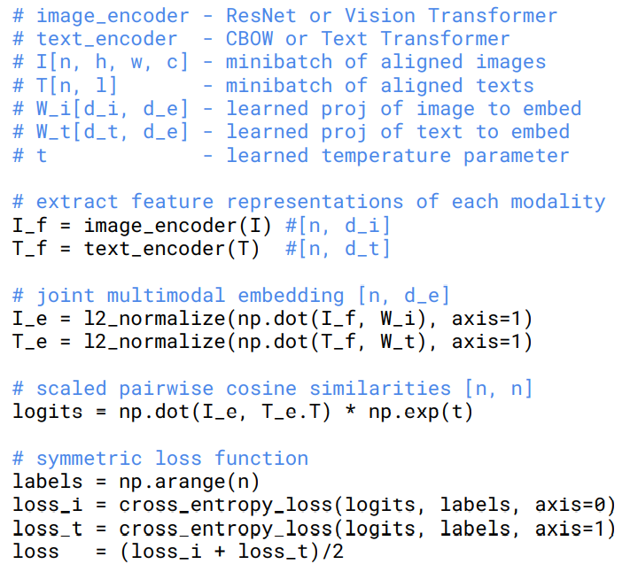
- 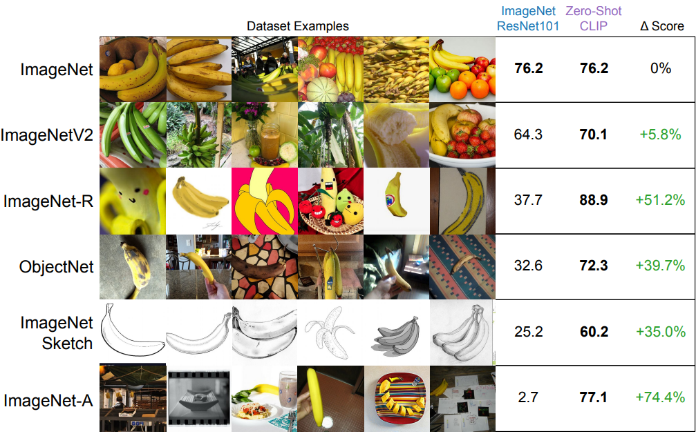
- For the prediction task of a new label class, just add this new label to the label set and generate the corresponding text features through the text encoder. An image with a new category can generate the corresponding image feature through the trained image encoder, and then calculate the cosine similarity of all text features of this image feature, and then the category of the image can be output, although the image of this type has never appeared in the training set.

## [05 Masked Autoencoders Are Scalable Vision Learners](./Masked%20Autoencoders%20Are%20Scalable%20Vision%20Learners.pdf)
- He K, Chen X, Xie S, et al./2022/CVPR/261
- MAE approach is simple: **we mask random patches of the input image and reconstruct the missing pixels**. It is based on two core designs. First, we develop an **asymmetric** encoder-decoder architecture, with an encoder that operates only on the visible subset of patches (without mask tokens), along with a **lightweight decoder** that reconstructs the original image from the latent representation and mask tokens. Second, we find that masking a high proportion of the input image, yields a nontrivial and meaningful self-supervisory task.
- *what makes masked autoencoding different between vision and language?* : **1)** architectures were different; **2)** Information density is different between language and vision; **3)** The autoencoder’s decoder, which maps the latent representation back to the input, plays a different role between reconstructing text and images.
- 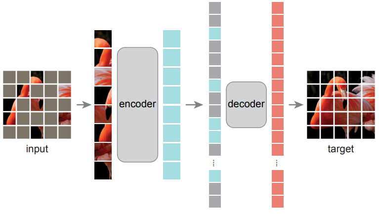
- 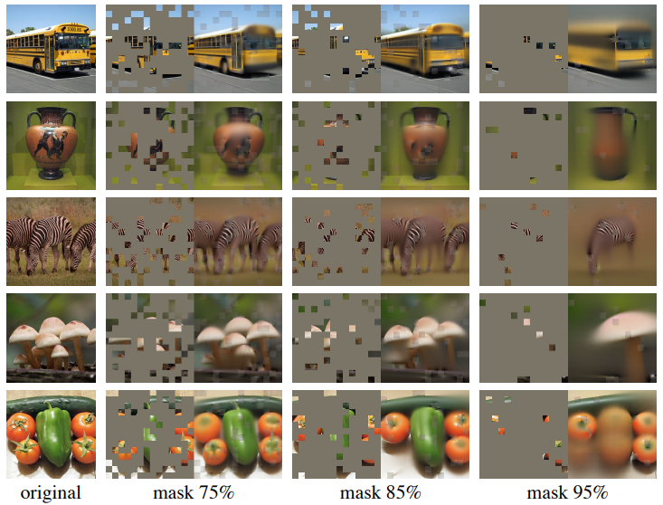
- 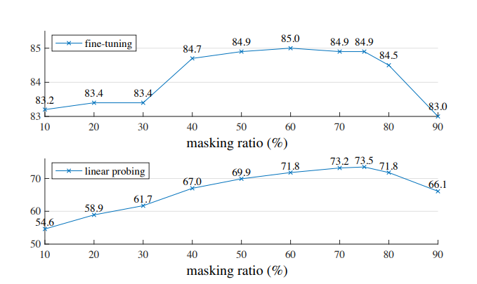

## [06 Momentum Contrast for Unsupervised Visual Representation Learning](./Momentum%20Contrast%20for%20Unsupervised%20Visual%20Representation%20Learning.pdf)
- He K, Fan H, Wu Y, et al./2020/CVPR/3686
- **Contrastive Learning (Anchor & Positive & Negetive)** can be thought of as building **dynamic dictionaries**. The “keys -> **anchor**” (tokens) in the dictionary are sampled from data (e.g., images or patches) and are represented by an encoder network. Unsupervised learning trains encoders to perform dictionary **look-up**: an encoded “query” should be similar to its matching key (**positive**) and dissimilar (**negetive**) to others. The dictionary is dynamic in the sense that the **keys are randomly sampled**, and that the **key encoder evolves during training**.
- Momentum Contrast (MoCo) trains a **visual representation encoder** by matching an encoded query *q* to a dictionary of encoded keys using a contrastive loss. The keys are encoded by a slowly progressing encoder, driven by a **momentum update** with the query encoder. This method enables a **large** and **consistent** dictionary for learning **visual representations**.
- 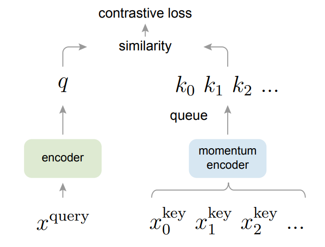 , 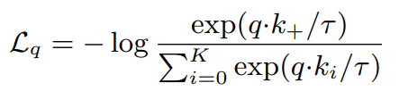
- **Dictionary as a queue** : a queue decouples the dictionary size from the mini-batch size and dictionary size can be much larger than a typical mini-batch size. removing the oldest mini-batch can be beneficial, because its encoded keys are the most outdated and thus the least consistent with the newest ones.
- **Momentum update** : using queue makes the model intractable to update the key encoder by back-propagation.  copy the key encoder fk from the query encoder fq yields poor results. We hypothesize that such failure is caused by the rapidly changing encoder that reduces the key representations’ consistency. We propose a momentum update to address this issue. though the keys in the queue are encoded by different encoders (in different mini-batches), the difference among these encoders can be made small. **m = 0.999**
- 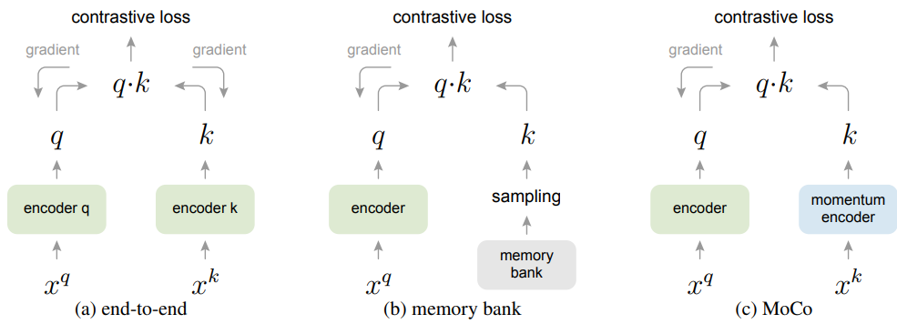
- 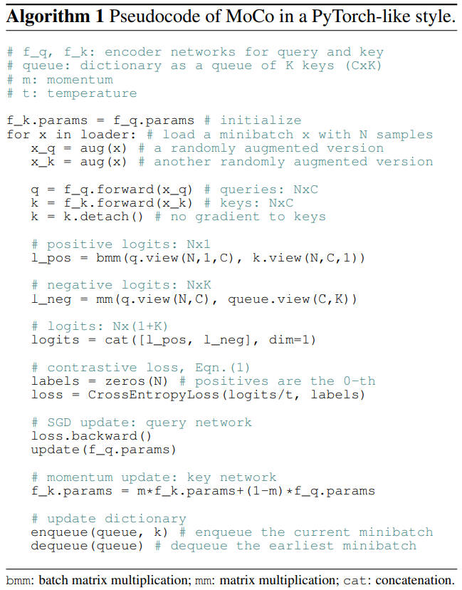
- *Moco aim to provide tons of negetive sample for contrastive learning by constructing dynamic dictionaries to get excellent visual representation. *
- *A main goal of unsupervised learning is to learn features that are transferrable. ImageNet supervised pre-training is most influential when serving as the initialization for fine-tuning in downstream tasks.*

## [07 A Simple Framework for Contrastive Learning of Visual Representations](./A%20Simple%20Framework%20for%20Contrastive%20Learning%20of%20Visual%20Representations.pdf)
- Chen T, Kornblith S, Norouzi M, et al. /2020/ICML/5373
- SimCLR is a **sim**ple framework for **C**ontrastive **L**earning of visual **R**epresentations, which almost all individual components of our framework have **appeared** in previous work, although the specific instantiations may be different. The superiority of our framework relative to previous work is **not explained by any single design choice, but by their composition**.  
- This work show that:
    - (1) **composition of data augmentations** (In addition, unsupervised contrastive learning benefits from **stronger** data augmentation than supervised learning.) plays a critical role in defining effective predictive tasks. This work conjecture that one serious issue when using only random cropping as data augmentation is that most patches from an image **share a similar color distribution**. Therefore, it is critical to **compose cropping with color distortion** in order to learn generalizable features.
    - (2) introducing a learnable **nonlinear transformation** (projection) between the representation and the contrastive loss substantially improves the quality of the learned representations, and 
    - (3) contrastive learning benefits from **larger batch sizes and more training steps** (provide more negative examples) compared to supervised learning and Like supervised learning, contrastive learning benefits from deeper and wider networks.
    - (4) Representation learning with contrastive cross entropy loss benefits from **normalized embeddings** and an **appropriately adjusted temperature parameter**.
- 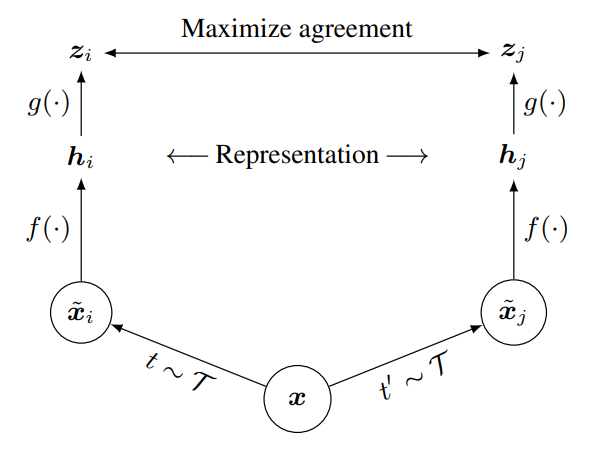 , 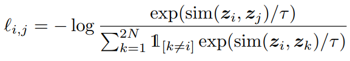
- 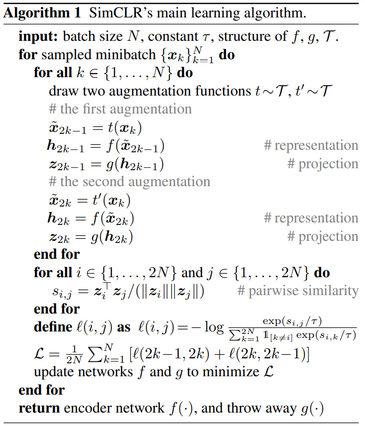
- [Big Self-Supervised Models are Strong Semi-Supervised Learners](./Big%20Self-Supervised%20Models%20are%20Strong%20Semi-Supervised%20Learners.pdf) propose **SimCLRv2**, which improves upon SimCLR in three major ways:
    - (1) To fully leverage the power of general pretraining, SimCLRv2 explore **larger ResNet models** (Encoder). Training 152-layer ResNet with 3× wider channels and selective kernels. Obtaining a 29% relative improvement in top-1 accuracy when fine-tuned on 1% of labeled examples.
    - (2) SimCLRv2 also increase the capacity of the non-linear network projection head (Projector)  by making it deeper from **2-layer to 3 layer**. Instead of throwing away g(·) entirely after pretraining as in SimCLR, SimCLRv2 fine-tuning from the 1st layer of projection head. Obtaining a 14% relative improvement in top-1 accuracy when fine-tuned on 1% of labeled examples.
    - (3) Motivated by *MOCO*, SimCLRv2 incorporate the **memory mechanism** from MoCo, which designates a memory network (with a **moving average of weights for stabilization**) whose output will be buffered as negative examples. 

## [08 Dynamic Convolution: Attention over Convolution Kernels](./Dynamic%20Convolution%20Attention%20over%20Convolution%20Kernels.pdf)
- Chen Y, Dai X, Liu M, et al./2020/CVPR/211
- Light-weight CNNs suffer performance degradation as their **low computational budgets** constrain both the **depth** (number of convolution layers) and the **width** (number of channels) of CNNs, resulting in **limited representation capability**. This paper is aim to building a **light-weight and efficient neural networks**. Provide better trade-off between network **performance** and **computational** burden.
- Dynamic Convolution is a new design that **increases model complexity without increasing the network depth or width**. Instead of using a single convolution kernel per layer, dynamic convolution aggregates **multiple parallel convolution kernels** dynamically based upon their **attentions**, which are input dependent. Assembling multiple kernels is not only **computationally efficient** due to the small kernel size, but also has more representation power since these kernels are aggregated in a **non-linear way** via attention.
- 
- 
- 

## [09 Squeeze-and-Excitation Networks](./Squeeze-and-Excitation%20Networks.pdf)
- Hu J, Shen L, Sun G./2018/CVPR/13737
- The goal is to **improve the representational power** of a network by explicitly modelling the interdependencies between the **channels of its convolutional features**. To achieve this, **feature recalibration** is proposed, through which it can learn to use global information to selectively **emphasise** informative features and **suppress** less useful ones.
- 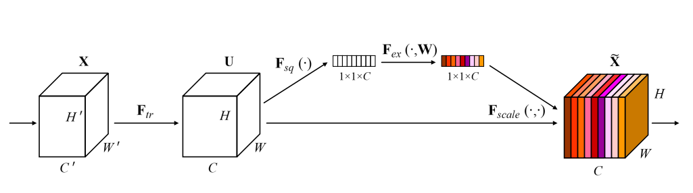
- The features U are first passed through a *squeeze operation*, which aggregates the feature maps across spatial dimensions H × W to produce a **channel descriptor** (1x1xC). This descriptor embeds the global distribution of channel-wise feature responses, enabling information from the **global receptive field** of the network to be leveraged by its lower layers.
- This is followed by an *excitation operation*, in which **sample-specific activations**, learned for each channel by a **self-gating mechanism** based on channel dependence, govern the excitation of each channel. It's aim to fully **capture channel-wise dependencies (The key point of the work)**.
- 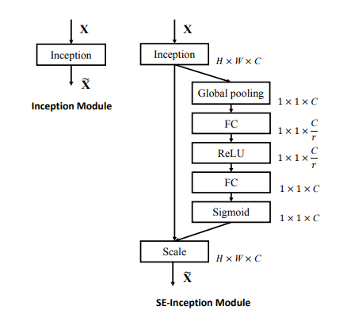 , 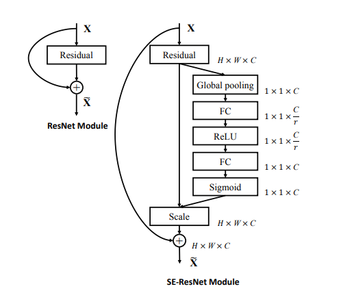

## [10 Deformable Convolutional Networks](./Deformable%20Convolutional%20Networks.pdf)
- Dai J, Qi H, Xiong Y, et al./2017/ICCV/3011
- Donvolutional neural networks (CNNs) are inherently limited to model geometric transformations due to the **fixed geometric structures** (Conv & Pooling) in their building modules.
- 
- 
- 
- 

## [11 Focal Loss for Dense Object Detection](./Focal%20Loss%20for%20Dense%20Object%20Detection.pdf)
- Lin T Y, Goyal P, Girshick R, et al. /2017/ICCV/14539
- In object detection task, **one-stage** (SSD\YOLO Variants) detectors that are applied over a **regular**, dense **sampling** of possible object locations have the potential to be **faster and simpler**, but have trailed the accuracy of **two-stage** (R-CNN Variants) detectors thus far. The main reason of it is that the **extreme foreground-background class imbalance** encountered during training of dense detectors.
- **This imbalance causes two problems**: (1) training is inefficient as most locations are easy negatives that contribute **no useful learning signal**; (2) en masse, the easy negatives can **overwhelm training** and lead to degenerate models. Focal loss **naturally** handles the class imbalance faced by a one-stage detector and allows us to efficiently train on all examples **without sampling** and **without easy negatives overwhelming** the loss and computed gradients.
- In contrast, rather than down-weighting *outliers* (hard examples), our focal loss is designed to address class imbalance by down-weighting *inliers* (easy examples) such that their contribution to the total loss is small even if their number is large. In other words, the focal loss performs the opposite role of a robust loss: **it focuses training on a sparse set of hard examples**.
- 
-  , 
-  , 
- 

## [12 BEIT: BERT Pre-Training of Image Transformers](./BEIT%20%20BERT%20Pre-Training%20of%20Image%20Transformers.pdf)
- Bao H, Dong L, Wei F./2021/arXiv/290
- **BEIT** stands for **B**idirectional **E**ncoder representation from **I**mage **T**ransformers. It's a *Masked Image Modeling* like BERT in *Mask Language Modeling*. BEIT first **“tokenize”** the original image into **visual tokens** just like **word token** and predict the visual tokens in the pretext task rather than reconstruction the mask image patch like MAE.
- There are two modules during visual token learning, namely, **tokenizer** and **decoder**. The tokenizer **q_φ(z|x)** maps image pixels x into discrete tokens z according to a visual codebook (i.e.,vocabulary). The decoder **p_ψ(x|z)** learns to reconstruct the input image x based on the visual tokens z. detail in [Zero-Shot Text-to-Image Generation](./Zero-Shot%20Text-to-Image%20Generation.pdf)
- 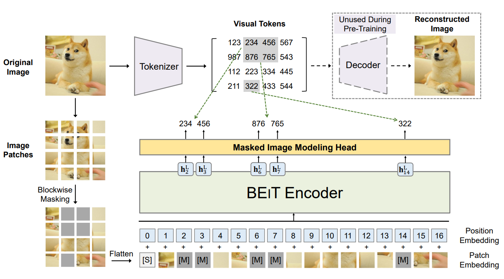
- 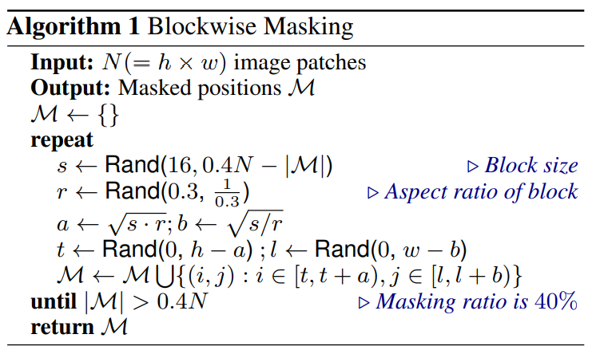

## [13 Context Autoencoder for Self-Supervised Representation Learning](./Context%20Autoencoder%20for%20Self-Supervised%20Representation%20Learning.pdf)
- Chen X, Ding M, Wang X, et al./2022/arXiv/24
- The goal is to pretrain an encoder by solving the pretext task: *estimate the masked patches from the visible patches in an image*. In comparison to previous MIM methods that *couple the encoding and pretext task completion roles*, our approach benefits the **separation** of *the representation learning encoding role and the pretext task completion role*, improving the representation learning capacity and accordingly helping more on downstream tasks. 
- 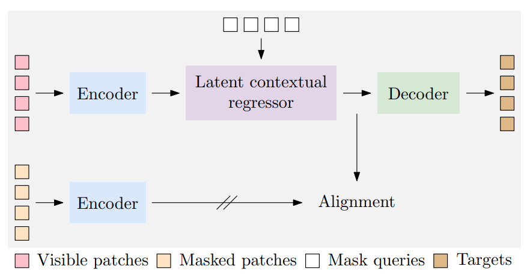
- 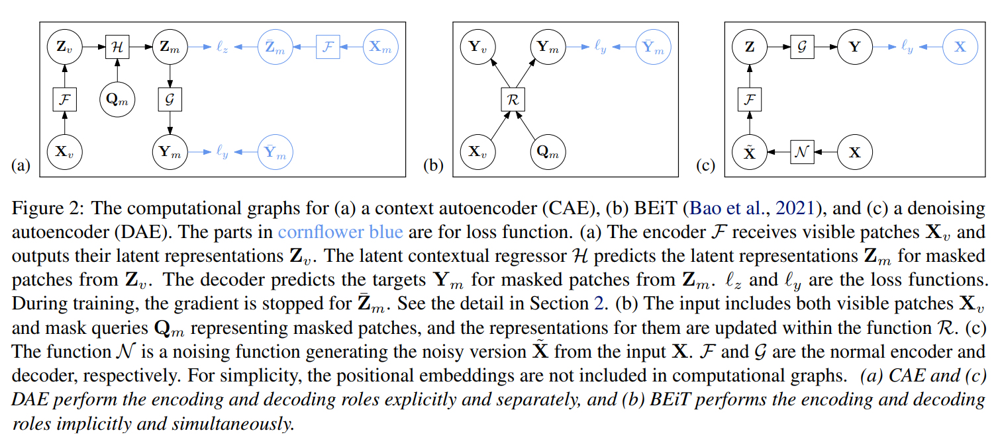

## [14 Selective Kernel Networks](./Selective%20Kernel%20Networks.pdf)
- Li X, Wang W, Hu X, et al./2019/CVPR/1024
- In **standard** Convolutional Neural Networks (CNNs), the **receptive fields** of artificial neurons in each layer are designed to share the same size. We propose a **dynamic selection mechanism** in CNNs that allows each neuron to adaptively adjust its receptive field size based on **multiple scales** of input information. 
- In SK units, there are three important hyper-parameters which determine the final settings of SK convolutions: the number of **paths M** that determines the number of choices of different kernels to be aggregated, the **group number G** that controls the cardinality of each path, and the **reduction ratio r** that controls the number of parameters in the fuse operator
- 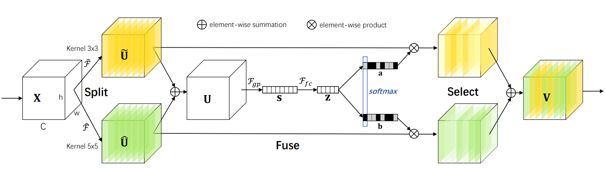
- 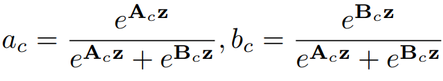

## [15 Deep High-Resolution Representation Learning for Visual Recognition](./Deep%20High-Resolution%20Representation%20Learning%20for%20Visual%20Recognition.pdf)
- Wang J, Sun K, Cheng T, et al./2020/TEEE on Trans PATTERN ANALYSIS AND MACHINE INTELLIGENCE/1233
- **HRNet** maintains **high-resolution representations** through the whole process. There are two key characteristics: (i) *Connect the high-to-low resolution convolution streams in parallel* and (ii) repeatedly *exchange the information across resolutions*. The benefit is that the resulting representation is **semantically richer and spatially more precise**. 
- Reasons: (i. **Connection Aspect**) HRNet connects high-to-low resolution convolution streams in **parallel** rather than in **series**. Thus, our approach is able to maintain the high resolution *instead of recovering high resolution* from low resolution, and accordingly the learned representation is potentially spatially more precise.  (ii. **Fusion Aspect**) Most existing fusion schemes aggregate high-resolution low-level and high-level representations obtained by upsampling low-resolution representations. Instead, we repeat multi-resolution fusions to boost the high-resolution representations with the help of the low-resolution representations, and vice versa.
- 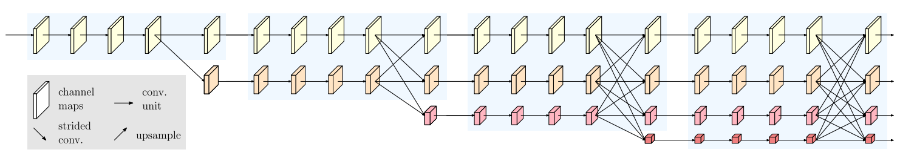
- 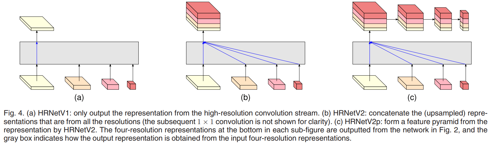
- 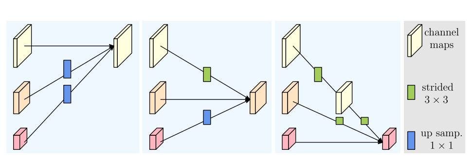

## [16 Batch Normalization: Accelerating Deep Network Training by Reducing Internal Covariate Shift](./Batch%20Normalization%20Accelerating%20Deep%20Network%20Training%20by%20Reducing%20Internal%20Covariate%20Shift.pdf)
- Ioffe S, Szegedy C./ICML/2015/39226
- Training Deep Neural Networks is complicated by the fact that **the distribution of each layer’s inputs changes during training**, as **the parameters of the previous layers change**. This **slows down** the training by requiring lower learning rates and careful parameter initialization, and makes it no toriously hard to train models with saturating nonlinearities. This phenomenon called **internal covariate shift**.
- Batch Normalization allows us to use much **higher learning rates** and be **less careful about initialization**. It also acts as a **regularizer**, in some cases eliminating the need for Dropout. 
- 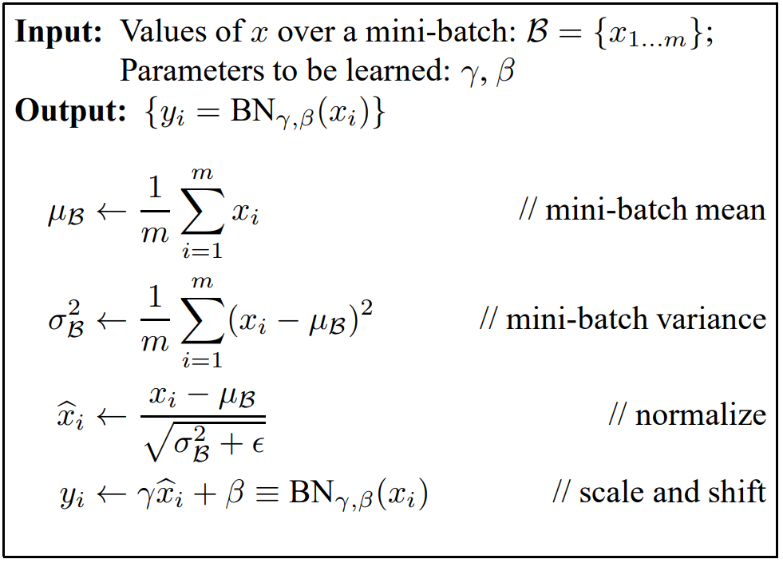
- 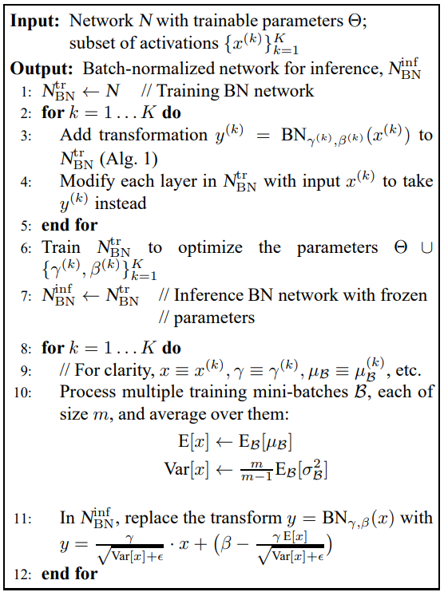

## [17 Interleaved Group Convolutions for Deep Neural Networks](./Interleaved%20Group%20Convolutions%20for%20Deep%20Neural%20Networks.pdf)
- Ting Z, Guo-Jun Q, Bin X, et al./2017/ICCV/111
- One representative advantage: **Wider** than a regular convolution with **the number of parameters and the computation complexity preserved**. Various design dimensions have been considered, ranging from **small kernels**, **identity mappings** or **general multi-branch structures** for easing the training of very deep networks, and multi-branch structures for increasing the width. Our interest is **to reduce the redundancy of convolutional kernels**. The redundancy comes from two extents: **the spatial extent**(small kernels etc.) and **the channel extent** (group convolutions, channel-wise convolutions , separable filter etc.). This work belongs to the kernel design in the channel extent.
- IGCV block contains two group convolutions: primary group convolution and secondary group convolution. Primary group convolutions to handle **spatial correlation**; Secondary group convolution to **blend the channels across partitions** outputted by primary group convolution and simply adopt 1 × 1 convolution kernels.
- 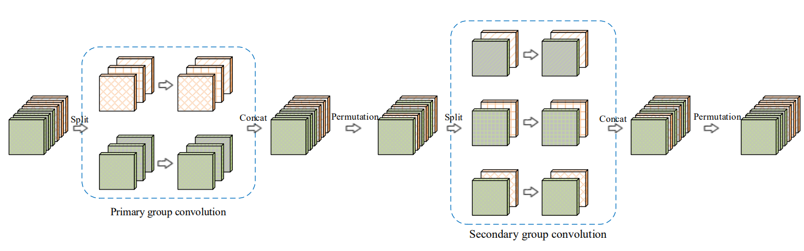
