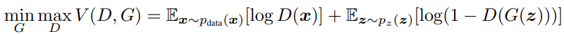
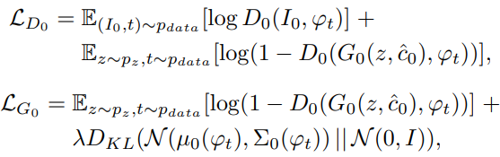
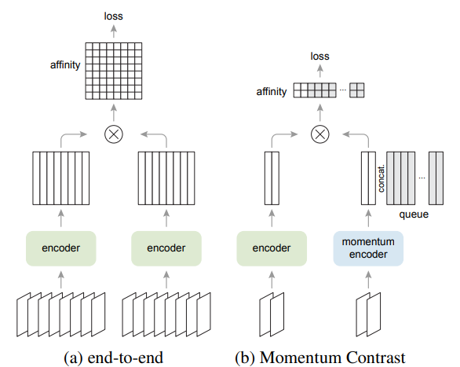

<!-- TOC -->

- [I. Generative Adversarial Nets Series](#i-generative-adversarial-nets-series)
  - [00 Generative Adversarial Nets](#00-generative-adversarial-nets)
  - [01 Conditional Generative Adversarial Nets](#01-conditional-generative-adversarial-nets)
  - [02 Unsupervised Representation Learning with Deep Convolutional Generative Adversarial Networks](#02-unsupervised-representation-learning-with-deep-convolutional-generative-adversarial-networks)
  - [03 Image-to-Image Translation with Conditional Adversarial Networks](#03-image-to-image-translation-with-conditional-adversarial-networks)
  - [04 Unpaired Image-to-Image Translation using Cycle-Consistent Adversarial Networks](#04-unpaired-image-to-image-translation-using-cycle-consistent-adversarial-networks)
  - [05 StackGAN: Text to Photo-realistic Image Synthesis with Stacked Generative Adversarial Networks](#05-stackgan-text-to-photo-realistic-image-synthesis-with-stacked-generative-adversarial-networks)
  - [06 Progressive Growing of GANs for Improved Quality, Stability, and Variation](#06-progressive-growing-of-gans-for-improved-quality-stability-and-variation)
  - [07 Large Scale GAN Training for High Fidelity Natural Image Synthesis](#07-large-scale-gan-training-for-high-fidelity-natural-image-synthesis)
  - [08 A Style-Based Generator Architecture for Generative Adversarial Networks](#08-a-style-based-generator-architecture-for-generative-adversarial-networks)
- [II. Contrastive Learning](#ii-contrastive-learning)
  - [00 Unsupervised Feature Learning via Non-Parametric Instance Discrimination](#00-unsupervised-feature-learning-via-non-parametric-instance-discrimination)
  - [01 Unsupervised Embedding Learning via Invariant and Spreading Instance Feature](#01-unsupervised-embedding-learning-via-invariant-and-spreading-instance-feature)
  - [02 Representation Learning with Contrastive Predictive Coding](#02-representation-learning-with-contrastive-predictive-coding)
  - [03 Contrastive Multiview Coding](#03-contrastive-multiview-coding)
  - [04 Momentum Contrast for Unsupervised Visual Representation Learning](#04-momentum-contrast-for-unsupervised-visual-representation-learning)
  - [05 Improved Baselines with Momentum Contrastive Learning](#05-improved-baselines-with-momentum-contrastive-learning)
  - [06 A Simple Framework for Contrastive Learning of Visual Representations](#06-a-simple-framework-for-contrastive-learning-of-visual-representations)
  - [07 Big Self-Supervised Models are Strong Semi-Supervised Learners](#07-big-self-supervised-models-are-strong-semi-supervised-learners)
  - [08 Unsupervised Learning of Visual Features by Contrasting Cluster Assignments](#08-unsupervised-learning-of-visual-features-by-contrasting-cluster-assignments)
  - [09 Bootstrap Your Own Latent A New Approach to Self-Supervised Learning](#09-bootstrap-your-own-latent-a-new-approach-to-self-supervised-learning)
  - [10 Exploring Simple Siamese Representation Learning](#10-exploring-simple-siamese-representation-learning)
  - [11 Emerging Properties in Self-Supervised Vision Transformers](#11-emerging-properties-in-self-supervised-vision-transformers)
- [III. Others](#iii-others)
  - [01 Self-supervised Visual Feature Learning with Deep Neural Networks: A Survey](#01-self-supervised-visual-feature-learning-with-deep-neural-networks-a-survey)
  - [02 An Image is Worth 16x16 Words: Transformers for Image Recognition at Scale](#02-an-image-is-worth-16x16-words-transformers-for-image-recognition-at-scale)
  - [03 Swin Transformer Hierarchical Vision Transformer using Shifted Windows](#03-swin-transformer-hierarchical-vision-transformer-using-shifted-windows)
  - [04 Learning Transferable Visual Models From Natural Language Supervision](#04-learning-transferable-visual-models-from-natural-language-supervision)
  - [05 Masked Autoencoders Are Scalable Vision Learners](#05-masked-autoencoders-are-scalable-vision-learners)
  - [06 Dynamic Convolution: Attention over Convolution Kernels](#06-dynamic-convolution-attention-over-convolution-kernels)
  - [07 Squeeze-and-Excitation Networks](#07-squeeze-and-excitation-networks)
  - [08 Deformable Convolutional Networks](#08-deformable-convolutional-networks)
  - [09 Focal Loss for Dense Object Detection](#09-focal-loss-for-dense-object-detection)
  - [10 BEIT: BERT Pre-Training of Image Transformers](#10-beit-bert-pre-training-of-image-transformers)
  - [11 Context Autoencoder for Self-Supervised Representation Learning](#11-context-autoencoder-for-self-supervised-representation-learning)
  - [12 Selective Kernel Networks](#12-selective-kernel-networks)
  - [13 Deep High-Resolution Representation Learning for Visual Recognition](#13-deep-high-resolution-representation-learning-for-visual-recognition)
  - [14 Batch Normalization: Accelerating Deep Network Training by Reducing Internal Covariate Shift](#14-batch-normalization-accelerating-deep-network-training-by-reducing-internal-covariate-shift)
  - [15 Interleaved Group Convolutions for Deep Neural Networks](#15-interleaved-group-convolutions-for-deep-neural-networks)
  - [16 IGCV2: Interleaved Structured Sparse Convolutional Neural Networks](#16-igcv2-interleaved-structured-sparse-convolutional-neural-networks)
  - [17 MobileNets: Efficient Convolutional Neural Networks for Mobile Vision Applications](#17-mobilenets-efficient-convolutional-neural-networks-for-mobile-vision-applications)
  - [18 MobileNetV2: Inverted Residuals and Linear Bottlenecks](#18-mobilenetv2-inverted-residuals-and-linear-bottlenecks)
  - [19 Searching for MobileNetV3](#19-searching-for-mobilenetv3)
  - [20 ShuffleNet: An Extremely Efficient Convolutional Neural Network for Mobile Devices](#20-shufflenet-an-extremely-efficient-convolutional-neural-network-for-mobile-devices)
  - [21 Randaugment: Practical automated data augmentation with a reduced search space](#21-randaugment-practical-automated-data-augmentation-with-a-reduced-search-space)
  - [22 Spatial Transformer Networks](#22-spatial-transformer-networks)
  - [23 Fast Fourier Convolution](#23-fast-fourier-convolution)

<!-- /TOC -->

# I. Generative Adversarial Nets Series

## [00 Generative Adversarial Nets](./generativeadversarialnets/Generative%20Adversarial%20Nets.pdf)
- Goodfellow I, Pouget-Abadie J, Mirza M, et al./NIPS/2014/44268
- We propose a new framework for estimating generative models via an **adversarial** process, in which we simultaneously train two models: a **generative model G** that captures the data distribution, and a **discriminative model D** that estimates the probability that a sample came from the training data rather than G. The training procedure for G is to **maximize the probability of D making a mistake**.
- We train D to **maximize** the probability of assigning the correct label to both training examples and samples from G. We simultaneously train G to **minimize** log(1 − D(G(z))). In other words, D and G play the following **two-player minimax game** with value function V (G, D): 
- Optimizing D to completion in the inner loop of training is computationally prohibitive, and on finite datasets would result in overfitting. Instead, we alternate between k steps of optimizing D and one step of optimizing G. This results in D being maintained near its optimal solution, so long as G changes slowly enough. 
- 
- The hyperparameter *k* is important for training D model & G model. If the D model is weak, the G model will generate poor result and get the bad estimating of p_x. If the D model is strong, the update of G model will be very slow and we can't train a good G model. In a word, it's important to set a suitable value of *k* to **keep G model & D model training synchronously**.
- 
- In practice, equation 1 may not provide sufficient gradient for G to learn well. Early in learning, when G is poor, D can reject samples with high confidence because they are clearly different from the training data. In this case, log(1 − D(G(z))) saturates. Rather than training G to minimize log(1 − D(G(z))) we can train G to **maximize** log D(G(z)). This objective function results in the same fixed point of the dynamics of G and D but provides much stronger gradients early in learning. (**New problem**: D(G(z)) might close to zero and log D(G(z)) close to infinit)

## [01 Conditional Generative Adversarial Nets](./generativeadversarialnets/Conditional%20Generative%20Adversarial%20Nets.pdf)
- cGAN introduce the conditional version of generative adversarial nets, which can be constructed by simply feeding the data, y, wish to **condition on to both the generator and discriminator**. This model can generate MNIST digits conditioned on **class labels** and learn a multi-modal model by **automated image tagging**. 
- 
- 
- 

## [02 Unsupervised Representation Learning with Deep Convolutional Generative Adversarial Networks](./generativeadversarialnets/Unsupervised%20Representation%20Learning%20with%20Deep%20Convolutional%20Generative%20Adversarial%20Networks.pdf)
- This work hope to help bridge the gap between the **success of CNNs** for supervised learning and unsupervised learning. DCGAN introduce a class of CNNs called deep convolutional generative adversarial networks (DCGANs), **that have certain architectural constraints**, and demonstrate that they are a strong candidate for unsupervised learning.
- 
- Architecture **guidelines** for stable Deep Convolutional GANs:
    1. Replace any pooling layers with strided convolutions (discriminator) and fractional-strided convolutions (generator).
    2. Use batchnorm in both the generator and the discriminator.
    3. Remove fully connected hidden layers for deeper architectures.
    4. Use ReLU activation in generator for all layers except for the output, which uses Tanh.
    5. Use LeakyReLU activation in the discriminator for all layers.

## [03 Image-to-Image Translation with Conditional Adversarial Networks](./generativeadversarialnets/Image-to-Image%20Translation%20with%20Conditional%20Adversarial%20Networks.pdf)
- This work investigate **conditional adversarial networks** as a general-purpose solution to **image-to-image translation problems**. These networks not only **learn the mapping** from input image to output image, but also **learn a loss function (the Discriminator)** to train this mapping. This makes it possible to apply the **same generic approach** to problems that traditionally would require very different loss formulations.
- 
- 
- 
- , 
  

## [04 Unpaired Image-to-Image Translation using Cycle-Consistent Adversarial Networks](./generativeadversarialnets/Unpaired%20Image-to-Image%20Translation%20using%20Cycle-Consistent%20Adversarial%20Networks.pdf)
- **CycleGAN** present an approach for learning to translate an image from a source domain X to a target domain Y in the **absence of paired examples**. Our goal is to learn a **mapping G** : X → Y such that the distribution of images from **G(X) is indistinguishable from the distribution Y** using an adversarial loss. Because this mapping is highly under-constrained, we couple it with an **inverse mapping F** : Y → X and introduce a **cycle consistency loss** to enforce **F(G(X)) ≈ X** (and vice versa).
- 
- 
- , 

## [05 StackGAN: Text to Photo-realistic Image Synthesis with Stacked Generative Adversarial Networks](./generativeadversarialnets/StackGAN%20Text%20to%20Photo-realistic%20Image%20Synthesis%20with%20Stacked%20Generative%20Adversarial%20Networks.pdf)
- Synthesizing high-quality images from **text descriptions** (like CLIP & DALL) is a challenging problem in computer vision and has many practical applications. Samples generated by existing textto-image approaches can **roughly** reflect the meaning of the given descriptions, but they fail to contain necessary **details and vivid** object parts. 
- StackGAN generate 256×256 photo-realistic images conditioned on text descriptions. We *decompose the hard problem into more manageable sub-problems* through a sketch-refinement process. The Stage-I GAN sketches the **primitive shape and colors** of the object based on the given text description, yielding Stage-I low-resolution images. The Stage-II GAN takes Stage-I results and text descriptions as inputs, and generates **high-resolution images** with photo-realistic details.
- To improve the **diversity of the synthesized images and stabilize the training** of the conditional-GAN, we introduce a novel **Conditioning Augmentation** technique that encourages smoothness in the latent conditioning manifold.
- 
- 
- , 

## [06 Progressive Growing of GANs for Improved Quality, Stability, and Variation](./generativeadversarialnets/Progressive%20Growing%20of%20GANs%20for%20Improved%20Quality%2C%20Stability%2C%20and%20Variation.pdf)
- The key idea is to ***grow both the generator and discriminator progressively: starting from a low resolution, we add new layers that model increasingly fine details as training progresses***. This both speeds the **training up and greatly stabilizes** it, allowing us to produce images of unprecedented quality.
- 
- 

## [07 Large Scale GAN Training for High Fidelity Natural Image Synthesis](./generativeadversarialnets/Large%20Scale%20GAN%20Training%20for%20High%20Fidelity%20Natural%20Image%20Synthesis.pdf)
- Generative Adversarial Networks at the largest scale yet attempted, and study the instabilities specific to such scale. We find that applying **orthogonal regularization** to the generator renders it amenable to a simple ***“truncation trick”*** allowing fine control over the **trade-off between sample fidelity and variety** by reducing the variance of the Generator’s input. **BigGAN** lead to models which set the new state of the art in **class-conditional image synthesis.**
- 

## [08 A Style-Based Generator Architecture for Generative Adversarial Networks](./generativeadversarialnets/A%20Style-Based%20Generator%20Architecture%20for%20Generative%20Adversarial%20Networks.pdf)
- **StyleGAN** propose an alternative generator architecture for generative adversarial networks, borrowing from **style transfer literature**. The new architecture leads to an automatically
learned, unsupervised **separation (Disentangles)** of **high-level attributes**(e.g., pose and identity when trained on human faces) and **stochastic variation** in the generated images (e.g., freckles,
hair), and it enables intuitive, scale-specific control of the synthesis. 
- The new generator improves the state-of-the-art in terms of traditional distribution quality metrics, leads to demonstrably better **interpolation properties**, and also **better disentangles** the latent factors of variation.
- 
- 

# II. Contrastive Learning
 
## [00 Unsupervised Feature Learning via Non-Parametric Instance Discrimination](./contrastivelearning/Unsupervised%20Feature%20Learning%20via%20Non-Parametric%20Instance%20Discrimination.pdf)
- Neural net classifiers trained on data with annotated class labels can also **capture apparent visual similarity among categories** without being directed to do so. So can we learn a **good feature representation** that captures apparent similarity among **instances, instead of classes**, by merely asking the feature to be discriminative of individual instances? **InsDis** formulate this intuition as a **non-parametric classification problem at the instance-level.** Our **unsupervised approach** takes the **class-wise supervision** to the extreme and learns a feature representation that discriminates among **individual instances**. (**Come up with Instance Discrimination Pretext (Money Bank)** )
- 
- 

## [01 Unsupervised Embedding Learning via Invariant and Spreading Instance Feature](./contrastivelearning/Unsupervised%20Embedding%20Learning%20via%20Invariant%20and%20Spreading%20Instance%20Feature.pdf)
- Motivated by the **positive concentrated and negative separated properties** observed from **category wise** supervised learning, we propose to utilize the **instance-wise** supervision to approximate these properties, which aims at learning ***data augmentation invariant and instance spreadout features (InvSpread)***. To achieve this goal, **InvSpread** propose a novel ***instance based softmax embedding*** method, which directly optimizes the ‘real’ instance features on top of the softmax function. It achieves significantly **faster learning speed and higher accuracy** than all existing methods. (**InvaSpread End to End: Nagitive Sample: 2*(N-1)** N=256)
- 
- 

## [02 Representation Learning with Contrastive Predictive Coding](./contrastivelearning/Representation%20Learning%20with%20Contrastive%20Predictive%20Coding.pdf) 
- **CPC** propose a universal (audio, images, natural language and reinforcement learning) unsupervised learning approach to extract useful representations from high-dimensional data, which we call Contrastive Predictive Coding. The key insight of our model is to **learn such representations by predicting the future in latent space by using powerful autoregressive models**. This work use a probabilistic contrastive loss which induces the latent space to capture information that is maximally useful to predict future samples. It also makes the model tractable by using **negative sampling**.
- 
- 

## [03 Contrastive Multiview Coding](./contrastivelearning/Contrastive%20Multiview%20Coding.pdf)
- Humans view the world through **many sensory channels**, e.g., the long-wavelength light channel, viewed by the left eye, or the high-frequency vibrations channel, heard by the right ear. Each view is **noisy and incomplete**, but important factors, such as physics, geometry, and semantics, tend to be shared between all views.
- CMC investigate the classic hypothesis that ***a powerful representation is one that models view-invariant factors***. We study this hypothesis under the framework of multiview contrastive learning, where we learn a representation that aims to **maximize mutual information** between different views of the same scene but is otherwise compact. Our approach scales to **any number of views**, and is **view-agnostic** (**Different View might need Different Encoder**).
- 
- 

## [04 Momentum Contrast for Unsupervised Visual Representation Learning](./contrastivelearning/Momentum%20Contrast%20for%20Unsupervised%20Visual%20Representation%20Learning.pdf)
- He K, Fan H, Wu Y, et al./2020/CVPR/3686
- **Contrastive Learning (Anchor & Positive & Negetive)** can be thought of as building **dynamic dictionaries**. The “keys -> **anchor**” (tokens) in the dictionary are sampled from data (e.g., images or patches) and are represented by an encoder network. Unsupervised learning trains encoders to perform dictionary **look-up**: an encoded “query” should be similar to its matching key (**positive**) and dissimilar (**negetive**) to others. The dictionary is dynamic in the sense that the **keys are randomly sampled**, and that the **key encoder evolves during training**.
- Momentum Contrast (MoCo) trains a **visual representation encoder** by matching an encoded query *q* to a dictionary of encoded keys using a contrastive loss. The keys are encoded by a slowly progressing encoder, driven by a **momentum update** with the query encoder. This method enables a **large** and **consistent** dictionary for learning **visual representations**.
-  , 
- **Dictionary as a queue** : a queue decouples the dictionary size from the mini-batch size and dictionary size can be much larger than a typical mini-batch size. removing the oldest mini-batch can be beneficial, because its encoded keys are the most outdated and thus the least consistent with the newest ones.
- **Momentum update** : using queue makes the model intractable to update the key encoder by back-propagation.  copy the key encoder fk from the query encoder fq yields poor results. We hypothesize that such failure is caused by the rapidly changing encoder that reduces the key representations’ consistency. We propose a momentum update to address this issue. though the keys in the queue are encoded by different encoders (in different mini-batches), the difference among these encoders can be made small. **m = 0.999**
- 
- 
- *Moco aim to provide tons of negetive sample for contrastive learning by constructing dynamic dictionaries to get excellent visual representation. *
- *A main goal of unsupervised learning is to learn features that are transferrable. ImageNet supervised pre-training is most influential when serving as the initialization for fine-tuning in downstream tasks.*

## [05 Improved Baselines with Momentum Contrastive Learning](./contrastivelearning/Improved%20Baselines%20with%20Momentum%20Contrastive%20Learning.pdf)
- With simple modifications to MoCo, using an **MLP projection head (MLP)** and **more data augmentation (Color & Crop), MOCOv2** establish stronger baselines that outperform SimCLR and do **not require large training batches**.
- 
- 

## [06 A Simple Framework for Contrastive Learning of Visual Representations](./A%20Simple%20Framework%20for%20Contrastive%20Learning%20of%20Visual%20Representations.pdf)
- Chen T, Kornblith S, Norouzi M, et al. /2020/ICML/5373
- SimCLR is a **sim**ple framework for **C**ontrastive **L**earning of visual **R**epresentations, which almost all individual components of our framework have **appeared** in previous work, although the specific instantiations may be different. The superiority of our framework relative to previous work is **not explained by any single design choice, but by their composition**.  
- This work show that:
    - (1) **composition of data augmentations** (In addition, unsupervised contrastive learning benefits from **stronger** data augmentation than supervised learning.) plays a critical role in defining effective predictive tasks. This work conjecture that one serious issue when using only random cropping as data augmentation is that most patches from an image **share a similar color distribution**. Therefore, it is critical to **compose cropping with color distortion** in order to learn generalizable features.
    - (2) introducing a learnable **nonlinear transformation** (projection) between the representation and the contrastive loss substantially improves the quality of the learned representations, and 
    - (3) contrastive learning benefits from **larger batch sizes and more training steps** (provide more negative examples) compared to supervised learning and Like supervised learning, contrastive learning benefits from deeper and wider networks.
    - (4) Representation learning with contrastive cross entropy loss benefits from **normalized embeddings** and an **appropriately adjusted temperature parameter**.
-  , 
- 

## [07 Big Self-Supervised Models are Strong Semi-Supervised Learners](./contrastivelearning/Big%20Self-Supervised%20Models%20are%20Strong%20Semi-Supervised%20Learners.pdf)
- One paradigm for learning from *few labeled examples while making best use of a large amount of unlabeled data* is **unsupervised pretraining** followed by **supervised fine-tuning**. A key ingredient of our approach is **the use of big (deep and wide) networks during pretraining and fine-tuning**. We find that, *the fewer the labels, the more this approach (**task-agnostic** use of unlabeled data) benefits from a bigger network*. After fine-tuning, the big network can be further improved and **distilled** into a much smaller one with little loss in classification accuracy by using the unlabeled examples for a second time, but in a ***task-specific*** way. 
- The proposed semi-supervised learning algorithm can be summarized in three steps: **1) unsupervised pretraining** of a big ResNet model using SimCLRv2, **2) supervised fine-tuning** on a few labeled examples, and **3) distillation** with unlabeled examples for refining and transferring the task-specific knowledge.
- propose **SimCLRv2**, which improves upon SimCLR in three major ways:
    - (1) To fully leverage the power of general pretraining, SimCLRv2 explore **larger ResNet models** (Encoder). Training 152-layer ResNet with 3× wider channels and selective kernels. Obtaining a 29% relative improvement in top-1 accuracy when fine-tuned on 1% of labeled examples.
    - (2) SimCLRv2 also increase the capacity of the non-linear network projection head (Projector)  by making it deeper from **2-layer to 3 layer**. Instead of throwing away g(·) entirely after pretraining as in SimCLR, SimCLRv2 fine-tuning from the 1st layer of projection head. Obtaining a 14% relative improvement in top-1 accuracy when fine-tuned on 1% of labeled examples.
    - (3) Motivated by *MOCO*, SimCLRv2 incorporate the **memory mechanism** from MoCo, which designates a memory network (with a **moving average of weights for stabilization**) whose output will be buffered as negative examples. 

## [08 Unsupervised Learning of Visual Features by Contrasting Cluster Assignments](./contrastivelearning/Unsupervised%20Learning%20of%20Visual%20Features%20by%20Contrasting%20Cluster%20Assignments.pdf)
- *Unsupervised image representations* have significantly reduced the gap with *supervised pre-training*, notably with the recent achievements of contrastive learning methods. These contrastive methods typically work online and rely on a large number of explicit pairwise feature comparisons, which is computationally challenging. In this paper, we propose an online algorithm, SwAV, that takes advantage of contrastive methods **without requiring to compute pairwise comparisons**. Specifically, our method **simultaneously clusters the data (3000 Clusters)** while enforcing consistency between cluster assignments produced for **different augmentations (or “views”)** of the same image, instead of comparing features directly as in contrastive learning. Simply put, we use a **“swapped” prediction mechanism** where we predict the code of a view from the representation of another view. Our method **can be trained with large and small batches** and can scale to unlimited amounts of data. Compared to previous contrastive methods, our method is more memory efficient since it does **not require a large memory bank or a special momentum network**. In addition, we also propose a new **data augmentation strategy, multi-crop (Important Data Argumentation)**, that uses a mix of views with different resolutions in place of two full-resolution views, without increasing the memory or compute requirements. (**SwAV: Compare with Cluster with Special Semantic Information**)
- 
- 

## [09 Bootstrap Your Own Latent A New Approach to Self-Supervised Learning](./contrastivelearning/Bootstrap%20Your%20Own%20Latent%20A%20New%20Approach%20to%20Self-Supervised%20Learning.pdf)
- **BYOL** is a new approach to self-supervised image representation learning. BYOL relies on two neural networks, referred to as **online and target networks**, that interact and learn from each other. From an augmented view of an image, we train the online network to predict the target network representation of the same image under a different augmented view. At the same time, we update the target network with **a slow-moving average (momentum encoders)** of the online network. While state-of-the art methods rely on **negative pairs**, BYOL achieves a new state of the art without them.
- 
- 
- [BYOL works even without batch statistics](./contrastivelearning/BYOL%20works%20even%20without%20batch%20statistics.pdf)
- 
- Using ***GN with WS*** leads to competitive performance without a *hypothetical implicit contrastive term provided by BN*.

## [10 Exploring Simple Siamese Representation Learning](./contrastivelearning/Exploring%20Simple%20Siamese%20Representation%20Learning.pdf)
- **Siamese networks** have become a common structure in various recent models for unsupervised visual representation learning. *These models maximize the similarity between two augmentations of one image, subject to certain conditions for avoiding collapsing solutions*. In this paper, we report surprising empirical results that simple Siamese networks can learn meaningful representations even using **none** of the following: **(i) negative sample pairs, (ii) large batches, (iii) momentum encoders**. Our experiments show that collapsing solutions do exist for the loss and structure, but a **stop-gradient** operation plays an essential role in preventing collapsing.
- 
- 

## [11 Emerging Properties in Self-Supervised Vision Transformers](./contrastivelearning/Emerging%20Properties%20in%20Self-Supervised%20Vision%20Transformers.pdf)
- In this paper, we question if self-supervised learning provides new properties to *Vision Transformer (ViT) that stand out compared to convolutional networks (convnets)*. Beyond the fact that adapting self-supervised methods to this architecture works particularly well, we make the following **observations**: First, *self-supervised ViT features contain explicit information about the semantic segmentation of an image, which does not emerge as clearly with supervised ViTs, nor with convnets*. Second, *these features (the [CLS] token) are also excellent k-NN classifiers, reaching 78.3% top-1 on ImageNet with a small ViT*. Our study also **underlines** the importance of ***momentum encoder***, ***multi-crop training***, and the use of ***small patches with ViTs***.
- 
- 

# III. Others
## [01 Self-supervised Visual Feature Learning with Deep Neural Networks: A Survey](./Self-supervised%20Visual%20Feature%20Learning%20with%20Deep%20Neural%20Networks%20A%20Survey.pdf)
- Jing L, Tian Y./2019/Pattern Analysis and Machine Intelligence/752.
- 
- The pre-trained models and fine-tuned for other tasks for two main reasons: (1) the parameters learned from large-scale diverse datasets provide a good starting point, therefore, networks training on other tasks can **converge faster**, (2) the network trained on large-scale datasets already learned the hierarchy features which can help to **reduce over-fitting problem** during the training of other tasks, especially when datasets of other tasks are **small or training labels are scarce**.
- The pretext tasks share two common properties: (1) visual features of images or videos need to **be captured by ConvNets** to solve the pretext tasks, (2) pseudo labels for the pretext task can be **automatically generated** based on the attributes of images or videos. After the training on the pretext task is finished, **ConvNet models** that can capture visual **features** for images or videos are obtained.
- 
- **Some Important Definition:**
    1. Supervised Learning: Supervised learning indicates learning methods using data with **fine-grained human-annotated labels** to train networks.
    2. Semi-supervised Learning: Semi-supervised learning refers to learning methods using a **small amount of labeled data** in conjunction with a **large amount of unlabeled data**.
    3. Weakly-supervised Learning: Weakly supervised learning refers to learning methods to learn with **coarse-grained labels or inaccurate labels**. The cost of obtaining weak supervision labels is generally **much cheaper** than fine-grained labels for supervised methods.
    4. **Unsupervised Learning**: Unsupervised learning refers to learning methods without using any human-annotated labels.(K-means, KNN)
    5. **Self-supervised Learning**: Self-supervised learning is a **subset of** unsupervised learning methods. Self-supervised learning refers to learning methods in which ConvNets are explicitly trained with **automatically generated labels**(Pseudo Lable).
- 
- Generation-based Image Feature Learning:
    1. Image Generation with GAN: The discriminator is required to capture **the semantic features** from images to accomplish the discriminate task(**real data distribution or generated data distribution**). The **parameters of the discriminator** can server as the pre-trained model for other computer vision tasks. 
    2. Image Generation with Inpainting:
    3. Image Generation with Colorization:
- Context-Based Image Feature Learning:
    1. Learning with Context Similarity:
    2. Learning with Spatial Context Structure:
- Free Semantic Label-based Image Feature Learning:
    1. Learning with Labels Generated by Game Engines: One problem needed to solve is how to bridge the domain gap between synthetic data and real-world data.
    2. Learning with Labels Generated by Hard-code programs: This type of methods generally has two steps: (1) label generation by employing hard-code programs on images or videos to obtain labels, (2) train ConvNets with the generated labels. Compared to other self-supervised learning methods, the supervision signal in these pretext tasks is **semantic labels(But very noisy)** which can directly drive the ConvNet to learn semantic features.

## [02 An Image is Worth 16x16 Words: Transformers for Image Recognition at Scale](./An%20Image%20is%20Worth%2016x16%20Words%20Transformers%20for%20Image%20Recognition%20at%20Scale.pdf)
- Dosovitskiy A, Beyer L, Kolesnikov A, et al./2021/ICLR/4852
- We show that this reliance on CNNs is not necessary and a **pure** transformer applied **directly** to sequences of image patches can perform **very** well on image classification tasks. Besides using patch to reduce the input number of Transformer, As an alternative to raw image patches, the input sequence can be formed from **feature maps** of a CNN.
- Inspired by the Transformer scaling successes in NLP, we experiment with applying a standard Transformer directly to images, **with the fewest possible modifications**. Image patches are treated the same way as tokens (words) in an NLP application.
- 
- 
- Position embeddings are added to the patch embeddings to retain positional information. We use standard learnable 1D position embeddings, since we have not observed significant performance gains from using more advanced 2D-aware position embeddings.

## [03 Swin Transformer Hierarchical Vision Transformer using Shifted Windows](./Swin%20Transformer%20Hierarchical%20Vision%20Transformer%20using%20Shifted%20Windows.pdf)
- Liu Z, Lin Y, Cao Y, et al./2021/ICCV/1752
- Challenges in adapting Transformer from language to vision arise from differences between the two domains, such as **large variations in the scale** of visual entities and the **high resolution of pixels** in images compared to words in text. In this paper, we seek to expand the applicability of Transformer such that it can serve as a **general-purpose backbone** for computer vision, as it does for NLP and as CNNs do in vision.
- 
- A key design element of Swin Transformer is its shift of the window partition between consecutive self-attention layers.  The shifted windows bridge the windows of the preceding layer, **providing connections among them that significantly enhance modeling power**. This strategy is also efficient in regards to real-world latency: all query patches within a window share the same key set, which **facilitates memory access in hardware**.
- 
- 

## [04 Learning Transferable Visual Models From Natural Language Supervision](./Learning%20Transferable%20Visual%20Models%20From%20Natural%20Language%20Supervision.pdf)
- Radford A, Kim J W, Hallacy C, et al./2021/PMLR/1279
- State-of-the-art computer vision systems are trained to predict a **fixed set of predetermined object categories**. This restricted form of supervision limits their **generality and usability** since **additional labeled data is needed to specify any other visual concept**. Learning directly from **raw text about images** (Image, Text) pair is a promising alternative which leverages a much broader source of supervision.
- Summary of **CLIP**. While standard image models jointly train an **image feature extractor** and a **linear classifier** to predict some label, CLIP jointly trains an **image encoder** and a **text encoder** to predict the correct pairings of a batch of (image, text) training examples. At test time the learned text encoder synthesizes a zero-shot linear classifier by embedding the names or descriptions of the target dataset’s classes.
- 
- 
- 
- For the prediction task of a new label class, just add this new label to the label set and generate the corresponding text features through the text encoder. An image with a new category can generate the corresponding image feature through the trained image encoder, and then calculate the cosine similarity of all text features of this image feature, and then the category of the image can be output, although the image of this type has never appeared in the training set.

## [05 Masked Autoencoders Are Scalable Vision Learners](./Masked%20Autoencoders%20Are%20Scalable%20Vision%20Learners.pdf)
- He K, Chen X, Xie S, et al./2022/CVPR/261
- MAE approach is simple: **we mask random patches of the input image and reconstruct the missing pixels**. It is based on two core designs. First, we develop an **asymmetric** encoder-decoder architecture, with an encoder that operates only on the visible subset of patches (without mask tokens), along with a **lightweight decoder** that reconstructs the original image from the latent representation and mask tokens. Second, we find that masking a high proportion of the input image, yields a nontrivial and meaningful self-supervisory task.
- *what makes masked autoencoding different between vision and language?* : **1)** architectures were different; **2)** Information density is different between language and vision; **3)** The autoencoder’s decoder, which maps the latent representation back to the input, plays a different role between reconstructing text and images.
- 
- 
- 

## [06 Dynamic Convolution: Attention over Convolution Kernels](./Dynamic%20Convolution%20Attention%20over%20Convolution%20Kernels.pdf)
- Chen Y, Dai X, Liu M, et al./2020/CVPR/211
- Light-weight CNNs suffer performance degradation as their **low computational budgets** constrain both the **depth** (number of convolution layers) and the **width** (number of channels) of CNNs, resulting in **limited representation capability**. This paper is aim to building a **light-weight and efficient neural networks**. Provide better trade-off between network **performance** and **computational** burden.
- Dynamic Convolution is a new design that **increases model complexity without increasing the network depth or width**. Instead of using a single convolution kernel per layer, dynamic convolution aggregates **multiple parallel convolution kernels** dynamically based upon their **attentions**, which are input dependent. Assembling multiple kernels is not only **computationally efficient** due to the small kernel size, but also has more representation power since these kernels are aggregated in a **non-linear way** via attention.
- 
- 
- 

## [07 Squeeze-and-Excitation Networks](./Squeeze-and-Excitation%20Networks.pdf)
- Hu J, Shen L, Sun G./2018/CVPR/13737
- The goal is to **improve the representational power** of a network by explicitly modelling the interdependencies between the **channels of its convolutional features**. To achieve this, **feature recalibration** is proposed, through which it can learn to use global information to selectively **emphasise** informative features and **suppress** less useful ones.
- 
- The features U are first passed through a *squeeze operation*, which aggregates the feature maps across spatial dimensions H × W to produce a **channel descriptor** (1x1xC). This descriptor embeds the global distribution of channel-wise feature responses, enabling information from the **global receptive field** of the network to be leveraged by its lower layers.
- This is followed by an *excitation operation*, in which **sample-specific activations**, learned for each channel by a **self-gating mechanism** based on channel dependence, govern the excitation of each channel. It's aim to fully **capture channel-wise dependencies (The key point of the work)**.
-  , 

## [08 Deformable Convolutional Networks](./Deformable%20Convolutional%20Networks.pdf)
- Dai J, Qi H, Xiong Y, et al./2017/ICCV/3011
- Donvolutional neural networks (CNNs) are inherently limited to model geometric transformations due to the **fixed geometric structures** (Conv & Pooling) in their building modules.
- 
- 
- 
- 

## [09 Focal Loss for Dense Object Detection](./Focal%20Loss%20for%20Dense%20Object%20Detection.pdf)
- Lin T Y, Goyal P, Girshick R, et al. /2017/ICCV/14539
- In object detection task, **one-stage** (SSD\YOLO Variants) detectors that are applied over a **regular**, dense **sampling** of possible object locations have the potential to be **faster and simpler**, but have trailed the accuracy of **two-stage** (R-CNN Variants) detectors thus far. The main reason of it is that the **extreme foreground-background class imbalance** encountered during training of dense detectors.
- **This imbalance causes two problems**: (1) training is inefficient as most locations are easy negatives that contribute **no useful learning signal**; (2) en masse, the easy negatives can **overwhelm training** and lead to degenerate models. Focal loss **naturally** handles the class imbalance faced by a one-stage detector and allows us to efficiently train on all examples **without sampling** and **without easy negatives overwhelming** the loss and computed gradients.
- In contrast, rather than down-weighting *outliers* (hard examples), our focal loss is designed to address class imbalance by down-weighting *inliers* (easy examples) such that their contribution to the total loss is small even if their number is large. In other words, the focal loss performs the opposite role of a robust loss: **it focuses training on a sparse set of hard examples**.
- 
-  , 
-  , 
- 

## [10 BEIT: BERT Pre-Training of Image Transformers](./BEIT%20%20BERT%20Pre-Training%20of%20Image%20Transformers.pdf)
- Bao H, Dong L, Wei F./2021/arXiv/290
- **BEIT** stands for **B**idirectional **E**ncoder representation from **I**mage **T**ransformers. It's a *Masked Image Modeling* like BERT in *Mask Language Modeling*. BEIT first **“tokenize”** the original image into **visual tokens** just like **word token** and predict the visual tokens in the pretext task rather than reconstruction the mask image patch like MAE.
- There are two modules during visual token learning, namely, **tokenizer** and **decoder**. The tokenizer **q_φ(z|x)** maps image pixels x into discrete tokens z according to a visual codebook (i.e.,vocabulary). The decoder **p_ψ(x|z)** learns to reconstruct the input image x based on the visual tokens z. detail in [Zero-Shot Text-to-Image Generation](./Zero-Shot%20Text-to-Image%20Generation.pdf)
- 
- 

## [11 Context Autoencoder for Self-Supervised Representation Learning](./Context%20Autoencoder%20for%20Self-Supervised%20Representation%20Learning.pdf)
- Chen X, Ding M, Wang X, et al./2022/arXiv/24
- The goal is to pretrain an encoder by solving the pretext task: *estimate the masked patches from the visible patches in an image*. In comparison to previous MIM methods that *couple the encoding and pretext task completion roles*, our approach benefits the **separation** of *the representation learning encoding role and the pretext task completion role*, improving the representation learning capacity and accordingly helping more on downstream tasks. 
- 
- 

## [12 Selective Kernel Networks](./Selective%20Kernel%20Networks.pdf)
- Li X, Wang W, Hu X, et al./2019/CVPR/1024
- In **standard** Convolutional Neural Networks (CNNs), the **receptive fields** of artificial neurons in each layer are designed to share the same size. We propose a **dynamic selection mechanism** in CNNs that allows each neuron to adaptively adjust its receptive field size based on **multiple scales** of input information. 
- In SK units, there are three important hyper-parameters which determine the final settings of SK convolutions: the number of **paths M** that determines the number of choices of different kernels to be aggregated, the **group number G** that controls the cardinality of each path, and the **reduction ratio r** that controls the number of parameters in the fuse operator
- 
- 

## [13 Deep High-Resolution Representation Learning for Visual Recognition](./Deep%20High-Resolution%20Representation%20Learning%20for%20Visual%20Recognition.pdf)
- Wang J, Sun K, Cheng T, et al./2020/TEEE on Trans PATTERN ANALYSIS AND MACHINE INTELLIGENCE/1233
- **HRNet** maintains **high-resolution representations** through the whole process. There are two key characteristics: (i) *Connect the high-to-low resolution convolution streams in parallel* and (ii) repeatedly *exchange the information across resolutions*. The benefit is that the resulting representation is **semantically richer and spatially more precise**. 
- Reasons: (i. **Connection Aspect**) HRNet connects high-to-low resolution convolution streams in **parallel** rather than in **series**. Thus, our approach is able to maintain the high resolution *instead of recovering high resolution* from low resolution, and accordingly the learned representation is potentially spatially more precise.  (ii. **Fusion Aspect**) Most existing fusion schemes aggregate high-resolution low-level and high-level representations obtained by upsampling low-resolution representations. Instead, we repeat multi-resolution fusions to boost the high-resolution representations with the help of the low-resolution representations, and vice versa.
- 
- 
- 

## [14 Batch Normalization: Accelerating Deep Network Training by Reducing Internal Covariate Shift](./Batch%20Normalization%20Accelerating%20Deep%20Network%20Training%20by%20Reducing%20Internal%20Covariate%20Shift.pdf)
- Ioffe S, Szegedy C./ICML/2015/39226
- Training Deep Neural Networks is complicated by the fact that **the distribution of each layer’s inputs changes during training**, as **the parameters of the previous layers change**. This **slows down** the training by requiring lower learning rates and careful parameter initialization, and makes it no toriously hard to train models with saturating nonlinearities. This phenomenon called **internal covariate shift**.
- Batch Normalization allows us to use much **higher learning rates** and be **less careful about initialization**. It also acts as a **regularizer**, in some cases eliminating the need for Dropout. 
- 
- 

## [15 Interleaved Group Convolutions for Deep Neural Networks](./Interleaved%20Group%20Convolutions%20for%20Deep%20Neural%20Networks.pdf)
- Ting Z, Guo-Jun Q, Bin X, et al./2017/ICCV/111
- One representative advantage: **Wider** than a regular convolution with **the number of parameters and the computation complexity preserved**. Various design dimensions have been considered, ranging from **small kernels**, **identity mappings** or **general multi-branch structures** for easing the training of very deep networks, and multi-branch structures for increasing the width. Our interest is **to reduce the redundancy of convolutional kernels**. The redundancy comes from two extents: **the spatial extent**(small kernels etc.) and **the channel extent** (group convolutions, channel-wise convolutions , separable filter etc.). This work belongs to the kernel design in the channel extent.
- IGCV block contains two group convolutions: primary group convolution and secondary group convolution. Primary group convolutions to handle **spatial correlation**; Secondary group convolution to **blend the channels across partitions** outputted by primary group convolution and simply adopt 1 × 1 convolution kernels.
- 

## [16 IGCV2: Interleaved Structured Sparse Convolutional Neural Networks](./Interleaved%20Structured%20Sparse%20Convolutional%20Neural%20Networks.pdf)
- Xie G, Wang J, Zhang T, et al./2018/CVPR/112
- IGCV2 study the problem of designing efficient convolutional neural network architectures with the interest in **eliminating the redundancy** in convolution kernels. The efforts include (i) **network compression**: compress the pretrained model by **decomposing the convolutional kernel matrix** or **removing connections or channels** to eliminate redundancy and (ii) **architecture design**: design **small kernels, sparse kernels or use the product of less-redundant kernels** to approach single kernel and **train the networks from scratch**. IGCV2 present the complementary condition and the balance condition to guide the design of structured sparse kernels, obtaining a balance among three aspects: **model size, computation complexity and classification accuracy**.
- Most existing technologies design **efficient and effective convolutional kernels** using various forms with redundancy eliminated, by learning from scratch or approximating pre-trained models. We roughly divide them into low-precision kernels, sparse kernels, low-rank kernels, product of low-rank kernels, product of structured sparse kernels:
  1. **Low-precision kernels**. There exist redundancies in the weights in convolutional kernels represented by float numbers. Include **quantization, binarization, trinarization**.
  2. **Sparse kernels**. Sparse kernels, or namely **sparse connections**, mean that some weights are nearly zero. The efforts along this path mainly lie in how to perform optimization, and the technologies include non-structure sparsity regularization, and structure sparsity regularization. The scheme of structure sparsity regularization is more friendly for hardware acceleration and storage.
  3. **Low-rank kernels**. **Small filters**, e.g., 3 × 3 kernels replacing 5 × 5 kernels, reduce the ranks in the spatial domain. Channel pruning and Filter pruning.
  4. **Composition from low-rank kernels**. Using a pair of 1×3 and 3 × 1 kernels to approximate a 3 × 3 kernel is an example of using the product of two small (low-rank) filters.
  5. **Composition from sparse kernels**. Interleaved group convolution consists of two group convolutions, each of which corresponds to a structured-sparse kernel. *Xception can be viewed as an extreme case of interleaved group convolutions*.
- 
- 

## [17 MobileNets: Efficient Convolutional Neural Networks for Mobile Vision Applications](./MobileNets%20Efficient%20Convolutional%20Neural%20Networks%20for%20Mobile%20Vision%20Applications.pdf)
- Howard A G, Zhu M, Chen B, et al./2017/arXiv/14535
- MobileNets are based on a streamlined architecture that uses **depthwise separable convolutions** to build light weight deep neural networks. MobileNets using **width multiplier** and **resolution multiplier** by trading off a reasonable amount of **accuracy to reduce size and latency**. In many real world applications such as robotics, self-driving car and augmented reality, the recognition tasks need to be carried out in a timely fashion on a **computationally limited platform**. Although the base MobileNet architecture is already small and low latency, many times a specific use case or application may require the model to be smaller and faster. 
- The role of the **width multiplier** α is to thin a network uniformly at each layer. For a given layer and width multiplier α, the number of **input channels** M becomes αM and the number of **output channels** N becomes αN. 
- The second hyper-parameter to reduce the computational cost of a neural network is a **resolution multiplier** ρ. We apply this to the **input image** and the **internal representation of every layer** is subsequently reduced by the same multiplier.
- 
- 
- 

## [18 MobileNetV2: Inverted Residuals and Linear Bottlenecks](./MobileNetV2%20Inverted%20Residuals%20and%20Linear%20Bottlenecks.pdf)
- Sandler M, Howard A, Zhu M, et al./2018/CVPR/11002
- Our main contribution is a novel layer module: the **inverted residual** with **linear bottleneck**. This module takes as an input a low-dimensional compressed representation which is first **expanded to high dimension** and **filtered with a lightweight depthwise convolution**. Features are subsequently **projected back to a low-dimensional representation** with a linear convolution. 
- It has been long assumed that **manifolds of interest** in neural networks could be embedded in low-dimensional subspaces. In other words, when we look at all individual d-channel pixels of a deep convolutional layer, the information encoded in those values actually lie in some manifold, which in turn is embeddable into a low-dimensional subspace. 
- However, this intuition breaks down when we recall that deep convolutional neural networks actually have **non-linear per coordinate transformations**, such as ReLU. In other words, deep networks only have the power of a **linear classifier** on the non-zero volume part of the output domain. On the other hand, when ReLU **collapses** the channel, it inevitably loses information in that channel. However if we have lots of channels, and there is a a structure in the activation manifold that information might still be preserved in the other channels. 
- To summarize, we have highlighted two properties that are indicative of the requirement that the **manifold of interest should lie in a low-dimensional subspace of the higher-dimensional activation space**: 
    - 1.If the manifold of interest remains non-zero volume after ReLU transformation, it corresponds to a linear transformation; 
    - 2.ReLU is capable of preserving complete information about the input manifold, but only if the input manifold lies in a low-dimensional subspace of the input space.
- 
- 
- 
- 
- 

## [19 Searching for MobileNetV3](./Searching%20for%20MobileNetV3.pdf)
- Howard A, Sandler M, Chu G, et al./2019/ICCV/2660
- MobileNetV3 is tuned to mobile phone CPUs through a combination of hardware-aware **network architecture search (NAS)** complemented by the **NetAdapt algorithm** and then subsequently improved through **novel architecture advances**. 
- Depthwise separable convolutions are defined by two separate layers: light weight depthwise convolution for **spatial filtering** and heavier 1x1 pointwise convolutions for **feature generation**.
- For MobileNetV3 we use platform-aware NAS to search for the **global network structures** by optimizing each network block. We then use the NetAdapt algorithm to search **per layer for the number of filters**. *These techniques are complementary and can be combined to effectively find optimized models for a given hardware platform*.
- 
- 
- 
- 
- 

## [20 ShuffleNet: An Extremely Efficient Convolutional Neural Network for Mobile Devices](./ShuffleNet%20An%20Extremely%20Efficient%20Convolutional%20Neural%20Network%20for%20Mobile.pdf)
- Zhang X, Zhou X, Lin M, et al./2018/CVPR/4508
- The new architecture, ShuffleNet, utilizes two new operations, **pointwise group convolution** and **channel shuffle**, to greatly *reduce computation cost while maintaining accuracy*. Many existing works focus on **pruning, compressing, or low-bit representing** a “basic” network architecture. Here we aim to explore a highly efficient basic architecture specially designed for our desired computing ranges.
- This work notice that state-of-the-art basic architectures become less efficient in extremely small networks because of **the costly dense 1 × 1 convolutions**. ShuffleNet propose using **pointwise group convolution to reduce computation complexity of 1 × 1 convolutions**. *To overcome the side effects brought by group convolutions*, we come up with a novel **channel shuffle operation to help the information flowing across feature channe**.
- 
- In tiny networks, **expensive pointwise convolutions (95%) result in limited number of channels to meet the complexity constraint**, which might significantly **damage the accuracy**. In ShuffleNet, with an **increase in group number** (thus wider feature maps), input channels for **each convolutional filter become fewer**, **which may harm representation capability**.
- 
- 

## [21 Randaugment: Practical automated data augmentation with a reduced search space](./Randaugment%20Practical%20automated%20data%20augmentation%20with%20a%20reduced%20search%20space.pdf)
- Cubuk E D, Zoph B, Shlens J, et al./2022/CVPR/1839
- An obstacle to a large-scale adoption of automated augmentation is that they require a **separate and expensive** search phase. A common way to overcome the expense of the search phase was to use **a smaller proxy task**. However, it was **not clear if the optimized hyperparameters found on the proxy task are also optimal for the actual task**.
- We find that while previous work required a search for both **magnitude and probability of each operation independently**, it is sufficient to only search for a **single distortion magnitude that jointly controls all operations**. We hence propose a **simplified search space** that vastly reduces the computational expense of automated augmentation, and permits the **removal of a separate proxy task**.
- 

## [22 Spatial Transformer Networks](./Spatial%20Transformer%20Networks.pdf)
- Jaderberg M, Simonyan K, Zisserman A./2015/NIPS/7240
- Convolutional Neural Networks define an exceptionally powerful class of models, but are still limited by the lack of ability to be **spatially invariant** to the input data in a computationally and parameter efficient manner. In this work we introduce a new **learnable module**, the Spatial Transformer, which explicitly **allows the spatial manipulation of data within the network**. 
- This differentiable module can be inserted into existing convolutional architectures, giving neural networks the ability to actively spatially transform feature maps, **conditional on the feature map itself** , without any e**xtra training supervision or modification to the optimisation process**(trained with standard back-propagation, allowing for end-to-end training).
- Due to the typically small spatial support for max-pooling (e.g. 2 × 2 pixels) this spatial invariance is only realised over a **deep hierarchy of max-pooling and convolutions**, and the **intermediate feature maps** (convolutional layer activations) in a CNN are not actually invariant to large transformations of the input data.
- Unlike pooling layers, **where the receptive fields are fixed and local**, the spatial transformer module is a **dynamic mechanism** that can actively spatially transform an image (or a feature map) by **producing an appropriate transformation** for each input sample. 
- 
- 

## [23 Fast Fourier Convolution](./Fast%20Fourier%20Convolution.pdf)
- Chi L, Jiang B, Mu Y./2020/NIPS/254
- Vanilla convolutions in modern deep networks are known to **operate locally and at fixed scale**. This causes low efficacy in connecting **two distant locations in the network**. fast Fourier convolution (FFC), which has the main hallmarks of non-local receptive fields and cross-scale fusion within the convolutional unit. According to spectral convolution theorem in Fourier theory, *point-wise update in the spectral domain globally affects all input features involved in Fourier transform*, which sheds light on neural architectural design with **non-local receptive field**.
- 

