<!-- TOC -->

- [I. Survey of Medical Image Analysis](#i-survey-of-medical-image-analysis)
  - [00 A Review of Deep Learning in Medical Imaging: Imaging Traits, Technology Trends, Case Studies With Progress Highlights, and Future Promises](#00-a-review-of-deep-learning-in-medical-imaging-imaging-traits-technology-trends-case-studies-with-progress-highlights-and-future-promises)
  - [01 Survey Study Of Multimodality Medical Image Fusion Methods](#01-survey-study-of-multimodality-medical-image-fusion-methods)
  - [02 Deep Learning Techniques for Medical Image Segmentation: Achievements and Challenges](#02-deep-learning-techniques-for-medical-image-segmentation-achievements-and-challenges)
  - [03 U-Net and Its Variants for Medical Image Segmentation A Review of Theory and Applications](#03-u-net-and-its-variants-for-medical-image-segmentation-a-review-of-theory-and-applications)
  - [04 A brief review of domain adaptation](#04-a-brief-review-of-domain-adaptation)
  - [05 Domain Adaptation for Medical Image Analysis: A Survey](#05-domain-adaptation-for-medical-image-analysis-a-survey)
- [II. Semantic Segmentation Architecture](#ii-semantic-segmentation-architecture)
  - [00 SegNet: A Deep Convolutional Encoder-Decoder Architecture for Image Segmentation](#00-segnet-a-deep-convolutional-encoder-decoder-architecture-for-image-segmentation)
  - [01 U-Net: Convolutional Networks for Biomedical Image Segmentation](#01-u-net-convolutional-networks-for-biomedical-image-segmentation)
  - [02 Unet++: A nested u-net architecture for medical image segmentation](#02-unet-a-nested-u-net-architecture-for-medical-image-segmentation)
  - [03 \*Unet 3+: A full-scale connected unet for medical image segmentation](#03-unet-3-a-full-scale-connected-unet-for-medical-image-segmentation)
  - [04 3D U-Net: Learning Dense Volumetric Segmentation from Sparse Annotation](#04-3d-u-net-learning-dense-volumetric-segmentation-from-sparse-annotation)
  - [05 V-Net: Fully Convolutional Neural Networks for Volumetric Medical Image Segmentation](#05-v-net-fully-convolutional-neural-networks-for-volumetric-medical-image-segmentation)
  - [06 nnU-Net: A Self-configuring Method for Deep Learning-based Biomedical Image Segmentation](#06-nnu-net-a-self-configuring-method-for-deep-learning-based-biomedical-image-segmentation)
  - [07 KiU-Net Overcomplete Convolutional Architectures for Biomedical Image and Volumetric Segmentation](#07-kiu-net-overcomplete-convolutional-architectures-for-biomedical-image-and-volumetric-segmentation)
  - [08 DeepLab: Semantic Image Segmentation with Deep Convolutional Nets, Atrous Convolution and Fully Connected CRFs](#08-deeplab-semantic-image-segmentation-with-deep-convolutional-nets-atrous-convolution-and-fully-connected-crfs)
  - [09 DeepLabV3: Rethinking Atrous Convolution for Semantic Image Segmentation](#09-deeplabv3-rethinking-atrous-convolution-for-semantic-image-segmentation)
  - [10 DeepLabV3+: Encoder-Decoder with Atrous Separable Convolution for Semantic Image Segmentation](#10-deeplabv3-encoder-decoder-with-atrous-separable-convolution-for-semantic-image-segmentation)
  - [11 High-Resolution Swin Transformer for Automatic Medical Image Segmentation](#11-high-resolution-swin-transformer-for-automatic-medical-image-segmentation)
  - [12 ScaleFormer: Revisiting the Transformer-based Backbones from a Scale-wise Perspective for Medical Image Segmentation](#12-scaleformer-revisiting-the-transformer-based-backbones-from-a-scale-wise-perspective-for-medical-image-segmentation)
  - [13 UNETR: Transformers for 3D Medical Image Segmentation](#13-unetr-transformers-for-3d-medical-image-segmentation)
  - [14 HRFormer: High-Resolution Transformer for Dense Prediction](#14-hrformer-high-resolution-transformer-for-dense-prediction)
  - [15 CRIS: CLIP-Driven Referring Image Segmentation](#15-cris-clip-driven-referring-image-segmentation)
  - [16 Rethinking Semantic Segmentation: A Prototype View](#16-rethinking-semantic-segmentation-a-prototype-view)
  - [17 Segment Anything](#17-segment-anything)
- [III. Few-shot Segmentation](#iii-few-shot-segmentation)
  - [00 SG-One: Similarity Guidance Network for One-Shot Semantic Segmentation](#00-sg-one-similarity-guidance-network-for-one-shot-semantic-segmentation)
  - [01 PANet: Few-Shot Image Semantic Segmentation with Prototype Alignment](#01-panet-few-shot-image-semantic-segmentation-with-prototype-alignment)
  - [02 Self-Supervision with Superpixels: Training Few-shot Medical Image Segmentation without Annotation](#02-self-supervision-with-superpixels-training-few-shot-medical-image-segmentation-without-annotation)
  - [03 Learning Non-target Knowledge for Few-shot Semantic Segmentation](#03-learning-non-target-knowledge-for-few-shot-semantic-segmentation)
  - [04 Generalized Few-shot Semantic Segmentation](#04-generalized-few-shot-semantic-segmentation)
  - [05 Decoupling Zero-Shot Semantic Segmentation](#05-decoupling-zero-shot-semantic-segmentation)
  - [06 Dynamic Prototype Convolution Network for Few-Shot Semantic Segmentation](#06-dynamic-prototype-convolution-network-for-few-shot-semantic-segmentation)
  - [07 Zero-Shot Day-Night Domain Adaptation with a Physics Prior](#07-zero-shot-day-night-domain-adaptation-with-a-physics-prior)
- [IV. Self-Supervised based Segmentation](#iv-self-supervised-based-segmentation)
  - [00 C-CAM: Causal CAM for Weakly Supervised Semantic Segmentation on Medical Image](#00-c-cam-causal-cam-for-weakly-supervised-semantic-segmentation-on-medical-image)
  - [01 Self-Supervised Pre-Training of Swin Transformers for 3D Medical Image Analysis](#01-self-supervised-pre-training-of-swin-transformers-for-3d-medical-image-analysis)
  - [02 Class-Balanced Pixel-Level Self-Labeling for Domain Adaptive Semantic Segmentation](#02-class-balanced-pixel-level-self-labeling-for-domain-adaptive-semantic-segmentation)
- [V. Domain Adaptation](#v-domain-adaptation)
  - [00 Open Compound Domain Adaptation](#00-open-compound-domain-adaptation)
  - [01 Source-Free Open Compound Domain Adaptation in Semantic Segmentation](#01-source-free-open-compound-domain-adaptation-in-semantic-segmentation)
  - [02 ML-BPM: Multi-teacher Learning with Bidirectional Photometric Mixing for Open Compound Domain Adaptation in Semantic Segmentation](#02-ml-bpm-multi-teacher-learning-with-bidirectional-photometric-mixing-for-open-compound-domain-adaptation-in-semantic-segmentation)
  - [03 Discover, Hallucinate, and Adapt: Open Compound Domain Adaptation for Semantic Segmentation](#03-discover-hallucinate-and-adapt-open-compound-domain-adaptation-for-semantic-segmentation)
  - [04 Cluster, Split, Fuse, and Update: Meta-Learning for Open Compound Domain Adaptive Semantic Segmentation](#04-cluster-split-fuse-and-update-meta-learning-for-open-compound-domain-adaptive-semantic-segmentation)
  - [05 Amplitude Spectrum Transformation for Open Compound Domain Adaptive Semantic Segmentation](#05-amplitude-spectrum-transformation-for-open-compound-domain-adaptive-semantic-segmentation)
  - [06 Open Set Domain Adaptation](#06-open-set-domain-adaptation)
  - [07 Learning to Adapt Structured Output Space for Semantic Segmentation](#07-learning-to-adapt-structured-output-space-for-semantic-segmentation)
  - [08 Constructing Self-motivated Pyramid Curriculums for Cross-Domain Semantic Segmentation: A Non-Adversarial Approach](#08-constructing-self-motivated-pyramid-curriculums-for-cross-domain-semantic-segmentation-a-non-adversarial-approach)
  - [09 Synergistic Image and Feature Adaptation: Towards Cross-Modality Domain Adaptation for Medical Image Segmentation](#09-synergistic-image-and-feature-adaptation-towards-cross-modality-domain-adaptation-for-medical-image-segmentation)
  - [10 Unsupervised Cross-Modality Domain Adaptation of ConvNets for Biomedical Image Segmentations with Adversarial Loss](#10-unsupervised-cross-modality-domain-adaptation-of-convnets-for-biomedical-image-segmentations-with-adversarial-loss)
  - [11 Universal Domain Adaptation](#11-universal-domain-adaptation)
  - [12 CyCADA: Cycle-Consistent Adversarial Domain Adaptation](#12-cycada-cycle-consistent-adversarial-domain-adaptation)
  - [13 Unsupervised Domain Adaptation with Dual-Scheme Fusion Network for Medical Image Segmentation](#13-unsupervised-domain-adaptation-with-dual-scheme-fusion-network-for-medical-image-segmentation)
  - [14 Generalizable Cross-modality Medical Image Segmentation via Style Augmentation and Dual Normalization](#14-generalizable-cross-modality-medical-image-segmentation-via-style-augmentation-and-dual-normalization)
  - [15 Data augmentation using learned transformations for one-shot medical image segmentation](#15-data-augmentation-using-learned-transformations-for-one-shot-medical-image-segmentation)
  - [16 Models Genesis: Generic Autodidactic Models for 3D Medical Image Analysis](#16-models-genesis-generic-autodidactic-models-for-3d-medical-image-analysis)
  - [17 Synchronous Medical Image Augmentation framework for deep learning-based image segmentation](#17-synchronous-medical-image-augmentation-framework-for-deep-learning-based-image-segmentation)
  - [18 CyCMIS: Cycle-consistent Cross-domain Medical Image Segmentation via diverse image augmentation](#18-cycmis-cycle-consistent-cross-domain-medical-image-segmentation-via-diverse-image-augmentation)
  - [19 Source free domain adaptation for medical image segmentation with fourier style mining](#19-source-free-domain-adaptation-for-medical-image-segmentation-with-fourier-style-mining)
  - [20 FDA: Fourier Domain Adaptation for Semantic Segmentation](#20-fda-fourier-domain-adaptation-for-semantic-segmentation)
  - [21 RDA: Robust Domain Adaptation via Fourier Adversarial Attacking](#21-rda-robust-domain-adaptation-via-fourier-adversarial-attacking)
  - [22 Domain Generalisation via Domain Adaptation: An Adversarial Fourier Amplitude Approach](#22-domain-generalisation-via-domain-adaptation-an-adversarial-fourier-amplitude-approach)
  - [23 Cross-domain Contrastive Learning for Unsupervised Domain Adaptation](#23-cross-domain-contrastive-learning-for-unsupervised-domain-adaptation)
  - [24 Exploring Domain-Invariant Parameters for Source Free Domain Adaptation](#24-exploring-domain-invariant-parameters-for-source-free-domain-adaptation)
  - [25 Bidirectional Learning for Domain Adaptation of Semantic Segmentation](#25-bidirectional-learning-for-domain-adaptation-of-semantic-segmentation)
  - [26 Shallow Features Guide Unsupervised Domain Adaptation for Semantic Segmentation at Class Boundaries](#26-shallow-features-guide-unsupervised-domain-adaptation-for-semantic-segmentation-at-class-boundaries)
  - [27 Weakly-Supervised Domain Adaptive Semantic Segmentation with Prototypical Contrastive Learning](#27-weakly-supervised-domain-adaptive-semantic-segmentation-with-prototypical-contrastive-learning)
  - [28 Prior Knowledge Guided Unsupervised Domain Adaptation](#28-prior-knowledge-guided-unsupervised-domain-adaptation)
  - [29 Do We Really Need to Access the Source Data Source? Hypothesis Transfer for Unsupervised Domain Adaptation](#29-do-we-really-need-to-access-the-source-data-source-hypothesis-transfer-for-unsupervised-domain-adaptation)
  - [30 Prototypical Pseudo Label Denoising and Target Structure Learning for Domain Adaptive Semantic Segmentation](#30-prototypical-pseudo-label-denoising-and-target-structure-learning-for-domain-adaptive-semantic-segmentation)
  - [31 Unsupervised Domain Adaptation for Medical Image Segmentation by Selective Entropy Constraints and Adaptive Semantic Alignment](#31-unsupervised-domain-adaptation-for-medical-image-segmentation-by-selective-entropy-constraints-and-adaptive-semantic-alignment)
  - [32 Reducing Domain Gap in Frequency and Spatial Domain for Cross-Modality Domain Adaptation on Medical Image Segmentation](#32-reducing-domain-gap-in-frequency-and-spatial-domain-for-cross-modality-domain-adaptation-on-medical-image-segmentation)
  - [33 Class Relationship Embedded Learning for Source-Free Unsupervised Domain Adaptation](#33-class-relationship-embedded-learning-for-source-free-unsupervised-domain-adaptation)
- [VI. Domain Generalization](#vi-domain-generalization)
  - [00 FedDG: Federated Domain Generalization on Medical Image Segmentation via Episodic Learning in Continuous Frequency Space](#00-feddg-federated-domain-generalization-on-medical-image-segmentation-via-episodic-learning-in-continuous-frequency-space)
  - [01 Semantic-Aware Domain Generalized Segmentation](#01-semantic-aware-domain-generalized-segmentation)
  - [02 RobustNet: Improving Domain Generalization in Urban-Scene Segmentation via Instance Selective Whitening](#02-robustnet-improving-domain-generalization-in-urban-scene-segmentation-via-instance-selective-whitening)
  - [03 FSDR: Frequency Space Domain Randomization for Domain Generalization](#03-fsdr-frequency-space-domain-randomization-for-domain-generalization)
  - [04 Domain Randomization and Pyramid Consistency: Simulation-to-Real Generalization without Accessing Target Domain Data](#04-domain-randomization-and-pyramid-consistency-simulation-to-real-generalization-without-accessing-target-domain-data)
  - [05 Two at Once: Enhancing Learning and Generalization Capacities via IBN-Net](#05-two-at-once-enhancing-learning-and-generalization-capacities-via-ibn-net)
  - [06 Switchable Whitening for Deep Representation Learning](#06-switchable-whitening-for-deep-representation-learning)
  - [07 WildNet: Learning Domain Generalized Semantic Segmentation From the Wild](#07-wildnet-learning-domain-generalized-semantic-segmentation-from-the-wild)
  - [08 DIRL: Domain-Invariant Representation Learning for Generalizable Semantic Segmentation](#08-dirl-domain-invariant-representation-learning-for-generalizable-semantic-segmentation)
  - [09 Intra-Source Style Augmentation for Improved Domain Generalization](#09-intra-source-style-augmentation-for-improved-domain-generalization)
  - [10 Global and Local Texture Randomization for Synthetic-to-Real Semantic Segmentation](#10-global-and-local-texture-randomization-for-synthetic-to-real-semantic-segmentation)
  - [11 Generalizing Deep Learning for Medical Image Segmentation to Unseen Domains via Deep Stacked Transformation](#11-generalizing-deep-learning-for-medical-image-segmentation-to-unseen-domains-via-deep-stacked-transformation)
  - [12 Causality-Inspired Single-Source Domain Generalization for Medical Image Segmentation](#12-causality-inspired-single-source-domain-generalization-for-medical-image-segmentation)
  - [13 Learning to Diversify for Single Domain Generalization](#13-learning-to-diversify-for-single-domain-generalization)
  - [14 Self-Challenging Improves Cross-Domain Generalization](#14-self-challenging-improves-cross-domain-generalization)
  - [15 Domain Generalization by Solving Jigsaw Puzzles](#15-domain-generalization-by-solving-jigsaw-puzzles)
  - [16 Generalizable Cross-modality Medical Image Segmentation via Style Augmentation and Dual Normalization](#16-generalizable-cross-modality-medical-image-segmentation-via-style-augmentation-and-dual-normalization)
  - [17 Meta-causal Learning for Single Domain Generalization](#17-meta-causal-learning-for-single-domain-generalization)
  - [18 Domain Generalization with Mixstyle](#18-domain-generalization-with-mixstyle)
  - [19 Adaptive Texture Filtering for Single-Domain Generalized Segmentation](#19-adaptive-texture-filtering-for-single-domain-generalized-segmentation)
  - [20 Rethinking Data Augmentation for Single-Source Domain Generalization in Medical Image Segmentation](#20-rethinking-data-augmentation-for-single-source-domain-generalization-in-medical-image-segmentation)
  - [21 Single-Domain Generalization in Medical Image Segmentation via Test-Time Adaptation from Shape Dictionary](#21-single-domain-generalization-in-medical-image-segmentation-via-test-time-adaptation-from-shape-dictionary)
- [VII. Test Time Adaptation](#vii-test-time-adaptation)
  - [00 DLTTA: Dynamic Learning Rate for Test-Time Adaptation on Cross-Domain Medical Images](#00-dltta-dynamic-learning-rate-for-test-time-adaptation-on-cross-domain-medical-images)
  - [01 Continual Test-Time Domain Adaptation](#01-continual-test-time-domain-adaptation)
  - [02 Test-Time Training with Self-Supervision for Generalization under Distribution Shifts](#02-test-time-training-with-self-supervision-for-generalization-under-distribution-shifts)
  - [03 Tent: Fully test-time adaptation by entropy minimization](#03-tent-fully-test-time-adaptation-by-entropy-minimization)
  - [04 Autoencoder based self-supervised test-time adaptation for medical image analysis](#04-autoencoder-based-self-supervised-test-time-adaptation-for-medical-image-analysis)
  - [05 Improved Test-Time Adaptation for Domain Generalization](#05-improved-test-time-adaptation-for-domain-generalization)
  - [06 Decorate the Newcomers: Visual Domain Prompt for Continual Test Time Adaptation](#06-decorate-the-newcomers-visual-domain-prompt-for-continual-test-time-adaptation)
- [VIII. Others](#viii-others)
  - [00 Fully Convolutional Networks for Semantic Segmentation](#00-fully-convolutional-networks-for-semantic-segmentation)
  - [01 Pyramid Scene Parsing Network](#01-pyramid-scene-parsing-network)
  - [02 DRANet: Disentangling Representation and Adaptation Networks for Unsupervised Cross-Domain Adaptation](#02-dranet-disentangling-representation-and-adaptation-networks-for-unsupervised-cross-domain-adaptation)
  - [03 Learning Topological Interactions for Multi-Class Medical Image Segmentation](#03-learning-topological-interactions-for-multi-class-medical-image-segmentation)
  - [04 Large-Kernel Attention for 3D Medical Image Segmentation](#04-large-kernel-attention-for-3d-medical-image-segmentation)
  - [05 Two-Stream UNET Networks for Semantic Segmentation in Medical Images](#05-two-stream-unet-networks-for-semantic-segmentation-in-medical-images)
  - [06 Style and Content Disentanglement in Generative Adversarial Networks](#06-style-and-content-disentanglement-in-generative-adversarial-networks)
  - [07 Content and Style Disentanglement for Artistic Style Transfer](#07-content-and-style-disentanglement-for-artistic-style-transfer)

<!-- /TOC -->
<!-- /TOC -->
<!-- /TOC -->
<!-- /TOC -->
<!-- /TOC -->
<!-- /TOC -->
<!-- /TOC -->
<!-- /TOC -->
<!-- /TOC -->
<!-- /TOC -->
<!-- /TOC -->
<!-- /TOC -->
<!-- /TOC -->
<!-- /TOC -->
<!-- /TOC -->
<!-- /TOC -->

# I. Survey of Medical Image Analysis

## [00 A Review of Deep Learning in Medical Imaging: Imaging Traits, Technology Trends, Case Studies With Progress Highlights, and Future Promises](./survey/A%20Review%20of%20Deep%20Learning%20in%20Medical%20Imaging%20Imaging%20Traits%2C%20Technology%20Trends%2C%20Case%20Studies%20With%20Progress%20Highlights%2C%20and%20Future%20Promises.pdf)
- Zhou S K, Greenspan H, Davatzikos C, et al./2021/Proceedings of the IEEE/142
- **Traits of Medical Imaging:** 
    1. Medical images have multiple modalities and are dense in pixel resolution; 
    2. Medical image data are isolated and acquired in nonstandard settings; 
    3. The disease patterns in medical images are numerous, and their incidence exhibits a long-tailed distribution; 
    4. The labels associated with medical images are sparse and noisy(In fact, the establishment of gold standards for image labeling remains an open issue); 
    5. Medical image processing and analysis tasks are complex and diverse(*reconstruction, enhancement, restoration, classification, detection, segmentation, registration, multimodality*).
- 
- **Key Technologies and Deep Learning:**
    1. **Medical image reconstruction**, which aims to form a visual representation from signals acquired by a medical imaging device, such as a CT or MRI scanner.
    2. **Medical image enhancement**, which aims to adjust the intensities of an image so that the resultant image is more suitable for display or further analysis. (denoising, super resolution, MR bias field correction, image harmonization)
    3. **Medical image segmentation**, which aims to assign labels to pixels so that the pixels with the same label form a segmented object.
    4. **Medical image registration**, which aims to align the spatial coordinates of one or more images into a common coordinate system.
    5. **Computer-aided detection (CADe) and diagnosis (CADx)**: CADe aims to localize or find a bounding box that contains an object (typically a lesion) of interest. CADx aims to further classify the localized lesion as benign/malignant or one of the multiple lesion types.
- **Emerging Deep Learning Approaches:**
    1. **Network Architectures:** 1) Making it deeper: AlexNet, VGG, Inception, ResNet, DenseNet,U-Net; 2) Adversarial and attention mechanisms; 3) Neural architecture search(NAS); 
    2. **Annotation Efficient Approaches:** 1) Transfer Learning; 2) Domain adaptation(A key part of transfer learning); 3) Self-supervised learning; 4) Semisupervised learning; 4) Weakly or partially supervised learning; 5) Unsupervised learning and disentanglement.
    3. **Embedding Knowledge Into Learning** 
    4. **Federated Learning**
    5. **Interpretability:** 1) Model-based interpretability; 2) Posthoc interpretability.
    6. **Uncertainty Quantification**
- In general, most challenges are met by continuous improvement of solutions to the well-known **data challenge**. The community as a whole is continuously developing and improving **TL-based solutions** and **data augmentation schemes**.
- **Multimodality**: One immediate step forward is to **combine the image with additional clinical context**, from patient record to additional clinical descriptors (such as blood tests, genomics, medications, vital signs, and nonimaging data, such as ECG). This step will provide a transition from **image space** to **patient-level** information.
- **Medical Data Collectio**: This step requires building complex infrastructure, along with the generation of new privacy and security regulations—between hospitals and academic research institutes, across hospitals, and in multinational consortia. As more and more data become available, DL and AI will enable unsupervised explorations within the data, thus providing for new discoveries of drugs and treatments toward the advancement and augmentation of healthcare as we know it.

## [01 Survey Study Of Multimodality Medical Image Fusion Methods](./survey/Survey%20Study%20Of%20Multimodality%20Medical%20Image%20Fusion%20Methods.pdf)
- Tawfik N, Elnemr H A, Fakhr M, et al./2021/Multimedia Tools and Applications/20
- Each imaging technique has its **practical characteristics and its limitations**, So there is a need to find new imaging technologies or to develop new fusion methods that are able to merge information from several images with different modalities and take the privileges of the complementary characteristics exhibited in these different images. The multimodality medical image fusion generally focuses on three groups: **MRI-CT, MRI-PET, and MRI-SPECT images**.
- 
- Image fusion methods can be categorized into **pixel-level, feature-level (Hybrid of pixel and feature level), and decision-level methods**: 
    1. Pixel-level image fusion is the process of directly merging the original information from the source images or from their multi-resolution transforms to create a more informative final image for visual perception. 
    2. Feature-level fusion aims to extract salient features from the source images such as shape, length, edges, segments, and directions. The extracted features from input images are merged to form more meaningful features, which provide a better descriptive and comprehensive image. 
    3. Decision-level fusion represents a high level of fusion that indicates the actual target. It joins the results from several algorithms to produce an ultimate fusion decision.
- 
- **Pixel-levvel Fusion:**
    1. Spatial-domain pixel-level fusion: the direct image fusion methods depend on generating each pixel in the fusion result **as the weighted average of the corresponding pixels** in the source images.(**fast and easy to implement / may create block artifacts on image boundaries**)
    2. Transform-domain pixel-level fusion:(Wavelet-based pixel-level fusion & Transform-based pixel-level fusion & Hybrid transform-based pixel-level fusion &  Guided-filtering-based pixel-level fusion &  Intelligent pixel-level fusion) the images are first turned into the **transform domain**, thereafter **the fusion process** is performed in this domain. Finally, an **inverse transformation** process is performed to produce the fusion result. In the transform-domain fusion methods, the choice of the multi-scale decomposition technique is an important issue, in addition to the determination of the decomposition levels. The decomposition techniques have their advantages as well as limitations. To integrate the advantages of different transforms (the last two methods), different fusion methods have been proposed based on hybrid transforms.
- **Feature-level fusion:** The feature-level fusion methods aim to deal with the image features since **the features and objects within a scene are more valuable than the individual pixels**. In the feature-level fusion, the features are extracted separately from each source image, and then the fusion method is applied based on the features from the source images. (increase the reliability of the fusion process， decrease the loss of information and avoid the block artifacts / the fusion process at this level is hard to implement since heterogeneous features)
- **Hybrid Pixel- and Feature-Level Fusion:** The hybrid methods avoid the pixel-level drawbacks such as **high sensitivity to noise** and **blurring effects**. Furthermore, they consider the **information content correlated with each pixel**.
- **Decision-level fusion:** Decision-level fusion aims to merge **higher-level aggregation of the results** from several algorithms to get the final decision for the fusion process. Each image to be fused is first handled individually and then supplied to the fusion algorithm.

## [02 Deep Learning Techniques for Medical Image Segmentation: Achievements and Challenges](./survey/Deep%20Learning%20Techniques%20for%20Medical%20Image%20Segmentation%20Achievements%20and%20Challenges.pdf)
- Hesamian M H, Jia W, He X, et al./2019/Journal of digital imaging/616
- **Approaches/Network Structures:**
    1. *Convolutional Neural Networks (CNNs):* 2D CNN; 2.5D CNN(XY, YZ, and XZ planes); 3D CNN(3D convolution); 
    2. *Fully Convolutional Network (FCN):* FCN for Multi-Organ Segmentation; Cascaded FCN (CFCN); Focal FCN(focal loss); Multi-Stream FCN. 
    3. *U-Net:* 2D U-Net; 3D U-Net; V-Net. 
    4. *Convolutional Residual Networks (CRNs):* to train deeper networks and avoid gradient vanishing and model degradation.
    5. *Recurrent Neural Networks (RNNs):* convolutional-LSTM (CLSTM); Contextual LSTM (CLSTM); GRU + FCN -> RFCN; Clockwork RNN (CW-RNN)
- **Network Training Techniques:**
    1. *Deeply Supervised:* The core idea of deep supervision is to provide the **direct supervision of the hidden layers** and propagate it to lower layers, **instead of just doing it at the output layer**.Their presented results not only show a **better convergence** but also **lower training and validation error**.
    2. *Weakly Supervised:* Existing supervised approaches for automated medical image segmentation require the pixel-level annotation which is not always available in various cases(**tedious and expensive**). 
    3. *Transfer Learning:* 1) fine-tuning the network pre-trained on **general images**; 2) fine-tuning a network pre-trained on **medical images** for a different target organ or task; 
- **Challenges and State-of-the-Art Solutions:**
    1. *Limited Annotated Data:* Collecting such huge dataset of annotated cases in medical image processing is often a very tough task and performing the annotation on new images will also be very tedious and expensive. 1) Data augmentation; 2) Transfer Learning; Patch-Wise Trainin(overlapping or random patches); 3) Weakly Supervised Learning; 4) Sparse Annotation(set weight to unlabeled pixels to zero) 
    2. *Effective Negative Set:* To enhance the discrimination power of the network on false positive cases, the negative set must contain cases which are nodule-like but not positive.
    3. *Class Imbalance:*  Training a network with imbalabce data often leads to the trained network being biased toward the background and got trapped in local minima. A popular solution for this issue is sample re-weighting, where a higher weight is applied to the foreground patches during training. Another approach to deal with this issue is sampled loss in which the loss will not be calculated for the entire image and just some random pixels (areas) will be selected for loss calculation.
    4. *Challenges with Training Deep Models:* 1) Overfitting(increase the size of data, creating multiple views of a patch, dropout); 2) Training Time(Pooling layers, Setting stride, Batch normalization); Gradient Vanishing(Deeply supervised, Careful weight initialization);Organ Appearance(heterogeneous appearance of the target organ -> Increasing the depth of network, ambiguous boundary -> Multi-modality-based approaches); 3D Challenges(computationally expensive);

## [03 U-Net and Its Variants for Medical Image Segmentation A Review of Theory and Applications](./survey/U-Net%20and%20Its%20Variants%20for%20Medical%20Image%20Segmentation%20A%20Review%20of%20Theory%20and%20Applications.pdf)
- Siddique N, Paheding S, Elkin C P, et al./2021/IEEE Access/86
- **BASE U-NET:** contracting path &  expansive path (copy & crop)
- **3D U-NET:** To enables 3D volumetric segmentation, all of the 2D operations are replaced with corresponding 3D operations. The core structure still contains a contracting and expansive path.
- **ATTENTION U-NET:** An often-desirable trait in an image processing network is the ability to focus on specific objects that are of importance while ignoring unnecessary areas. **The attention gate** applies a function in which the feature map is weighted according to each class, and the network can be tuned to focus on a particular class and hence pay attention to particular objects in an image. 
- **INCEPTION U-NET:** Most image processing algorithms tend to use fixed-size filters for convolutions. However, tuning the model to find **the correct filter size** can often be cumbersome.
- 
- **RESIDUAL U-NET:** The motivation behind ResNet was to overcome the difficulty in training highly deep neural networks. The usage
of residual skip connections helps to alleviate the vanishing gradient problem, thereby allowing for U-net models with deeper neural networks to be designed.
- **RECURRENT U-NET:** The recurrent U-net makes use of **recurrent convolutional neural networks**(RCNN) by incorporating the recurrent
feedback loops into a convolutional layer. The feedback is applied after both convolution and an activation function and feeds the feature map produced by a filter back into the associated layer. The feedback property allows the units to update their feature maps based on context from adjoining units, providing better accuracy and performance.
- **DENSE U-NET:** DenseNet is a deep learning architecture built on top of ResNet with two key changes: **1)** every layer in a block receives the feature or identity map from all of its preceding layers; **2)** the identity maps are combined via channel-wise concatenation into tensors. This allows **1)** DenseNet to preserve all identity maps from prior layers and significantly promote gradient propagation and **2)** ensures that any given layer has contextual information from any of the previous layers in the block. The adoption of dense blocks allows for deeper U-net models, which can segment objects in an image with greater distinction.
- 
- **U-NET++:** U-net++ is powerful form of the U-net architecture inspired from DenseNet, which uses a dense network of skip connections as an intermediary grid between the contracting and expansive paths. This aids the network by propagating more semantic information between the two paths, thereby enabling it to segment images more accurately.
- **ADVERSARIAL U-NET:** An adversarial model is a setup in which two networks compete against each other in order to improve their performance.  The key difference in adversarial U-nets is that the goal of the generator is not to produce new images but rather **transformed images**. 
- 
- **ENSEMBLE U-NET:** 1) Cascading two or more U-nets: each stage for the different levels of segmentation from coarse to fine; 2) Parallel two or more U-nets: parallel training same U-nets to improved segmentation accuracy.

## [04 A brief review of domain adaptation](./survey/A%20brief%20review%20of%20domain%20adaptation.pdf)
- Farahani A, Voghoei S, Rasheed K, et al./2021/Advances in Data Science and Information Engineering/56
- Classical machine learning assumes that ***the training and test sets come from the same distributions***. Therefore, a model learned from the labeled training data is expected to perform well on the test data. However, This assumption may not always hold in real-world applications where the training and the test data fall from **different distributions**, due to many factors, e.g., collecting the training and test sets from different sources, or having an out-dated training set due to the change of data over time.
- In this case, there would be a discrepancy across domain distributions, and naively applying the trained model on the new dataset may cause degradation in the performance. *Domain adaptation is a sub-field within machine learning that aims to cope with these types of problems by aligning the disparity between domains such that the trained model can be generalized into the domain of interest*.
- ***Domain adaptation is a special case of transfer learning***. These two closely related problem settings are sub-discipline of machine learning which aim to improve the performance of a target model with **insufficient or lack of annotated data** by using the knowledge from another **related domain with adequate labeled data**. Transfer learning refers to a class of machine learning problems where either the **tasks and/or domains** may change between source and target while in domain adaptations **only domains differ and tasks remain unchanged**.
- Semi-supervised classification addresses the problem of having insufficient labeled data. This problem setting employs **abundant unlabeled samples and a small amount of annotated samples** to train a model. In this approach, both labeled and unlabeled data samples are assumed to be drawn from the **equivalent distributions**. In contrast, transfer learning and domain adaptation relax this assumption to allow domains to be from **distinct distributions**.
- Multi-task learning, is another related task that *aims to improve generalization performance in multiple related tasks by simultaneously training them*. Since related tasks are assumed to utilize **common information**, Multi-task learning tends to learn the **underlying structure of data and share the common representations** across all tasks.
- Multi-view learning aims to *learn from multi-view data or multiple sets of distinctive features*. The intuition behind this type of learning is that the **multi-view data contains complementary information**, and a model can learn more **comprehensive and compact representation** to improve the generalization performance.
- Domain generalization, also tends to *train a model on multiple annotated source domains which can be generalized into an unseen target domain*. In domain generalization, **target samples are not available at the training time**. However, domain adaptation requires the target data during training to **align the shift across domains**. Generally, the performance of the former is lower than that of the latter because the latter get use of **target domain infomation**.
- Based on the category gap, domain adaptation can be divided into four main categories: ***closed set, open set, partial, and universal domain adaptation***.
    1. Closed set domain adaptation refers to the situation where both source and target domains **share the same classes** while there still exists a **domain gap** between domains;
    2. Open set domain adaptation, related domains **share some labels** in the common label set and also they may have private labels. Open set domain adaptation is suitable when there are **multiple source domains** where each includes a subset of target classes. Domain adaptation techniques aim to utilize all the source domain information contained in the **shared classes** to boost the model's performance in the target domain;
    3. Partial domain adaptation refers to the situation where the **target label set is a subset of the source label set**. In this setting, the available source domain can be considered as a generic domain that consists of an abundant number of classes, and the target is only a subset of the source label set with fewer classes;
    4. Universal domain adaptation (UDA), generalizes the above scenarios. In contrast to the above settings, which require prior knowledge about the source and target label sets, **universal domain adaptation is not restricted to any prior knowledge**.
- Domain shift mainly can be categorized into three classes: ***prior shift, covariate shift, and concept shift***.
    1. Prior shift or class imbalance considers the situation where *posterior distributions are equivalent and prior distributions of classes are different between domains*. To solve a domain adaptation problem with a prior shift, we need labeled data in both source and target domains.
    2. Covariate shift refers to a situation where *marginal probability distributions differ, while conditional probability distributions remain constant across domains*. Sample selection bias and missing data are two causes for the covariate shift. Most of the proposed domain adaptation techniques aim to solve this class of domain gap.
    3. Concept shift, also known as data drift, is a scenario where *data distributions remain unchanged, while conditional distributions differ between domains*. Concept shift also requires labeled data in both domains to estimate the ratio of conditional distributions.

## [05 Domain Adaptation for Medical Image Analysis: A Survey](./survey/Domain%20Adaptation%20for%20Medical%20Image%20Analysis%20A%20Survey.pdf)
- Guan H, Liu M./2021/IEEE Transactions on Biomedical Engineering/78
- we summarize different categories of DA methods for medical image analysis based on six problem settings:
    1. **Model Type**: Shallow DA（human-engineered imaging features and conventional machine learning models） & Deep DA（end-to-end learning and task-oriented manner）;
    2. **Label Availability**: Supervised DA（small number of labeled data） & Semi-Supervised DA（small number of labeled data as well as redundant unlabeled data） & Unsupervised DA（unlabeled target data）;
    3. **Modality Difference**: Single-Modality DA（the source and target domains share the same data modality） & Cross-Modality DA（the modalities of source and target domains are different with various scanning technologies）;
    4. **Number of Sources**: Single-Source DA（assumption that there is only one source domain） & Multi-Source DA（data heterogeneity among different source domains）;
    5. **Adaptation Step**: One-Step DA（adaption between source and target domains is accomplished in one step due to a relatively close relationship between them） & Multi-Step DA（data heterogeneity between source and target domains is significant）;
- For medical image based learning tasks, domain adaptation can be performed at two levels, **feature-level** and **image-level**. Generally, *feature-level methods are more suitable for classification or regression problems*. *Image-level adaptation methods are often suitable for segmentation tasks to preserve more original structure information of pixels/voxels*.
- Two commonly-used strategies in **shallow DA methods**: 1) instance weighting, and 2) feature transformation.
    1. **Instance weighting** is one of the most popular strategies adopted by shallow DA methods for medical image analysis. In this strategy, *samples/instances in the source domain are assigned with different weights according to their relevance with target samples/instances.* Generally, source instances that are more relevant to the target instances will be assigned larger weights. After instance weighting, a learning model is trained on the re-weighted source samples, thus reducing domain shift between the source and target domains.
    2. **Feature transformation** strategy focuses on *transforming source and target samples from their original feature spaces to a new shared feature representation space*. The goal of feature transformation for DA is to construct a **common/shared feature space** for the source and target domains to reduce their distribution gap, based on various techniques such as low-rank representation . Then, a learning model can be trained on the new feature space, which is less affected by the domain shift in the original feature space between the two domains.
- Challenges of Data Adaptation for Medical Image Analysis:
    1. 3D/4D Volumetric Representation
    2. Limited Training Data
    3. Inter-Modality Heterogeneity
- Future Research Trends:
    1. Task-Specific 3D/4D Models for Domain Adaptation (task-specific ROIs can help filter out these redundant/noisy regions)
    2. Unsupervised Domain Adaptation (domain generalization and zero/few-shot learning)
    3. **Multi-Modality Domain Adaptation**
    4. Multi-Source/Multi-Target Domain Adaptation
    5. **Source-Free Domain Adaptation** (handle multi-site/domain medical image data in accordance with corresponding data privacy policies, Federal Learning)
- 
- 
- 
- 
- 
- 
- 

# II. Semantic Segmentation Architecture

## [00 SegNet: A Deep Convolutional Encoder-Decoder Architecture for Image Segmentation](./segmentation/SegNet%20A%20Deep%20Convolutional%20Encoder-Decoder%20Architecture%20for%20Image%20Segmentation.pdf)
- Badrinarayanan V, Kendall A, Cipolla R./2017/Pattern Analysis And Machine Learning/11224
- The results of semantic pixel-wise labelling appear coarse. This is primarily because **max pooling and sub-sampling reduce feature map resolution**. Our motivation to design SegNet arises from this need to map low resolution features to input resolution for pixel-wise classification. 
- The increasingly lossy (boundary detail) image representation is not beneficial for segmentation where boundary delineation is vital. Therefore, it is necessary to capture and store boundary information in the encoder feature maps before sub-sampling is performed. However, it's need tons of memory to store all the encode feature maps in pratical applications. SgeNet store only the max-pooling indeces for each encode feature map. 
-  

## [01 U-Net: Convolutional Networks for Biomedical Image Segmentation](./segmentation/U-Net%20Convolutional%20Networks%20for%20Biomedical%20Image%20Segmentation.pdf)
- Ronneberger O, Fischer P, Brox T./2015/MICCAI/42233
- The architecture consists of a **contracting path** to capture **context** and a symmetric **expanding path** that enables **precise localization** witch relies on the strong use of **data augmentation** to get more efficient using of the annotated samples.
- **Sliding-window based segmentation method:**
    1. Advantage: First, this network can **localize**. Secondly, the training data in terms of **patches** is much larger than the number of training images.
    2. Disadvantage: First, it is quite slow because the network must be run separately for each patch, and there is a lot of **redundancy** due to overlapping patches. Secondly, there is a **trade-off** between **localization** accuracy and the use of **context**.
- 
- 
- *Many cell segmentation tasks is the separation of **touching objects** of the same class. To handle this issue, this paper propose the use of a **weighted loss**, where the separating background labels between touching cells obtain a large weight in the loss function.
- 

## [02 Unet++: A nested u-net architecture for medical image segmentation](./segmentation/Unet%2B%2B%20A%20nested%20u-net%20architecture%20for%20medical%20image%20segmentation.pdf)
- Zhou Z, Rahman Siddiquee M M, Tajbakhsh N, et al./2018/DLMIA/2025
- These encoder-decoder networks used for segmentation share a **key similarity**: skip connections, which combine deep, semantic, coarse-grained feature maps from the decoder sub-network with shallow, low-level, fine-grained feature maps from the encoder sub-network.
- This is in contrast to the plain skip connections commonly used in U-Net, which directly fast-forward high-resolution feature maps from the encoder to the decoder network, **resulting in the fusion of semantically dissimilar feature maps**.
- 
- In summary, UNet++ differs from the original U-Net in three ways: (1) **having convolution layers on skip pathways** (shown in green),
which bridges the semantic gap between encoder and decoder feature maps; (2) **having dense skip connections on skip pathways** (shown in blue), which improves gradient flow; and (3) **having deep supervision** (shown in red), which enables model pruning and improves or in the worst case achieves comparable performance to using only one loss layer.

## [03 *Unet 3+: A full-scale connected unet for medical image segmentation](./segmentation/Unet%203%2B%20A%20full-scale%20connected%20unet%20for%20medical%20image%20segmentation.pdf)
- Huang H, Lin L, Tong R, et al./2020/ICASSP/291
- Unet 3+ takes advantage of **full-scale skip connections** and **deep supervisions**. The full-scale skip connections incorporate **low-level details**(rich spatial information, which highlight the boundaries of organs) with **high-level semantics**(embody position information, which locate where the organs are) from feature maps in different scales; while the deep supervision learns **hierarchical representations** from the full-scale aggregated feature maps. The model improve segmentation accuracy specially for organs that appear at **varying scales** and reduce the parameter of networks to get more **efficient computation**. (compare to U-net & U-net++)
- Main contributions: **(i)** devising a novel UNet 3+ to make full use of the multi-scale features by introducing **full-scale skip connections**, which incorporate low-level details with high-level semantics from feature maps in full scales, but with fewer parameters; **(ii)** developing a **deep supervision to learn hierarchical representations** from the full-scale aggregated feature maps, which optimizes a hybrid loss function to enhance the organ boundary; **(iii)** proposing a **classification-guided module** to reduce over-segmentation on none-organ image by jointly training with an image-level classification;
- 
- To further enhance the boundary of organs, we propose a **[multi-scale structural similarity index (MS-SSIM) Loss](../basemethods/Multiscale%20Structural%20Similarity%20For%20Image%20Quality%20Assessment.pdf)** function to assign higher weights to the fuzzy boundary. Benefiting from it, the UNet 3+ will keep eye on fuzzy boundary as the greater the regional distribution difference, the higher the MS-SSIM value. Adapting **[Focal Loss](../basemethods/Focal%20Loss%20for%20Dense%20Object%20Detection.pdf)** to relieve the example inbalance problem.
- 
- 

## [04 3D U-Net: Learning Dense Volumetric Segmentation from Sparse Annotation](./segmentation/3D%20U-Net%20Learning%20Dense%20Volumetric%20Segmentation%20from%20Sparse%20Annotation.pdf)
- Çiçek Ö, Abdulkadir A, Lienkamp S S, et al./2016/MICCAI/3934
- The 3D U-Net network extends the previous u-net architecture from U-Net by **replacing all 2D operations with their 3D counterparts**(3D convolutions, 3D max pooling, and 3D up-convolutional layers). There are two use cases of this model:  (1) In a **semi-automated setup**, the user annotates some slices in the volume to be segmented.
The network learns from these sparse annotations and provides a dense 3D segmentation. (2) In a **fully-automated setup**, we assume that a representative, sparsely annotated training set exists. Trained on this data set, the network densely segments new volumetric images.
- Annotation of large volumes in a slice-by-slice manner is very tedious. It is inefficient, too, since **neighboring slices show almost the same information**.
- 

## [05 V-Net: Fully Convolutional Neural Networks for Volumetric Medical Image Segmentation](./segmentation/V-Net%20Fully%20Convolutional%20Neural%20Networks%20for%20Volumetric%20Medical%20Image%20Segmentation.pdf)
- Milletari F, Navab N, Ahmadi S A./2016/3DV/5566
- Comparing 2D image process, this work propose an approach to **3D image segmentation** based on a **volumetric**, **fully convolutional**, neural network. V-Net is trained **end-to-end** on MRI volumes depicting prostate, and learns to predict segmentation for the whole volume at once with novel objective function named **Dice overlap coefficient**(imbalance of FG & BG) and **residual connection**(converge in short training steps).
- 
- 

## [06 nnU-Net: A Self-configuring Method for Deep Learning-based Biomedical Image Segmentation](./segmentation/nnU-Net%20a%20self-configuring%20method%20for%20deep%20learning-based%20biomedical%20image%20segmentation.pdf)
- Isensee F, Jaeger P F, Kohl S A A, et al./2021/Nature methods/431
- While semantic segmentation algorithms enable image analysis and quantification in many applications, the design of **respective specialized solutions** is non-trivial and highly dependent on **dataset properties and hardware conditions**. We developed nnU-Net, a deep learning-based segmentation method that **automatically configures itself**, including *preprocessing, network architecture, training and post-processing* for **any new task**. The key design choices in this process are modeled as a set of **fixed parameters**, **interdependent rules** and **empirical decisions**.
- Configuration process definenation: 1) **Fixed Parameters:** Collect design decisions that do not require adaptation between 
datasets and identify a robust common confguration. 2) **Rule-based Parameters:** For as many of the remaining decisions as possible, formulate explicit dependencies between specifc dataset properties (**dataset fingerprint**) and design choices (**pipeline fingerprint**) in the form of heuristic rules to allow for almost-instant adaptation on application. 3) **Empirical Parameters:** Learn only the remaining decisions empirically from the data.
- **Fixed parameters**: *1) Architecture Design decisions* - Unet-like architectures, Leaky ReLU, Two  computational blocks per resolution stage in encoder and decoder, Strided Convolution, Transposed Convoluton; *2) *Selecting the best U-Net configuration* -  Designs three separate configurations and choose by cross-validation; 3) *Training Scheme* - 1000 epochs, 250 training iterations each epoch, SGD with 0.01 lr and 0.99 momentum, PolyLR schedule, Data augmentation, Averaged Dice & Cross-entropy  Loss; 4) *Inference* - 5 folds cross-validation, Patch based with the same patch size in training.
- **Rule-based parameters**(configured on-the-fly by data fingerprint): *1) Dynamic Network adaptation* - architecture adapted to input data and cover the entire input, downsampling feature map to ensure sufficient context aggregation, number of convolution layers; *2) Configuration of the input patch size* - As large as possible still allowing a batch size of 2 (GPU memory limit), Aspect ratio of patch size; *3) Batch size* - minimum of 2; *3) Target spacing and resampling* - For isotropic data: median spacing set as default, resampling with third order spline & linear
interpolation; For anisotropic data: smaller than the median to get higher resolution; *4) Intensity normalization* - Z-score, for CT image a global normalization scheme is determined by all training cases.
- **Empirical parameters**(determined empirically by monitoring validation performance after training): *1) Model selection* -  choose best in three U-Net configurations by cross-validation; *2) Postprocessing*: ‘non-largest component suppression’ triggered by Dice score is improved. 
- In this work, we outline a new path between the status quo of primarily **expert-driven** method configuration in biomedical segmentation on one side and primarily **data-driven AutoML** approaches on the other.
- 
- 
- More details go to the [**supplementary**](./segmentation/nnU-Net%20a%20self-configuring%20method%20for%20deep%20learning-based%20biomedical%20image%20segmentation%20supplementary.pdf)

## [07 KiU-Net Overcomplete Convolutional Architectures for Biomedical Image and Volumetric Segmentation](./segmentation/KiU-Net%20Overcomplete%20Convolutional%20Architectures%20for%20Biomedical%20Image%20and%20Volumetric%20Segmentation.pdf)
- Valanarasu J M J, Sindagi V A, Hacihaliloglu I, et al./2021/IEEE trans on Medical Imaging/36
- U-Net or its variants perform poorly in detecting **smaller structures** and are unable to segment **boundary regions** precisely. The extra focus on learning high level features **causes U-Net based approaches** (with pooling operation) to learn less information about low-level features which are crucial for detecting small structures. This does not cause much decrement in terms of the **overall dice accuracy** for the prediction since the datasets **predominantly** contain images with large structures. 
- **KiU-Net** which has two branches: (1) an **overcomplete convolutional network**(key component) Kite-Net which learns to capture **fine details and accurate edges** of the input, and (2) U-Net which learns **high level features**. Extension models: **KiU-Net 3D, Res-KiUNet, Dense-KiUNet**. The filters in this type of KiNet architecture learn finer low-level features due to *the decreasing size of receptive field even as we go deeper in the encoder network*.
- 
- 
- 
- More details of [KiUNet2D](./segmentation/KiU-Net%20Towards%20Accurate%20Segmentation%20of%20Biomedical%20Images%20Using%20Over-Complete%20Representations.pdf)

## [08 DeepLab: Semantic Image Segmentation with Deep Convolutional Nets, Atrous Convolution and Fully Connected CRFs](./segmentation/DeepLab%20Semantic%20Image%20Segmentation%20with%20Deep%20Convolutional%20Nets%2C%20Atrous%20Convolution%20and%20Fully%20Connected%20CRFs.pdf)
- Chen L C, Papandreou G, Kokkinos I, et al./2017/Pattern Analysis and Machine Intelligence/11453
- Three **challengens** of  DCNNs to semantic image segmentation: **(1)** reduced feature resolution(caused by repeated combination of max-pooling and downsampling->**atrous convolution**), **(2)** existence of objects at multiple scales(using multiple parallel atrous convolutional layers with different sampling rates, called **ASPP**), and **(3)** reduced localization accuracy due to DCNN invariance (fully connected Conditional Random Field, **CRF**). The DeepLab have three main advantages: *(1) Speed; (2) Accuracy; (3)Simplicity*
- 
- 
- 
- 
- 

## [09 DeepLabV3: Rethinking Atrous Convolution for Semantic Image Segmentation](./segmentation/DeepLabV3%20Rethinking%20Atrous%20Convolution%20for%20Semantic%20Image%20Segmentation.pdf)
- Chen L C, Papandreou G, Schroff F, et al./2017/CVPR/4868
-  Deep Convolutional Neural Networks (DCNNs) for the semantic segmentation task have two challenges: **(1)** reduced feature resolution(**atrous convolution**); **(2)** existence of objects at multiple scales(**atrous convolution & spatial pyramid pooling**). In DeepLab V3, the authors take different strategy to handle these issues.
- 
- 
- 

## [10 DeepLabV3+: Encoder-Decoder with Atrous Separable Convolution for Semantic Image Segmentation](./segmentation/DeepLabV3%2B%20Encoder-Decoder%20with%20Atrous%20Separable%20Convolution%20for%20Semantic%20Image%20Segmentation.pdf)
- Chen L C, Zhu Y, Papandreou G, et al./2018/ECCV/6537
- The former networks are able to **encode multi-scale contextual information** by probing the incoming features with filters or pooling operations at multiple rates and multiple effective fields-of-view, while the latter networks can **capture sharper object boundaries** by gradually recovering the spatial information. DeepLabv3+ extends DeepLabv3 by adding a **simple yet effective decoder module** to refine the
segmentation results especially along object boundaries and apply the **depthwise separable convolution**(depthwise convolution + pointwise convolution, to reduce the model parameter) to both ASPP and decoder modules.
- DeepLabv3+'s work: 1) powerful encoder with atrous convolution and simple yet effective decoder; 2) adapt the Xception model to get faster and stronger encoder-decoder network.
- 
- 
- 

## [11 High-Resolution Swin Transformer for Automatic Medical Image Segmentation](./segmentation/High-Resolution%20Swin%20Transformer%20for%20Automatic%20Medical%20Image%20Segmentation.pdf)
- Wei C, Ren S, Guo K, et al./2022/arXiv/-
- Most of the existing Transformer-based networks for medical image segmentation are **U-Net-like** architecture that contains
an **encoder** that utilizes a sequence of Transformer blocks to convert the input medical image from high-resolution representation into low-resolution feature maps and a **decoder** that gradually recovers the high-resolution representation from low-resolution feature maps. **HRSTNet** utilize the network design style from the High-Resolution Network (**HRNet**), *replace the convolutional layers with Swin Transformer blocks*, and continuously **exchange information** from the different resolution feature maps that are generated by Transformer blocks. 
- The multi-resolution feature fusion block is designed to fusion features of different resolutions, and it utilizes the **patch merging** block to **downsample** feature maps’ resolution and the **patch expanding** block to **upsample** feature maps’ resolution.
- 
- 

## [12 ScaleFormer: Revisiting the Transformer-based Backbones from a Scale-wise Perspective for Medical Image Segmentation](./segmentation/ScaleFormer%20Revisiting%20the%20Transformer-based%20Backbones%20from%20a%20Scale-wise%20Perspective%20for%20Medical%20Image%20Segmentation.pdf)
- Huang H, Xie S, Lin L, et al./2022/arXiv/-
- There are mainly two challenges in a scale-wise perspective: (1) **intrascale problem**: the existing methods *lacked in extracting local-global cues in each scale*, which may impact the signal propagation of **small objects**; (2) **inter-scale problem**: the existing methods *failed to explore distinctive information from multiple scales*, which may hinder the representation learning from objects with **widely variable size, shape and location**.
- 
- 
- 
- 
-  

## [13 UNETR: Transformers for 3D Medical Image Segmentation](./segmentation/UNETR%20Transformers%20for%203D%20Medical%20Image%20Segmentation.pdf)
- Hatamizadeh A, Tang Y, Nath V, et al./2022/CVPR/148
- Despite FCNNs' success, the locality of convolutional layers in FCNNs, limits the capability of learning **long-range spatial dependencies**. Following the successful “U-shaped” network design for the encoder and decoder, the transformer encoder is directly connected to a decoder via skip connections at different resolutions to compute the final semantic segmentation output. 
- In particular, we reformulate the task of 3D segmentation as a 1D **sequence-to-sequence** prediction problem and use a **transformer** as the encoder to learn contextual information from the embedded input patches. Instead of using transformers in the decoder, our proposed framework uses a **CNN-based decoder**. This is due to the fact that *transformers are unable to properly capture localized information*, despite their great capability of learning global information. 
- The **95% HD** uses the 95th percentile of the distances between ground truth and prediction surface point sets. As a result, the impact of a very small subset of outliers is minimized when calculating HD. We proposed to use a transformer encoder to increase the model's capability for learning **long-range dependencies** and **effectively capturing global contextual representation** at multiple scales.
- 
- 

## [14 HRFormer: High-Resolution Transformer for Dense Prediction](./segmentation/HRformer%20High-resolution%20vision%20transformer%20for%20dense%20predict.pdf)
- Yuan Y, Fu R, Huang L, et al./2021/NIPS/53
- In contrast to the original Vision Transformer that produces **low-resolution representations** and has **high memory and computational cost**, HRFormer take advantage of the multi-resolution parallel design introduced in high-resolution convolutional networks (**HRNet**), along with **local-window self-attention** that performs self-attention over **small non-overlapping image windows**, for improving the **memory and computation efficiency**. In addition, we introduce a convolution into the **FFN to exchange information**(no-overlapping) across the disconnected image windows. The Vision Transformer only outputs a **single-scale feature representation**, and thus lacks the capability to handle multi-scale variation.
- First, HRFormer adopts convolution in both the stem and **the first stage** as several concurrent studies also suggest that *convolution performs better in the early stages*. Second, HRFormer **maintains a high-resolution stream** through the entire process with **parallel medium- and low-resolution streams** helping boost high-resolution representations. With feature maps of **different resolutions**, thus HRFormer is capable to model the multi-scale variation. Third, HRFormer mixes the **short-range and long-range attention** via exchanging multi-resolution feature information with the multi-scale fusion module.
- 
- 
- 
- In the development of high-resolution convolutional neural networks, the community has developed three main paths including: **(i)** applying dilated convolutions to remove some down-sample layers, **(ii)** recovering high-resolution representations from low-resolution representations with decoders, and **(iii)** maintaining high-resolution representations throughout the network.
- The benefits of 3×3 depth-wise convolution are twofold: **one is enhancing the locality and the other one is enabling the interactions across windows**. based on the combination of the local window self-attention and the FFN with 3 × 3 depth-wise convolution, we can build the HRFormer block that **improves the memory and computation efficiency significantly**.

## [15 CRIS: CLIP-Driven Referring Image Segmentation](./segmentation/CRIS%20CLIP-Driven%20Referring%20Image%20Segmentation.pdf)
- Wang Z, Lu Y, Li Q, et al./CVPR/2022/3
- Referring image segmentation(**text-to-pixel not text-to-image feature learning**) aims to **segment a referent via a natural linguistic expression**. Due to **the distinct data** properties between text and image, it is challenging for a network to **well align text and pixel-level features**. Existing approaches use pretrained models to facilitate learning, yet **separately** transfer the **language/vision knowledge** from pretrained models, **ignoring the multi-modal corresponding information**.
- Unlike semantic and instance segmentation, which requires segmenting the visual entities **belonging to a pre-determined set of categories**, referring image segmentation is **not limited to indicating specific categories** but finding a particular region according to the **input language expression**.
- Direct usage of the CLIP can be **sub-optimal for pixel-level prediction tasks**, e.g., referring image segmentation, duo to the **discrepancy between image-level and pixel-level prediction**. The former focuses on **the global information** of an input image, while the latter needs to learn **fine-grained visual representations** for each spatial activation.
- Firstly, **visual-language decoder** that captures **long-range dependencies** of pixel-level features through the self-attention operation and adaptively propagate fine-structured textual features into pixel-level features through the cross-attention operation. Secondly, we introduce the **text-to-pixel contrastive learning**, which can **align linguistic features and the corresponding pixel-level features**, meanwhile **distinguishing irrelevant pixel-level features in the multi-modal embedding space**.
- 
- 

## [16 Rethinking Semantic Segmentation: A Prototype View](./segmentation/Rethinking%20Semantic%20Segmentation%20A%20Prototype%20View.pdf)
- Zhou T, Wang W, Konukoglu E, et al./2022/CVPR/106 (**Writing**)
- Prevalent semantic segmentation solutions, despite their different network designs (FCN based or attention based) and mask decoding strategies (parametric softmax based or pixel-query based),**can be placed in one category**, by *considering the softmax weights or query vectors as learnable class prototypes*.
- Instead of prior methods learning a single weight/query vector for each class in a fully parametric manner, our model represents **each class as a set of non-learnable prototypes**, relying solely on the mean features of several training pixels within that class. The dense prediction is thus achieved by nonparametric nearest prototype retrieving. *This allows our model to directly shape the pixel embedding space, by optimizing the arrangement between embedded pixels and anchored prototypes. It is able to handle arbitrary number of classes with a constant amount of learnable parameters.*
- 
- *What are the limitations of this learnable prototype based parametric paradigm?* 
    1. First, usually only one single prototype is learned per class, insufficient to describe rich intra-class variance.
    2. Second, to map a H×W×D image feature tensor into a H×W×C semantic mask, at least D×C parameters are needed for prototype learning. This hurts generalizability, especially in the large-vocabulary case.
    3. Third, with the cross-entropy loss, only the relative relations between intra-class and inter-class distances are optimized ; the actual distances between pixels and prototypes, i.e., intra-class compactness and inter-class separation, are ignored.
- **Our model has three appealing advantages**:
    1. each class is abstracted by a set of prototypes, well capturing class-wise characteristics and intra-class variance. With the clear meaning of the prototypes, the interpretability is also enhanced
    2. due to the nonparametric nature, the generalizability is improved. Large-vocabulary semantic segmentation can also be handled efficiently, as the amount of learnable prototype parameters is no longer constrained to the number of classes
    3. via prototype-anchored metric learning, the pixel embedding space is shaped as wellstructured, benefiting segmentation prediction eventually.
- 

## [17 Segment Anything](./segmentation/Segment%20Anything.pdf)
- Kirillov A, Mintun E, Ravi N, et al./2023/arXiv/572
- In this work, our goal is to build a **foundation model** for image segmentation. That is, we seek to develop a **promptable model** and pre-train it on a **broad dataset** using a **task that enables powerful generalization**.
- The success of this plan hinges on three components: *task, model, and data*. To develop them, we address the following questions about image segmentation: 
    1. What task will enable zero-shot generalization? (promptable segmentation task for pre-training and downstream segmentation tasks. points, a rough box or mask, free-form text.)
    2. What is the corresponding model architecture? (flexible prompts, real-time to interactive, and ambiguity-aware. powerful image encoder, prompt encoder and lightweight mask decoder)
    3. What data can power this task and model? (Constructing SA-1B with Data engine, three steps: assisted-manual, semi-automatic, and fully automatic.)
- 
- An important distinction in our work is that a model trained for promptable segmentation can perform a **new, different task** at inference time by acting as a **component** in a larger system, e.g., to perform instance segmentation, a promptable segmentation model is combined with an existing object detector.
- Discussion: **Prompting and composition** are powerful tools that enable a single model to be used in extensible ways, potentially to accomplish tasks unknown at the time of model design. we anticipate that composable system design, powered by techniques such as prompt engineering, will enable a wider variety of applications than systems trained specifically for a fixed set of tasks.
- 

# III. Few-shot Segmentation

## [00 SG-One: Similarity Guidance Network for One-Shot Semantic Segmentation](./fewshotdomainadaptation/SG-One%20Similarity%20Guidance%20Network%20for%20One-Shot%20Semantic%20Segmentation.pdf)
- Zhang X, Wei Y, Yang Y, et al./2020/IEEE Transactions on Cybernetics/177
- Main Contribution: 1) We propose to produce robust object-related representative vectors using **masked average pooling**(Inspiron next work) for incorporating contextual information without changing the input structure of networks. (2) We produce the **pixel-wise guidance** using **cosine similarities** between representative vectors and query features for predicting the segmentation masks.
- 
- ,
- 
  

## [01 PANet: Few-Shot Image Semantic Segmentation with Prototype Alignment](./fewshotdomainadaptation/PANet%20Few-Shot%20Image%20Semantic%20Segmentation%20with%20Prototype%20Alignment.pdf)
- Wang K, Liew J H, Zou Y, et al./2020/ICCV/302
- PANet learns **class specific prototype representations** from a few support images within an embedding space and then performs segmentation over the query images through **matching each pixel to the learned prototypes** (Segmentation over the query images
is performed by labeling each pixel as the class of the nearest prototype). With non-parametric metric learning, PANet offers **high-quality prototypes** that are representative for each semantic class and meanwhile discriminative for different classes.
- 
- **Key Steps:** 1) Prototype learning (adopted **masked average pooling**); 2) Non-parametric metric learning(adopted **cos similarity with factor alpha**) 3) Prototype alignment regularization(**swapping the support and query set**): Intuitively, if the model can predict a good segmentation mask for the query using prototypes extracted from the support, the prototypes learned from the query set based on the predicted masks should be able to segment support images well.
- 
-  , 
  

## [02 Self-Supervision with Superpixels: Training Few-shot Medical Image Segmentation without Annotation](./fewshotdomainadaptation/Self-Supervision%20with%20Superpixels%20Training%20Few-shot%20Medical%20Image%20Segmentation%20without%20Annotation.pdf)
- Ouyang C, Biffi C, Chen C, et al./2020/ECCV/54
- Most of the existing Few-shot semantic segmentation (FSS) techniques require abundant (compare traditional segmentation model is **much fewer**) annotated semantic classes for training.To address this problem we make several contributions:(1) A novel self-supervised FSS framework for medical images in order to **eliminate the requirement for annotations** during training. Additionally, **superpixel-based pseudo-labels** are generated to provide supervision;(2) An **adaptive local prototype pooling** module plugged into prototypical networks, to solve the common challenging **foreground-background imbalance** problem in medical image segmentation;
- The aim of few-shot segmentation is to obtain a model that can segment an **unseen semantic class**(Dtrain's Query set), by just learning from a **few labeled images**(Dtrain's Support set) of this unseen class during inference without retraining the model. Dataset: **Dtrain & Dtest** have the same structurs but the classes of them is totally different eg. **SupSet = {Image, Mask}, QurSet = {Image, Mask}**  
- 
- 
-  ,  
- 
  

## [03 Learning Non-target Knowledge for Few-shot Semantic Segmentation](./fewshotdomainadaptation/Learning%20Non-target%20Knowledge%20for%20Few-shot%20Semantic%20Segmentation.pdf)
- Liu Y, Liu N, Cao Q, et al./2022/CVPR/-
- For existing works, The main reason is that solely focusing on **target objects** in the few-shot setting makes their models hard on learning discriminative features and differentiating ambiguous regions. This paper aim to mining and excluding **non-target regions** like back grounds (BG) & co-existing objects belonging to other classes, namely, distracting objects (DOs).
- 
- 
- The DOEM only cares about the DO mask Y_DO in the DO eliminating process. However, a good DO eliminating model requires not only accurate DO masks, but also *good prototype feature embeddings that can differentiate the **target objects** from **DOs** easily*.
- 
- PS. the detail of **BGMM, BGEM, FM, DOEM** should go to the paper.

## [04 Generalized Few-shot Semantic Segmentation](./fewshotdomainadaptation/Generalized%20Few-shot%20Semantic%20Segmentation.pdf)
- Tian Z, Lai X, Jiang L, et al./2022/CVPR/7
- Considering that the **contextual relation** is essential for semantic segmentation, we propose the Context-Aware Prototype Learning (**CAPL**) that provides significant performance gain to the baseline by updating the weights of base prototypes with adapted feature. CAPL not only exploits essential **co-occurrence information** from support samples, but also **adapts the model to various contexts** of query images.
- FS-Seg models only learn to predict the foreground masks for the **given novel classes** (from the given support set). GFS-Seg adapts all possible **base and novel classes** (this is why called **Generalized**) to make predictions.
- Support Contextual Enrichment(**SCE**) is designed to get the baes prototype (**n_b**) from the support sample of novel class which contained base class. 
- 
- 
- 
- 

## [05 Decoupling Zero-Shot Semantic Segmentation](./fewshotdomainadaptation/Decoupling%20Zero-Shot%20Semantic%20Segmentation.pdf)
- Ding J, Xue N, Xia G S, et al./2022/CVPR/-
- An intuitive observation is that, given an image for semantic segmentation, we humans can **first group pixels into segments** and **then perform a segment-level semantic labeling process**.  Decoupling the ZS3 have two sub-tasks: 1) a **class-agnostic grouping** task to **group** the pixels into segments (**CAG**). 2) a **zero-shot classification** task on **segments** (**s-ZSC**). The implementation of this architecture is named **ZegFormer**.
- 
- 

## [06 Dynamic Prototype Convolution Network for Few-Shot Semantic Segmentation](./fewshotdomainadaptation/Dynamic%20Prototype%20Convolution%20Network%20for%20Few-Shot%20Semantic%20Segmentation.pdf)
- Liu J, Bao Y, Xie G S, et al./2022/CVPR/-
- The key challenge for few-shot semantic segmentation (FSS) is how to tailor a desirable **interaction among support and query** features and/or their prototypes, under the episodic training scenario. Most existing FSS methods implement such support/query interactions by **solely leveraging plain operations** like cosine similarity and feature concatenation, which cannot well capture the intrinsic object details in the query images and cannot do segmentation for fine shapes like holes and slots.
- 
- 
- **Support Activation Module** (SAM) is deigned to generate pseudo mask for the query images. Opt for **symmetrical and asymmetrical** (5x5，1x5，5x1) windows to account for possible object geometry variances.
- 
- **Feature Filtering Module** (FFM) is deigned to filter out background information for the query images
- **Dynamic Convolution Module** (DCM) is firstly proposed to generate dynamic kernels from support foreground, then information interaction is achieved by convolution operations over query features using these kernels. (5x1, 3x3, 5x1)
- 

## [07 Zero-Shot Day-Night Domain Adaptation with a Physics Prior](./fewshotdomainadaptation/Zero-Shot%20Day-Night%20Domain%20Adaptation%20with%20a%20Physics%20Prior.pdf)
- Lengyel A, Garg S, Milford M, et al./2021/ICCV/31
- We show that the color invariant layer reduces the day-night distribution shift in feature map activations throughout the a trainable **Color Invariant Convolution** (CIConv) layer which can be used as the input layer to any CNN to transform the input to a domain invariant representation. (color invariants have been widely used in classical computer vision applications, yet their use in a deep learning setting has remained largely unexplored.)
- 
- 
- *Adding prior knowledge from physical models in a neural network has the potential to improve performance without additional training data*.
- The CIConv layer transforms **the input image into an edge map representation** that is no longer sensitive to the intensity and color of the light source, but as a side effect also **removes valuable color information**. (**TODO**: optimally combining color information and color invariant edge information)
- [Supplementary](./fewshotdomainadaptation/Zero-Shot%20Day-Night%20Domain%20Adaptation%20with%20a%20Physics%20Prior_Supplemental.pdf) 

# IV. Self-Supervised based Segmentation

## [00 C-CAM: Causal CAM for Weakly Supervised Semantic Segmentation on Medical Image](./segmentation/C-CAM%20Causal%20CAM%20for%20Weakly%20Supervised%20Semantic%20Segmentation%20on%20Medical%20Image.pdf)
- Chen Z, Tian Z, Zhu J, et al./2022/CVPR/-
-  Main challenges of medical images. **Challenge1:** The object boundary for medical image is more ambiguous than natural image. **Challenge2:** Different organs often occur in the same medical image in training stage. To deal with those challenges, C-CAM(Causality CAM) proposal two cause-effect chains. The **category-causality**(designed to alleviate the problem of **ambiguous boundary**) chain represents the **image content** (cause) affects the **category** (effect). The **anatomy-causality**(designed to solve the co-occurrence problem) chain represents the **anatomical structure** (cause) affects the **organ segmentation** (effect).
- 
- Common pipeline of CAM-based method could be divided into three stages. **The first stage** is to generate seed regions with CAM method. **The second stage** is to refine seeds regions to generate pseudo masks.(Most work in the stage) **The last stage** is to train segmentation model with pseudo masks.
- **Question 1:** why the accuracy of classification model is very high but the activated region of CAM is not accurate? **Question 2:** why the shape of activated region differs far from the groundtruth contour of object? The answer for the first question is that classification model is essentially an **association model**, which performs well in classification task. The answer for the second question is that current learning-based methods ignore **constraint of output structure** since they use pixel-wise loss functions.
- 
- 
- 

## [01 Self-Supervised Pre-Training of Swin Transformers for 3D Medical Image Analysis](./segmentation/Self-Supervised%20Pre-Training%20of%20Swin%20Transformers%20for%203D%20Medical%20Image%20Analysis.pdf)
- Tang Y, Yang D, Li W, et al./2022/CVPR/10
- The **contrastive learning** is used to differentiate various ROIs of different body compositions, whereas the **inpainting** allows for learning the texture, structure and correspondence of masked regions to their surrounding context. The **rotation** task serves as a mechanism to learn the structural content of images and generates various sub-volumes that can be used for contrastive learning.
- 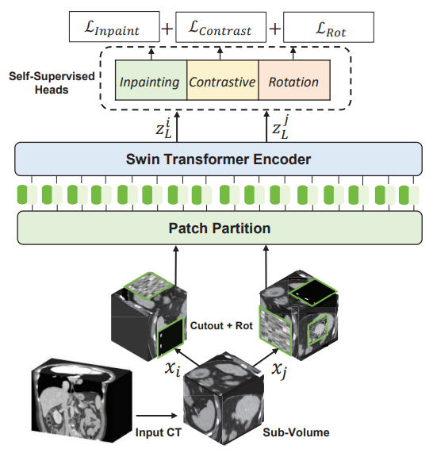
- 

## [02 Class-Balanced Pixel-Level Self-Labeling for Domain Adaptive Semantic Segmentation](./segmentation/Class-Balanced%20Pixel-Level%20Self-Labeling%20for%20Domain%20Adaptive%20Semantic%20Segmentation.pdf)
- Li R, Li S, He C, et al./2022/CVPR/2
- **Domain adaptive semantic segmentation** aims to learn a model with the supervision of **source domain data**, and produce satisfactory dense predictions on **unlabeled target domain**. One popular solution to this challenging task is **self-training**, which selects **high-scoring predictions** on target samples as **pseudo labels** for training. However, the produced pseudo labels often contain much **noise** because *the model is biased to source domain as well as majority categories*. To address the above issues, we propose to directly explore the **intrinsic pixel distributions of target domain data**, instead of heavily relying on the source domain. 
- However, the performance of deep models trained in one main often drops largely when they are applied to unseen domains. A natural way to improve the generalization ability of segmentation model is to **collect data from as many scenarios as possible**. However, it is very **costly** to annotate pixel-wise labels for a large amount of images . More effective and practical approaches are required to address the **domain shifts** of semantic segmentation.
- **Unsupervised Domain Adaptation** (UDA) provides an important way to **transfer** the knowledge learned from one labeled source domain to another unlabeled target domain. Most previous works of UDA bridge the domain gap by **aligning data distributions** at the *image level , feature level or output level* , through adversarial training or auxiliary style transfer networks. However, these techniques will increase the model complexity and make the training process unstable, which **impedes their reproducibility and robustness**. Another important approach is **self-training**, which alternatively generates pseudo labels by selecting high-scoring predictions on target domain and provides supervision for the next round of training. **On one hand**, the segmentation model tends to be **biased** to source domain so that the pseudo labels produced on target domain are error-prone; **on the other hand**, highly-confident predictions may only provide very limited supervision information for the model training. 
- Our idea comes from the fact that *pixel-wise cluster assignments could reveal the intrinsic distributions of pixels in target domain*, and provide useful supervision for model training. Compared to conventional label generation methods that are often biased towards source domain, cluster assignment in target domain is more **reliable** as it explores inherent data distribution.
- 
- P_SL can be regarded as the **weight map** to modulate the softmax probability map P_ST. The cluster assignment P_SL exploits the inherent data distribution of target domain, thus it is highly complementary to the classifier-based pseudo label P_ST which heavily relies on source domain. **On one hand**, the label noise was reduced and the bias to source domain was calibrated by exploring pixel-level intrinsic structures of target domain images. **On the other hand**, CPSL captured inherent class distribution of target domain, which effectively avoided gradual dominance of majority classes.
- 

 

# V. Domain Adaptation

## [00 Open Compound Domain Adaptation](./domainadaptation/Open%20Compound%20Domain%20Adaptation.pdf)
- Liu Z, Miao Z, Pan X, et al./2020/CVPR/72
- Whether the target contains a single homogeneous domain or multiple heterogeneous domains, existing works always assume that **there exist clear distinctions between the domains**, which is often not true in practice.
- open compound domain adaptation (OCDA) problem, in which the target is a compound of **multiple homogeneous domains without domain labels**, reflecting realistic data collection from **mixed and novel situations**. The task is to learn a model from **labeled source domain data** and **adapt it to unlabeled compound target domain data** which could differ from the source domain on various factors.  At the inference stage, OCDA tests the model not only **in the compound target domain** but also **in open domains** that have previously unseen during training.
- Unlike existing curriculum adaptation methods that rely on some **holistic measure** of instance difficulty, we schedule the learning of unlabeled instances in the compound target domain according to their **individual gaps** to the labeled source domain, so that we solve an incrementally harder domain adaptation problem till we cover the entire target domain.
- We first extract **domain-specific feature representations (assuming that all the factors not covered by this class-discriminative encoder reflect domain characteristics.)** from the data and then rank the target instances according to their distances to the source domain in that feature space, ***assuming that such features do not contribute to and even distract the network from learning discriminative features for classification***. We use a **class-confusion loss** to distill the domain-specific factors and formulate it as a conventional cross-entropy loss with a randomized class label twist.
- Intuitively, if ***the input is close enough to the source domain, the feature extracted from itself can most likely already result in accurate classification***. Consequently, this **memory-augmented network** is more agile at handling open domains than its vanilla counterpart.
- We propose a novel approach based on two technical **insights** into OCDA:
1) a **curriculum domain adaptation strategy** to bootstrap generalization across domain distinction in a data-driven self-organizing fashion and 2) a **memory module** to increase the model's agility towards novel domains. Instance-specific curriculum domain adaptation for **handling the target of mixed domains** and memory augmented features for **handling open domains**.
- **curriculum domain adaptation strategy** first train a neural network to 1) discriminate between classes in the labeled source domain and to 2) capture domain invariance from the easy target instanceswhich differ the least from labeled source domain data. Once the network can no longer differentiate between the source domain and the easy target domain data, we feed the network harder target instances, which are further away from the source domain.
- **memory module** insight is to prepare our model for open domains during inference with a memory module that effectively augments the representations of an input for classification. It allows knowledge transfer from the source domain so that the network can dynamically *balance the input-conveyed information and the memory-transferred knowledge* for more classification agility towards previously unseen domains.
- **Disentangling Domain Characteristics**：We separate characteristics specific to domains from
those discriminative between classes. They allow us to construct a curriculum for increment domain adaptation. *The class encoder places instances in the same class in a cluster, while the domain encoder places instances according to their common appearances, regardless of their classes*.
- **Curriculum Domain Adaptation：**We rank all the instances in the compound target domain
according to their distances (*domain gap*) to the source domain, to be used for curriculum domain adaptation
- **Memory Module for Open Domains：**Existing domain adaptation methods often use the features v_direct extracted directly from the input for adaptation. When the input comes from a *new domain that significantly differs from the seen domains during training*, this representatsentation becomes inadequate and could **fool the classifier**. This module contain **Class Memory，Enhancer and Domain Indicator which aim to get Source-Enhanced Representation.** All of these choices help cope with domain mismatch when the input is significantly different from the source domain.
- 
- 
- 
- 
- 

## [01 Source-Free Open Compound Domain Adaptation in Semantic Segmentation](./domainadaptation/Source-Free%20Open%20Compound%20Domain%20Adaptation%20in%20Semantic%20Segmentation.pdf)
- Zhao Y, Zhong Z, Luo Z, et al./2022/IEEE Transactions on Circuits and Systems for Video Technology/13
- - SF-OCDA is more challenging than the traditional domain adaptation but it is more practical.
It jointly considers (1) the issues of **data privacy and data storage** and (2) the scenario of **multiple target domains and unseen open domains**. In SF-OCDA, only **the source pre-trained model and the target data** are available to learn the target model. The model is evaluated on the samples from the **target and unseen open domains**. To solve this problem, we present an effective framework by separating the training process into two stages: (1) **pre-training a generalized source model** and (2) **adapting a target model with self-supervised learning**.
- **Cross-Patch Style Swap (CPSS)** to **diversify samples(**augment the samples with various image styles**)** with **various patch styles** in the feature-level, which can benefit the training of both stages. First, CPSS can significantly improve the **generalization ability** of the source model, providing more **accurate pseudo-labels** for the latter stage. Second, CPSS can **reduce the influence of noisy pseudo-labels** and also **avoid the model overfitting** to the target domain during self-supervised learning, consistently **boosting the performance on the target and open domains**. Specifically, CPSS first extracts the styles of patches in feature maps and then
randomly exchanges the styles among patches by the instance normalization and de-normalization. Additional, *CPSS is a lightweight module without learnable parameters, which can be readily injected into existing segmentation models*.
- Unsupervised Domain Adaptation (UDA), which aims to transfer the knowledge of **labeled synthetic data to unlabeled real-world data by align the domain gap between the source and the target domain**. In OCDA, the unlabeled target domain is a compound of multiple homogeneous domains without domain labels, given a **labeled (synthetic) source domain S** and an **unlabeled (real) compound target domain T** . The goal is to train a model that can accurately predict semantic labels for instances from **the compound and open target domains**.
- 
- 
- 

## [02 ML-BPM: Multi-teacher Learning with Bidirectional Photometric Mixing for Open Compound Domain Adaptation in Semantic Segmentation](./domainadaptation/ML-BPM%20Multi-teacher%20Learning%20with%20Bidirectional%20Photometric%20Mixing%20for%20Open%20Compound%20Domain%20Adaptation%20in%20Semantic%20Segmentation.pdf)
- Pan F, Hur S, Lee S, et al./2022/arXiv/-
- Current OCDA for semantic segmentation methods adopt **manual domain separation** and employ a **single model** to simultaneously adapt to all the target subdomains. However, *adapting to a target subdomain might hinder the model from adapting to other dissimilar target subdomains*, which leads to limited performance.
- multi-teacher framework with bidirectional photometric mixing (**ML-BPM**) to **separately adapt to every target subdomain**. First, we present an **automatic domain separation** to find the **optimal number of subdomains**. On this basis, we propose a **multi-teacher framework** in which **each teacher model** uses **bidirectional photometric mixing** to adapt to **one target subdomain**. Furthermore, we conduct an **adaptive distillation** to learn a student model and apply **consistency regularization** to improve the student generalization.
- In UDA, adversarial learning is used actively to **align input-level style** using **image translation**, **feature distribution**, or **structured output**. The purpose of domain generalization (DG) is to
train a model – **solely using source domain data** – such that it can perform **reliable predictions on unseen domain**. Even though DG for semantic segmentation has achieve obvious progress, their performance is inevitably lower than several UDA methods due to the absence of the target images, which is capable ofproviding abundant domain-specific information.
- 
- 

## [03 Discover, Hallucinate, and Adapt: Open Compound Domain Adaptation for Semantic Segmentation](./domainadaptation/Discover%2C%20Hallucinate%2C%20and%20Adapt%20Open%20Compound%20Domain%20Adaptation%20for%20Semantic%20Segmentation.pdf)
- Park K, Woo S, Shin I, et al./2020/NIPS/16
- **Three main design principles: discover, hallucinate, and adapt**. The scheme first **clusters compound target data based on *style***, discovering multiple latent domains (**discover**). Then, it
hallucinates **multiple latent target domains in source by using image-translation** (**hallucinate**). This step ensures *the latent domains in the source and the target to be paired*. Finally, **target-to-source alignment** is learned separately between domains(**adapt**). The **key idea** is simple and intuitive: *decompose a hard OCDA problem into multiple easy UDA problems*. We can then *ease the optimization difficulties of OCDA and also benefit from the various well-developed UDA techniques*.
- A naive way to perform OCDA is to apply the current UDA methods directly, viewing the compound target as a **uni-modal distribution**. As expected, this method has a fundamental limitation; **It induces a biased alignment,** where only the target data that are close to source aligns well. However, the compound target includes **various domains that are both close to and far from the source**.
- **Discover**: Multiple Latent Target Domains Discovery. The key motivation of the discovery step is to **make implicit multiple target domains explicit**. 
**Hallucinate**: Latent Target Domains Hallucination in Source  (**image-translation**). By using image-translation, the hallucination step **reduces the domain gap between the source and the
target in a pixel-level**. Those **translated source images** are closely aligned with the compound target images, easing the optimization difficulties of OCDA. Moreover, various latent data distributions can be covered by the segmentation model, as the translated source data which **changes the classifier boundary is used for training**.
**Adapt**: Domain-wise Adversaries. given **K target latent domains** and **translated K source domains** the model attempts to learn domain-invariant features (ranslated source and latent targets are both a **uni-modal** now). One might attempt to apply the existing state-of-the-art UDA methods. However, as the latent multi-mode structure is not fully exploited and  it gets the sub-optimal in inferior stage. Therefore, this work propose to utilize K different discriminators to achieve (latent) domainwise adversaries.
- 
- 

## [04 Cluster, Split, Fuse, and Update: Meta-Learning for Open Compound Domain Adaptive Semantic Segmentation](./domainadaptation/Cluster%2C%20Split%2C%20Fuse%2C%20and%20Update%20Meta-Learning%20for%20Open%20Compound%20Domain%20Adaptive%20Semantic%20Segmentation.pdf)
- Gong R, Chen Y, Paudel D P, et al./2021/CVPR/14
- **Meta-learning** based approach to **OCDA** for semantic segmentation, **MOCDA**, by *modeling the unlabeled target domain continuously,* which consists of four key steps. First, we **cluster** target domain into multiple sub-target domains by *image styles*, extracted in an unsupervised manner. Then, different sub-target domains are **split** into independent branches, for which *batch normalization parameters* are learnt to treat them independently. A *meta-learner* is thereafter deployed to learn to **fuse** sub-target domain-specific predictions, conditioned upon the style code. Meanwhile, we learn to online **update** the model by *modela-gnostic meta-learning* (MAML) algorithm, thus to further improve generalization.
- The method developed in OCDA does **not fully exploit the same assumption** for the task of **image segmentation**. This work  show that the homogeneous sub-domain assumption can be exploited effectively also for image segmentation.
- The **Cluster module** extracts and clusters the *style code( extracted by unsupervised image translation framework, MUNIT)* from the target domain images automatically, dividing the target domain into *multiple sub-target domains*. The **Split module** adopts the compound-domain specific batch normalization (*CDBN*) layer to *process different sub-target domain images using different branches*. The **Fuse module** exploits a hypernetwork to *predict the weights corresponding to each branch* adaptively, conditioned on *the style code of the input image*. The final output of the network is the weighted combination of the outputs of different branches. The MAML method is utilized to train the Fuse module, so as to make the model be adapted quickly in Update module. Finally, the **Update module** is *carried out online during the inference time with one-gradient step*, which is found to be beneficial for open domains.
- MOCDA model is trained in the multi-stage way, consisting of three steps: **i)** training the MUNIT model for style code extraction and clustering, **ii)** training with the CDBN layer in split module, **iii)** the CDBN layer is frozen, adding the hyper-network and the fuse module, and training the hypernetwork H and fine-tuning the semantic segmentation network G with MAML strategy. **iv)** Then during testing stage, our whole model, except for CDBN layer, is online updated with the MAML strategy.
- 
-  , 

## [05 Amplitude Spectrum Transformation for Open Compound Domain Adaptive Semantic Segmentation](./domainadaptation/Amplitude%20Spectrum%20Transformation%20for%20Open%20Compound%20Domain%20Adaptive%20Semantic%20Segmentation.pdf)
- Kundu J N, Kulkarni A R, Bhambri S, et al./2022/AAAI/1
- **Hypothesize** of this work: *an improved disentanglement of domain-related and task-related factors of dense intermediate layer features can greatly aid OCDA*. Prior-arts attempt this indirectly by employing **adversarial domain discriminators** on the spatial CNN output. However, We find that latent features derived from the **Fourier-based amplitude spectrum** of deep CNN features hold a more tractable mapping with domain discrimination.
- During adaptation, we employ the AST auto-encoder for two purposes. **First**, carefully mined **source-target instance pairs** undergo a simulation of cross-domain feature stylization (ASTSim) at a particular layer by altering the AST-latent. **Second**, AST operating at a later layer is tasked to **normalize (AST-Norm) the domain content** by fixing its latent to a mean prototype. Our simplified adaptation technique is not only **clustering-free** but also free from **complex adversarial alignment**.
- This work propose a **novel feature-space Amplitude Spectrum Transformation (AST-latent)**, based on a thorough analysis of **domain discriminability (DDM)**, for improved **disentanglement and manipulability** of domain characteristics. And provide insights into the usage of AST in two ways **AST-Sim** and **AST-Norm**, and propose a novel ***Simulate-then-Normalize*** strategy for effective OCDA.
- **Observation 1**. An ERM-network trained on **multi-domain data** for dense semantic segmentation tends to *learn increasingly more domain-specific features, in the deeper layer*.
**Remarks**. This is because the increase in **feature dimensions** for deeper layers allows more room to learn **unregularized domain-specific** hypotheses. employ **adversarial domain alignment**, aim to **minimize the DDM of deeper layer features** as a major part of the adaptation process.
- **Observation 2**. *Domain discriminability (and thus DDM) is easily identifiable and manipulatable in the latent Zk space*. Zk be a latent representation space where the multi-domain samples are easily separable based on their domain label.
**Remarks**. One can relate the latent AST representation as a similar measure to represent complex domain discriminating clues that are difficult to extract via multi-layer convolutional discriminator.
- 
- 
- 

## [06 Open Set Domain Adaptation](./domainadaptation/Open%20Compound%20Domain%20Adaptation.pdf)
- Panareda Busto P, Gall J./2017/ICCV/446
- all available evaluation protocols for domain adaptation describe a ***closed set*** recognition task, where both domains, namely source and target, contain exactly the same object classes. In this work, we also explore the field of domain adaptation in ***open sets***, which is a more realistic scenario where only a few categories of interest are shared between source and target data. Therefore, we propose a method that fits in both closed and open set scenarios. The approach learns a mapping from the source to the target domain by jointly solving an **assignment problem** that labels those target instances that potentially belong to the categories of interest present in the source dataset.
- 
- Overview of the proposed approach for ***unsupervised open set domain adaptation***. **(a)** The source domain contains some labelled images, indicated by the colours red, blue and green, and some images belonging to unknown classes (grey). For the target domain, we do not have any labels but the shapes indicate if they belong to one of the three categories or an unknown category (circle). **(b)** In the first step, we assign class labels to some target samples, leaving outliers unlabelled. **(c)** By minimising the distance between the samples of the source and the target domain that are labelled by the same category, we learn a mapping from the source to the target domain. The image shows the samples in the source domain after the transformation. ***This process iterates between (b) and (c) until it converges to a local minimum***. **(d)** In order to label all samples in the target domain either by one of the three classes (red, green, blue) or as unknown (grey), we learn a classifier on the source samples that have been mapped to the target domain (c) and apply it to the samples of the target domain (a). In this image, two samples with unknown classes are wrongly classified as red or green.
- 

## [07 Learning to Adapt Structured Output Space for Semantic Segmentation](./domainadaptation/Learning%20to%20Adapt%20Structured%20Output%20Space%20for%20Semantic%20Segmentation.pdf)
- Tsai Y H, Hung W C, Schulter S, et al./2018/CVPR/1039
- **AdaSeg** propose an **adversarial learning** method for domain adaptation in the context of semantic segmentation. Considering *semantic segmentations as structured outputs that contain spatial similarities between the source and target domains*, we adopt adversarial learning in the **output space** （**Not feature**）. To further enhance the adapted model, we construct a **multi-level adversarial network** to effectively **perform output space domain adaptation** at **different feature levels（Close to output layer）**.
- Different from the image classification task, **feature adaptation for semantic segmentation may suffer from the complexity of high-dimensional features** that needs to encode diverse visual cues, including **appearance, shape and context**. This motivates us to develop an effective method for **adapting pixel-level prediction** tasks rather than using feature adaptation. In semantic segmentation, we note that the **output space contains rich information, both spatially and locally**. For instance, even if images from two domains are very different in appearance, their segmentation outputs share a significant amount of similarities.
- **AdapSet consists of two parts**: 1) a segmentation model to predict output results, and 2) a discriminator to distinguish whether the input is from the source or target segmentation output. With an adversarial loss, the proposed segmentation model aims to fool the discriminator, with the goal of *generating similar distributions in the output space for either source or target images*.
- *With an adversarial loss on the **target prediction**, the network propagates gradients from Di to G, which would encourage G to generate similar segmentation distributions in the target domain to the source prediction.*
- *The ultimate goal is to minimize the segmentation loss in G for source images, while maximizing the probability of target predictions being considered as source predictions.*
- 

## [08 Constructing Self-motivated Pyramid Curriculums for Cross-Domain Semantic Segmentation: A Non-Adversarial Approach](./domainadaptation/Constructing%20Self-motivated%20Pyramid%20Curriculums%20for%20Cross-Domain%20Semantic%20Segmentation%20A%20Non-Adversarial%20Approach%20.pdf)
- Lian Q, Lv F, Duan L, et al./2019/ICCV/142
- Self-motivated pyramid curriculum domain adaptation (PyCDA) draws on an insight **connecting two existing works: curriculum domain adaptation and self-training**. Inspired by the former, PyCDA constructs a **pyramid curriculum** which contains various properties about the target domain. 
- the **self-training** alternates between two sub-tasks: 1) estimating **pseudo labels** for the target domain’s pixels and 2) **updating the weights** of the segmentation network by using both the source labels and the pseudo target labels. the **curriculum adaptation** first 1) **constructs a curriculum**, i.e., infers properties of the target domain in the form of frequency distributions of the class labels over an image (or image region) and then 2) **updates the network’s weights** using the source labels and the target domain’s properties. *the second steps of the two works share exactly the same form in math — a cross-entropy loss between a frequency distribution / pseudo label and a differentiable function of the network’s predictions.*
- 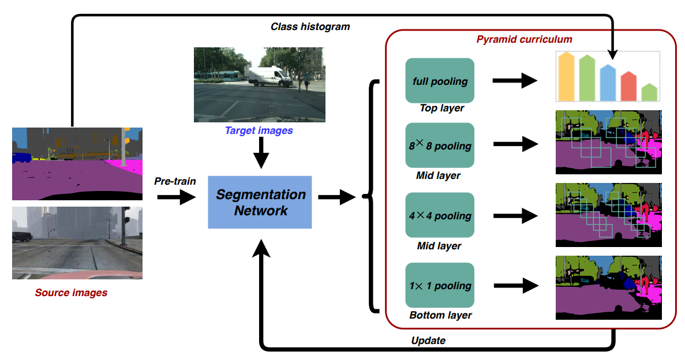

## [09 Synergistic Image and Feature Adaptation: Towards Cross-Modality Domain Adaptation for Medical Image Segmentation](./domainadaptation/Synergistic%20Image%20and%20Feature%20Adaptation%20Towards%20Cross-Modality%20Domain%20Adaptation%20for%20Medical%20Image%20Segmentation%20.pdf)
- Chen C, Dou Q, Chen H, et al./2019/AAAI/206
- SIFA is an elegant learning diagram which *presents synergistic fusion of adaptations from both **image and feature perspectives***. In particular, we simultaneously **transform the appearance of images across domains** and **enhance domain-invariance of the extracted features** towards the segmentation task. *The feature encoder layers are shared by both perspectives to grasp their mutual benefits during the end-to-end learning procedure*. Without using any annotation from the target domain, the learning of our unified model is **guided by adversarial losses, with multiple discriminators** employed from various aspects.
- One stream is the ***image adaptation***, by aligning the *image appearance* between domains with the pixel-to-pixel transformation. In this way, the domain shift is addressed at **input level** to DCNNs. 
- The other stream for unsupervised domain adaptation follows the ***feature adaptation***, which aims to *extract domaininvariant features* with DCNNs, regardless of the appearance difference between input domains. Most methods within this stream discriminate **feature distributions** of source/target domains in an adversarial learning scenario. Furthermore, considering the high-dimensions of plain feature spaces, some recent works connected the discriminator to more **compact spaces** (*semantic prediction space and reconstructed image space*). 
- **The major contributions of this paper are as follows**:
    - We present the SIFA, a novel unsupervised domain adaptation framework, that exploits synergistic image and feature adaptations to tackle domain shift via complementary perspectives.
    - We enhance feature adaptation by using discriminators in two aspects, i.e., semantic prediction space and generated image space. Both compact spaces help to further enhance domain-invariance of the extracted features.
- 
- 

## [10 Unsupervised Cross-Modality Domain Adaptation of ConvNets for Biomedical Image Segmentations with Adversarial Loss](./domainadaptation/Unsupervised%20Cross-Modality%20Domain%20Adaptation%20of%20ConvNets%20for%20Biomedical%20Image%20Segmentations%20with%20Adversarial%20Loss.pdf)
- Dou Q, Ouyang C, Chen C, et al./2018/arXiv/241
- a plug-and-play **domain adaptation module (DAM)** to map the target input to features which are aligned with source domain feature space. A **domain critic module (DCM)** is set up for discriminating the feature space of both domains. We optimize the DAM and DCM via an **adversarial loss** without using any target domain label.
- In transfer learning, the **last several layers** of the network are usually **fine-tuned** for a new task with new label space. The **supporting assumption** is that *early layers in the network extract low-level features (such as edge filters and color blobs) which are common for vision tasks. Those upper layers are more task-specific and learn high-level features for the classifier*.
- **This work’s hypothesis** is that *the distribution changes between the cross-modality domains are primarily low-level characteristics (e.g., gray-scale values) rather than high-level (e.g., geometric structures)*. The higher layers are closely in correlation with the class labels which can be **shared across different domains**. In this regard, we propose to *reuse the feature extractors learned in higher layers* (**frozen**) of the ConvNet, whereas the earlier layers (**replaced**) are *updated to conduct distribution mappings in feature space* for our unsupervised domain adaptation. For our problem, we train the DAM, *aiming that the ConvNet can generate source-like feature maps from target input*. Hence, the ConvNet is equivalent to a generator from GAN’s perspective.
- In practice, we **select several layers from the frozen higher layers**, and refer their corresponding feature maps as the set of F_H()*.* Similarly, we denote the **selected feature maps of DAM** by M_A() with the A being the selected layer set. *The aim of DCM is that minimize the distance between **(F_H(x_s),M_A(x_s))** and **(F_H(x_t),M_A(x_t))** domain distributions*.
- 
- Github: [https://github.com/carrenD/Medical-Cross-Modality-Domain-Adaptation](https://github.com/carrenD/Medical-Cross-Modality-Domain-Adaptation)

## [11 Universal Domain Adaptation](./domainadaptation/Universal%20Domain%20Adaptation.pdf)
- You K, Long M, Cao Z, et al./2019/CVPR/259
- Existing domain adaptation methods rely on **rich prior knowledge about the relationship between the label sets of source and target domains**, which greatly limits their application in the wild. **Universal Domain Adaptation (UDA) that requires no prior knowledge on the label sets**. 
- For a given source label set and a target label set, they may contain a common label set and hold a private label set respectively, bringing up an additional ***category gap***. UDA requires a model to either **(1) classify the target sample correctly if it is associated with a label in the common label set**, or **(2) mark it as “unknown” otherwise**.
- To solve the universal domain adaptation problem, this work propose Universal Adaptation Network (UAN). It quantifies sample-level transferability to **discover the common label set and the label sets private to each domain**, thereby **promoting the adaptation in the automatically discovered common label set and recognizing the “unknown” samples successfully**.
- 
- If the source label set is large enough to contain the target label set, partial domain adaptation methods are good choices; if the source label set is contained in the target label set or common classes are known, open set domain adaptation methods are good choices. In a general scenario, however, we cannot select the proper domain adaptation method because no prior knowledge about the target domain label set is given.
- 

## [12 CyCADA: Cycle-Consistent Adversarial Domain Adaptation](./domainadaptation/CyCADA%20Cycle-Consistent%20Adversarial%20Domain%20Adaptation.pdf)
- Hoffman J, Tzeng E, Park T, et al./2018/ICML/2481
- While **feature space** methods are difficult to interpret and sometimes fail to **capture pixel-level and low-level domain shifts**, **image space** methods sometimes fail to **incorporate high level semantic knowledge** relevant for the end task. CyCADA propose a model which adapts between domains using both **generative image space alignment and latent representation space alignment**.
- 
- 
- 

## [13 Unsupervised Domain Adaptation with Dual-Scheme Fusion Network for Medical Image Segmentation](./domainadaptation/Unsupervised%20Domain%20Adaptation%20with%20Dual-Scheme%20Fusion%20Network%20for%20Medical%20Image%20Segmentation%20.pdf)
- Zou D, Zhu Q, Yan P./2020/IJCAI/33
- This **imbalanced source-to-target** one way pass may not eliminate the domain gap, which limits the performance of the pre-trained model. This paper propose an Dual-Scheme Fusion Network (DSFN) for unsupervised domain adaptation. By building both **source-to-target and target-to-source** connections, this **balanced** joint information flow helps reduce the domain gap to further improve the network performance. The mechanism is further applied to **the inference stage**, where both the original input target image and the generated source images are segmented with the proposed joint network. The results are **fused** to obtain more robust segmentation.
- For the fusion strategy: **averaging** the prediction probabilities of these two results
- 
- 
- 

## [14 Generalizable Cross-modality Medical Image Segmentation via Style Augmentation and Dual Normalization](./domainadaptation/Generalizable%20Cross-modality%20Medical%20Image%20Segmentation%20via%20Style%20Augmentation%20and%20Dual%20Normalization.pdf)
- Zhou Z, Qi L, Yang X, et al. /2022/CVPR/6
- This paper propose a novel **dual-normalization model** by leveraging the **augmented source-similar and source-dissimilar images** during our generalizable segmentation. This work fouse on **cross-modality** DG problem.(cross-center and cross-modality, the later is more challenging with larger domain shift.)
- To be specifc, given a single source domain, aiming to simulate the **possible appearance change** in unseen target domains, we frst utilize **a nonlinear transformation** to augment source-similar and source-dissimilar images. Then, to **suffciently exploit these two types of augmentations**, our proposed dualnormalization based model employs a **shared backbone yet independent batch normalization layer** for separate normalization. Afterward, we put forward a **style-based selection scheme** to automatically choose the appropriate path **in the test stage**.
- We notice that in medical images, modality discrepancy usually manifests in **gray-scale distribution discrepancy**. Being aware of this fact, we wish to simulate possible appearance changes in **unseen target domains**. (*DN can preserve domain style information after model training.*)
- 
- 
- 
- 

## [15 Data augmentation using learned transformations for one-shot medical image segmentation](./domainadaptation/Data%20augmentation%20using%20learned%20transformations%20for%20one-shot%20medical%20image%20segmentation.pdf)
- Zhao A, Balakrishnan G, Durand F, et al./2019/CVPR/381
- The problem of limited labeled data is exacerbated by **differences in image acquisition procedures across machines and institutions**, which can produce wide variations in **resolution, image noise, and tissue appearance**. **Hand-engineered and Hand-tuned data** augmentation functions have **limited ability to emulate real variations**, and can be **highly sensitive to the choice of parameters**.
- *This novel approach to data augmentation leverages unlabeled images. Using **learning-based registration methods**, we model the set of **spatial and appearance transformations** between images in the dataset. These models **capture the anatomical and imaging diversity** in the unlabeled images. We **synthesize new examples** by sampling transformations and applying them to a single labeled example.
- 
- 
- 

## [16 Models Genesis: Generic Autodidactic Models for 3D Medical Image Analysis](./domainadaptation/Models%20Genesis%20Generic%20Autodidactic%20Models%20for%203D%20Medical%20Image%20Analysis.pdf)
- Zhou Z, Sodha V, Rahman Siddiquee M M, et al./2019/MICCAI/226
- Transfer learning from natural image to medical image has established as one of the most practical paradigms in deep learning for medical image analysis. However, to fit this paradigm, 3D imaging tasks in the most prominent imaging modalities (e.g., CT and MRI) have to be reformulated and solved in 2D, **losing rich 3D anatomical information and inevitably compromising the performance**.
- *Given the marked differences between natural images and medical images, we hypothesize that **transfer learning can yield more powerful (application-specific) target models if the source models are built directly from medical images**.
- This performance is attributable to the following **key observation**: *medical imaging protocols typically focus on particular parts of the body for specific clinical purposes, resulting in images of similar anatomy*. The sophisticated yet recurrent anatomy offers **consistent patterns** for self-supervised learning to discover **common representation** of a particular body part (like Lungs, Brain etc).
- Learning from scratch simply in 3D may not necessarily yield performance better than fine-tuning state-of-the-art ImageNet models. But this model consistently top any 2D approaches including fine-tuning the models pre-trained from ImageNet as well as fine-tuning the 2D versions of our Models Genesis, **confirming the importance of 3D anatomical information and significance** of our Models Genesis for 3D medical imaging.
- 
- Models Genesis learn from scratch on **unlabeled images**, with an objective to yield a **common visual representation** that is generalizable and transferable across diseases, organs, and modalities. In Models Genesis, an encoder-decoder is trained using a series of self-supervised schemes. Once trained, the encoder alone can be fine-tuned for **target classification tasks**; while the encoder and decoder together can be for **target segmentation tasks**.
- **Four novel transformations**: (*Similar to MAE with masking image patch, this work using image transformations*)
    1. Learning **appearance** via non-linear transformation (B´ezier Curve). Restoring image patches distorted with non-linear transformation focuses Models Genesis on learning organ appearance; 
    2. Learning **texture** via local pixel shuffling. To recover from local pixel shuffling, Models Genesis must memorize local boundaries and texture; 
    3. Learning **context** via out-painting and in-painting. Out-painting compels Models Genesis to learn global geometry and spatial layout of organs via extrapolating, while in-painting requires Models Genesis to appreciate local continuities of organs via interpolating.
- **Four unique properties**:
    1. Autodidactic—requiring no manual labeling.
    2. Eclectic—learning from multiple perspectives.(appearance, texture, context, etc.)
    3. Scalable—eliminating proxy-task-specific heads. (any favorable transformation can be easily amended into our framework)
    4. Generic—yielding diverse applications. (learned general purpose image representation that can be leveraged for a wide range of target tasks)

## [17 Synchronous Medical Image Augmentation framework for deep learning-based image segmentation](./domainadaptation/Synchronous%20Medical%20Image%20Augmentation%20framework%20for%20deep%20learning-based%20image%20segmentation.pdf)
- Chen J, Yang N, Pan Y, et al./2023/Computerized Medical Imaging and Graphics/-
-  In this paper, we focus on the **medical image augmentation** for DL-based image segmentation and the **synchronization between augmented image samples and their labels**. *SMIA includes two modules based on stochastic transformation and synthesis, and provides diverse and annotated training sets for DL models.* In **the transform-based SMIA module**, for each medical image sample and its tissue segments, a subset of SMIA factors with a random number of factors and stochastic parameter values are selected to simultaneously generate augmented samples and the paired tissue segments. In **the synthesis-based SMIA module**, we randomly replace the original tissues with the augmented tissues using an equivalent replacement method to synthesize new medical images, which can well maintain the original medical implications.
- Image augmentation of DL-based medical image seg mentation still **faces multiple challenges**.
    1. *Unique characteristics of medical images*. Compared with images in other fields, medical images have multiple unique character istics, such as **scaling sensitivity, position sensitivity, and motion sensitivity** for partial tissues, which has **important medical significance**. Changing the size of organs and tissues during image augmenta tion will affect medical characteristics. some existing image augmen tation methods applied in other fields **cannot** be directly applied to all medical images. 
    2. *Image-label pairs for image segmentation DL model training.* Unlike medical image classification tasks, as the training datasets of medical image segmentation DL models, we need to extract all **target tissues in the training samples to form an image-label pair**, and use them as the segmentation labels and ground truths. 
    3. *Imbalance of medical sample categories*. Owing to the uncertainty of patient visits, many medical images from clinical ap plications have an imbalance in the number of samples between normal and diseased samples or between different diseases.
- 
- 
- The transform-based SMIA module:
    1. **medical image and tissue preparation**: extract each target tissue with its position information from the original image to get (X_i,Y_i), where Y_i = {y_i1, y_i2, ..., y_in}, generate a tissue image for each segmented tissue, in which there is only one tissue without background.
    2. **stochastic IAF combination**: randomly select any number of IAFs from the IAF library to form a stochastic IAF combination. Repeat this step 𝐾 times to generate 𝐾 stochastic IAF combinations.
    3. **synchronous augmentation**: perform transformation operations on 𝑋𝑖 and generate a new augmented sample 𝑋′𝑖 and perform the same transformation operations on each tissue segment of 𝑌′𝑖.
- 
- The synthesis-based SMIA module:
    1. **tissue extraction and augmentation**：extract the target tissues from each medical image and transform them (using transform-based SMIA)to generate an **augmented tissue database**.
    2. **medical image synthesis**：tissues in a medical image are randomly replaced (equivalent replacement) by the augmented ones to synthesize a new medical image.
    3. **image-label pair generation**： the corresponding segmentation labels of the synthesized image are simultaneously generated.
- 
- 

## [18 CyCMIS: Cycle-consistent Cross-domain Medical Image Segmentation via diverse image augmentation](./domainadaptation/CyCMIS%20Cycle-consistent%20Cross-domain%20Medical%20Image%20Segmentation%20via%20diverse%20image%20augmentation.pdf)
- Wang R, Zheng G./2022/Medical Image Analysis/10
- **CyCMIS** integrate **online diverse image translation** via *disentangled representation learning* and **semantic consistency regularization** into one network. Different from learning one-to-one mapping, our method characterizes the complex relationship between domains as **many-to-many mapping**. where images are embedded onto two spaces: a **domain-invariant content space** and a **domain-specific attribute space**. 
- A novel diverse **inter-domain semantic consistency loss** is then proposed to regularize the cross-domain segmentation process. We additionally introduce an **intra-domain semantic consistency loss** to encourage the segmentation consistency between the original input and the image after cross-cycle reconstruction.
- The identified **limitations of existing methods** include: (1) most of them **do not preserve semantic information** in the process of image translation such that any error generated in **the cross-domain image synthesis stage** will be passed to **the image segmentation stage**; and (2) **the cross-domain image synthesis stage** cannot benefit from the **high-level semantic information** obtained from **the image segmentation stage**.
- 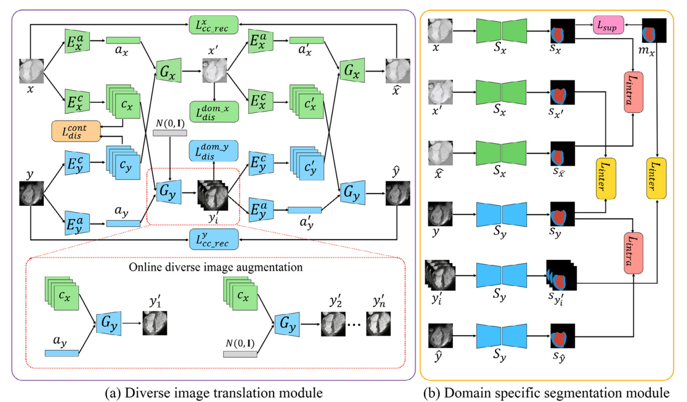
- 
- 

## [19 Source free domain adaptation for medical image segmentation with fourier style mining](./domainadaptation/Source%20free%20domain%20adaptation%20for%20medical%20image%20segmentation%20with%20fourier%20style%20mining.pdf)
- Yang C, Guo X, Chen Z, et al./2022/Medical Image Analysis/6
- Our framework is composed of two stages: In **the generation stage**, we design a **Fourier Style Mining (FSM) generator** to inverse source-like images through statistic information of the pretrained source model and **mutual Fourier Transform**. These generated source-like images can provide source data distribution and benefit the domain alignment. In **the adaptation stage**, we design a **Contrastive Domain Distillation (CDD) module** to achieve feature-level adaptation, including a domain distillation loss to transfer relation knowledge and a domain contrastive loss to narrow down the domain gap by a self-supervised paradigm. Besides, a **Compact-Aware Domain Consistency (CADC) module** is proposed to enhance consistency learning by filtering out noisy pseudo labels with shape compactness metric, thus achieving output-level adaptation.
- Previous SFDA imply utilize the well-trained source model to **generate pseudo labels and retrain a target model** (self-training). But these methods ignore the **distribution information stored in BN statistics of the source model**, which could provide valuable information for the domain adaptation. FSM module can **mine out** the latent style information stored in the source segmentation model and generate the source-like images optimized from the input noise images. (Different from previous style transfer methods,this method does not require these source images under privacy concerns, and only utilizes BN statistics of the source segmentation model to mine out the source style information)
- **Note**: *shallow features contain appearance information while deep features focus on semantic information*; *As low-frequency components in Fourier Transform can represent the style information*; *Input & Feature & Output Space*.
- 

## [20 FDA: Fourier Domain Adaptation for Semantic Segmentation](./domainadaptation/FDA%20Fourier%20Domain%20Adaptation%20for%20Semantic%20Segmentation.pdf)
- Yang Y, Soatto S./2020/CVPR/451
- FDA describe a simple method for unsupervised domain adaptation, whereby the discrepancy between the source and target distributions is reduced by **swapping the low-frequency spectrum of one with the other**. This method does not require any training to perform the domain alignment (**without adversarial training**), just a simple **Fourier Transform and its inverse**(just one free parameter).
- 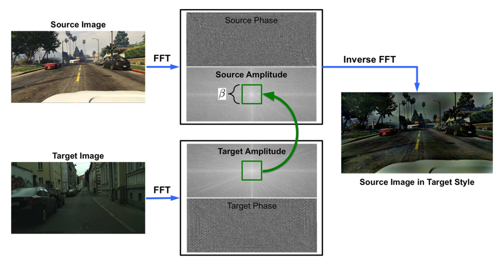
- 
- **Notes**: increasing β will decrease the domain gap but introduce artifacts (exhibits visible artifacts); Ref Advent: this is ineffective in regions with low entropy, **Charbonnier** penalizes high entropy predictions more than the low entropy ones for η > 0.5 (to pay more attention to effective regions)
- 
- , 
- 

## [21 RDA: Robust Domain Adaptation via Fourier Adversarial Attacking](./domainadaptation/RDA%20Robust%20Domain%20Adaptation%20via%20Fourier%20Adversarial%20Attacking.pdf)
- Huang J, Guan D, Xiao A, et al./2021/ICCV/31
- Unsupervised domain adaptation (UDA) involves a supervised loss in a labeled source domain and an unsupervised loss in an unlabeled target domain, which often faces more severe **overfitting** (than classical supervised learning) as **the supervised source loss has clear domain gap and the unsupervised target loss is often noisy due to the lack of annotations**.
- This paper presents RDA, a robust domain adaptation technique that introduces adversarial attacking to **mitigate overfitting in UDA**. We achieve robust domain adaptation by a novel **Fourier adversarial attacking** (FAA) method that allows **large magnitude of perturbation noises but has minimal modification of image semantics**, the former is critical to the effectiveness of its **generated adversarial samples** due to the existence of ‘domain gaps’. Specifically, FAA decomposes images into multiple **frequency components (FCs)** and **generates adversarial samples** by just perturbating certain FCs that capture little semantic in formation. With FAA-generated samples, the training can continue the **‘random walk’ and drift into an area with a flat loss landscape** (avoid overfitting), leading to more robust domain adaptation.
- 
- 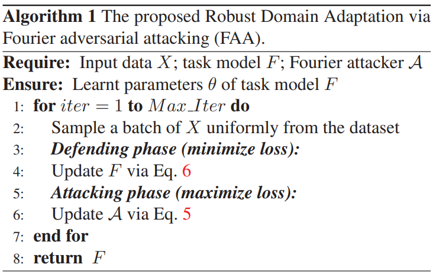

## [22 Domain Generalisation via Domain Adaptation: An Adversarial Fourier Amplitude Approach](./domainadaptation/Domain%20Generalisation%20via%20Domain%20Adaptation%20An%20Adversarial%20Fourier%20Amplitude%20Approach.pdf)
- Kim M, Li D, Hospedales T./2023/ICLR/-
- We tackle the domain generalisation (DG) problem by posing it as a domain adaptation (DA) task where we **adversarially synthesise the worst-case ‘target’ domain and adapt a model to that worst-case domain**, thereby improving the model’s robustness.
- To synthesise data that is challenging yet **semantics-preserving**, we **generate Fourier amplitude images** and **combine them with source domain phase images**, exploiting the widely believed conjecture from signal processing that **amplitude spectra mainly determines image style, while phase data mainly captures image semantics**.
- 
- 

## [23 Cross-domain Contrastive Learning for Unsupervised Domain Adaptation](./domainadaptation/Cross-domain%20Contrastive%20Learning%20for%20Unsupervised%20Domain%20Adaptation.pdf)
- Wang R, Wu Z, Weng Z, et al./2022/ IEEE Transactions on Multimedia/48
- Most existing UDA methods learn **domain-invariant feature representations** by **minimizing feature distances across domains**. In this work, we build upon
contrastive self-supervised learning to align features so as to reduce the domain discrepancy between training and testing sets. In this work, we build upon **contrastive self-supervised learning** to align features so as to reduce the domain discrepancy between training and testing sets.
- Exploring the **same set of categories shared by both domains**, we introduce a simple yet effective framework CDCL, for domain alignment. In particular, given an anchor image from one domain, we minimize its distances to cross-domain samples from the same class relative to those from different categories. Since target labels are unavailable, we use a **clustering-based approach** with carefully initialized centers to **produce pseudo labels**. 
- In this paper, we ask the following **question**: can we leverage contrastive learning that produces decent feature representations in a variety of downstream tasks for domain alignment in unsupervised domain adaptation? (In domain adaptation, it is not clear how to form **positive and negative pairs** in order to align feature distributions)
- More specifically, we **hypothesize** that *samples within the same category are close to each other while samples from different classes lie far apart, regardless of which domain they come from*. 
- The **intuition** is that the weight vectors in the classifier layer of a pre-trained model can be regarded as prototypical features of each class learned on the source domain. In particular, we first remove the bias of the fully-connected layer and perform normalization for the classifier.
- 
- 

## [24 Exploring Domain-Invariant Parameters for Source Free Domain Adaptation](./domainadaptation/Exploring%20Domain-Invariant%20Parameters%20for%20Source%20Free%20Domain%20Adaptation.pdf)
- Wang F, Han Z, Gong Y, et al./2022/CVPR/15
- Most existing methods focus on *learning the domain-invariant representations depending solely on the target data*, leading to the obtained representations are **target-specific**. In this way, they cannot fully address the distribution shift problem across domains. 
- The fascinating **insight**: *rather than attempting to learn domain-invariant representations, it is better to explore the domain-invariant parameters of the source model*. The motivation behind this insight is clear: *the domain-invariant representations are dominated by only partial parameters of an available deep source model*. 
- the Domain-Invariant Parameter Exploring (DIPE) approach to capture such **domain-invariant parameters in the source model to generate domain-invariant representations**. (**domain-invariant and domain-specific parameters**)
- The **fundamental challenge of SFDA** is that the domain-invariant presentations are challenging to be explored directly depending solely on the target data. In this paper, **a novel insight**: In SFDA, *exploring domain-invariant parameters stored in the source model is more feasible than exploring domain-invariant representations directly*. (from Lottery Ticket Hypothesis)
- 
- 
- 

## [25 Bidirectional Learning for Domain Adaptation of Semantic Segmentation](./domainadaptation/Bidirectional%20Learning%20for%20Domain%20Adaptation%20of%20Semantic%20Segmentation.pdf)
- Li Y, Yuan L, Vasconcelos N. /2019/CVPR/520
- Existing domain adaptation techniques either work on **limited datasets**, or yield **not so good performance** compared with supervised learning. Using the bidirectional learning(“translation-to-segmentation” and “segmentation-to-translation”), **the image translation model** and **the segmentation adaptation model** can be learned **alternatively** and **promote** to each other. Furthermore, we propose a **self-supervised learning algorithm** to learn a better segmentation adaptation model and in return improve the image translation model. 
- *How to allow one of both modules providing positive feedbacks to the other is the key to success*. **better segmentation adaptation model** would contribute to **better translation model** through our backward direction learning.
- domain adaptation for semantic segmentation has made good progress by separating it into **two sequential steps**: image-to-image translation model and add a discriminator on top of the features of the segmentation model. the segmentation model very relies on the quality of image-to-image translation. *Once the image-to-image translation fails, nothing can be done to make it up in the following stages*.
- a **perceptual loss**, which measures the distance of features obtained from a **pre-trained network** on object recognition, is used in the image translation network to improve the quality of translated result.
- 
- 

## [26 Shallow Features Guide Unsupervised Domain Adaptation for Semantic Segmentation at Class Boundaries](./domainadaptation/Shallow%20Features%20Guide%20Unsupervised%20Domain%20Adaptation%20for%20Semantic%20Segmentation%20at%20Class%20Boundaries.pdf)
- Cardace A, Ramirez P Z, Salti S, et al./2022/WACV/8
- Domain shift is particularly noticeable along **class boundaries**, invalidating one of the main goals of semantic segmentation that consists in **obtaining sharp segmentation masks**. 
- 
- In this work, we specifically address this core problem in the context of Unsupervised Domain Adaptation and present a novel **low-level adaptation strategy** that allows us to **obtain sharp predictions**. Moreover, inspired by recent self-training techniques, we introduce an **effective data augmentation** that **alleviates the noise** typically present at semantic boundaries when employing pseudo-labels for self-training.
- 
- Given an RGB input image, the network learns to **extract semantic edges** from shallow features. From the same feature map, a 2D **displacement map** is estimated in order to guide the warping of down-sampled deep features, which lacks of fine-grained details.(*refine the bi-linearly up-sampled coarse feature map*)
- we enforce the auxiliary semantic edge detection task for the very **first layers of the network** only by the **Canny edge detector** applied directly on **semantic annotations** for the source domain and on **pseudo-labels** for the target domain. **rather than**, as in typical multi-task learning settings at a deeper level, where features are more **task-dependent** (shared feature representation, which naturally leads to aligned distributions).
- Our intuition is that, due to **the unavoidable side-effect of the down-sample operations** in the forward pass, the representation of those elements in **final feature representation** whose receptive field includes regions at class boundaries in the original image, contains **ambiguous** semantic information. Indeed, when Ac is bi-linearly up-sampled, patches that receive contributions from ambiguous coarse patches **inherit such ambiguity**.
- 
- Although selecting source objects(**self-training with augmented source images**) may be useful to reduce the unbalanced distributions of classes, it is a sub-optimal choice since the network would be still trained to identify shapes and details peculiar to the source domain, which are different to those found at inference time for the target images. 

## [27 Weakly-Supervised Domain Adaptive Semantic Segmentation with Prototypical Contrastive Learning](./domainadaptation/Weakly-Supervised%20Domain%20Adaptive%20Semantic%20Segmentation%20with%20Prototypical%20Contrastive%20Learning.pdf)
- Das A, Xian Y, Dai D, et al./2023/CVPR/-
- In this work propose a common framework to use **different weak labels**, e.g., image, point and coarse labels from the target domain to reduce this performance gap between unsupervised domain adaptation and supervised learning.
- Specifically, we propose to learn better **prototypes** that are representative class features by exploiting these weak labels. We use these improved prototypes for the **contrastive alignment of class features**. In particular, we perform two different feature alignments: **first**, we align pixel features with prototypes within each domain and **second**, we align pixel features from the source to prototype of target domain in an asymmetric way. **intra domain alignment and inter domain alignment**.
- WDASS task has not been properly explored by the community. *They use the weak labels only as additional supervision signal and not for aligning the source and target features*. 
- 

## [28 Prior Knowledge Guided Unsupervised Domain Adaptation](./domainadaptation/Prior%20Knowledge%20Guided%20Unsupervised%20Domain%20Adaptation.pdf)
- Sun T, Lu C, Ling H./2022/ECCV/8
- In this paper, we address this issue by seeking compensation from **target domain prior knowledge** for UDA setup. This work considers two specific types of prior knowledge about **the class distribution** in the target domain: **Unary Bound** that describes the **lower and upper bounds of individual class probabilities**, and **Binary Relationship** that describes the **relations between two class probabilities** and proposes a general **rectification module** that uses such prior knowledge to **refine model generated pseudo labels** (suitable for self-training based model).
- Using *prior knowledge removes or reduces the reliance on training data*. we expect to see further studies to explore richer prior knowledge for UDA or to extend the idea to general DA scenarios (OCDA, DG).
- 
- 

## [29 Do We Really Need to Access the Source Data Source? Hypothesis Transfer for Unsupervised Domain Adaptation](./domainadaptation/Do%20We%20Really%20Need%20to%20Access%20the%20Source%20Data%20Source%20Hypothesis%20Transfer%20for%20Unsupervised%20Domain%20Adaptation.pdf)
- Liang J, Hu D, Feng J./2020/ICML/697
- This work tackles a practical setting where only a **trained source model** is available and investigates how we can effectively utilize such a model **without source data** to solve UDA problems (SF-UDA). SHOT freezes the classifier module (hypothesis) of the source model and learns the **target-specific feature extraction module** by exploiting both **information maximization and self-supervised pseudo-labeling** to implicitly align representations from the target domains to the source hypothesis.
- SHOT is designed based on the following **observations**. If we have learned *source-like representations for target data, then the classification outputs from the source classifier (hypothesis) for target data should be similar to those of source data*, i.e., close to one-hot encodings.
- Hypothesis Transfer Learning (HTL) can be seen as a generalization of **parameter adaptation**, which assumes *the optimal target hypothesis to be closely related to the source hypothesis*. Like the famous fine-tuning strategy, HTL mostly acquires at least a small set of **labeled target examples** per class.
- **Expression:** We view the challenging problem from another perspective: if the domain gap is mitigated, what kind of outputs should unlabeled target data have? We argue the ideal target outputs should be similar to one-hot encoding but differ from each other.
- 

## [30 Prototypical Pseudo Label Denoising and Target Structure Learning for Domain Adaptive Semantic Segmentation](./domainadaptation/Prototypical%20Pseudo%20Label%20Denoising%20and%20Target%20Structure%20Learning%20for%20Domain%20Adaptive%20Semantic%20Segmentation.pdf)
- Zhang P, Zhang B, Zhang T, et al./2021/CVPR/291 (**Writing**)
- For self-training, the pseudo labels are **noisy** and the target features are **dispersed** due to the discrepancy between source and target domains. This work rely on **representative prototypes** (the feature **centroids** of classes) to address the two issues for unsupervised domain adaptation.
- We find two key ingredients are lacking in previous works. First, typical practice  suggests selecting the pseudo labels according to a strict confidence threshold, **while high scores are not necessarily correct**, making the network fail to learn reliable knowledge in the target domain. Second, due to the domain gap, the network is prone to produce dispersed features in the target domain. It is likely that for target data, the closer to the source distribution, the higher the confidence score. As a result, **data lying far from the source distribution (i.e. low scores) will never be considered during the training**.
- 

## [31 Unsupervised Domain Adaptation for Medical Image Segmentation by Selective Entropy Constraints and Adaptive Semantic Alignment](./domainadaptation/Unsupervised%20Domain%20Adaptation%20for%20Medical%20Image%20Segmentation%20by%20Selective%20Entropy%20Constraints%20and%20Adaptive%20Semantic%20Alignment.pdf)
- Feng W, Ju L, Wang L, et al./2023/AAAI/1
- Most existing (adversarial training based) methods may still produce **overconfident but erroneous results** on unseen target images, due to the properties of cross-entropy loss, which forces the network output to match the one-hot ground truth label, the neural network may be **mis-calibrated** and would output **overconfdent predictions**. (This phenomenon is exacerbated in the presence of domain shifts)
- 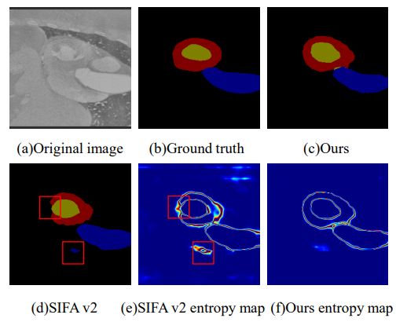
- (1) We frst introduce two data augmentation approaches to generate two sets of **semantics-preserving augmented images**. Based on the model’s predictive consistency on these two sets of augmented images, we **identify reliable and unreliable pixels**. (2) We then perform a **selective entropy constraints**: we **minimize** the entropy of reliable pixels to increase their confdence while **maximizing** the entropy of unreliable pixels to reduce their confdence. (3) Based on the identifed reliable and unreliable pixels, we further propose an **adaptive semantic alignment module** which performs class-level distribution adaptation by minimizing the distance between same class prototypes between domains, where unreliable pixels are removed to derive more accurate prototypes.
- 

## [32 Reducing Domain Gap in Frequency and Spatial Domain for Cross-Modality Domain Adaptation on Medical Image Segmentation](./domainadaptation/Reducing%20Domain%20Gap%20in%20Frequency%20and%20Spatial%20Domain%20for%20Cross-Modality%20Domain%20Adaptation%20on%20Medical%20Image%20Segmentation.pdf)
- Liu S, Yin S, Qu L, et al./2023/AAAI/1
- In the frequency domain, we first introduce **non-subsampled contourlet transform** for identifying domain-invariant and domain-variant frequency components (DIFs and DVFs), and then *keep the DIFs unchanged while replacing the DVFs of the source domain images with that of the target domain images to narrow the domain gap*. In the spatial domain, we propose a **batch momentum update-based histogram matching strategy** to reduce the domain-variant image style bias.
- 
- 
- the FC of **low frequency** sub-band retain most of the semantic content of the image, while the FCs corresponding to **high frequency sub-bands** represent the structure and texture of the image in different directions.
- 
- We propose to use batch momentum update to calculate an average histogram of a batch of target domain images for matching, rather than the entire target domain, which tends to **smooth the target domain histogram and ignores the intensity variants**.

## [33 Class Relationship Embedded Learning for Source-Free Unsupervised Domain Adaptation](./domainadaptation/Class%20Relationship%20Embedded%20Learning%20for%20Source-Free%20Unsupervised%20Domain%20Adaptation.pdf)
- Zhang Y, Wang Z, He W./2023/CVPR/1
- To fully utilize source knowledge, we propose to transfer the **class relationship, which is domain-invariant** but still under-explored in previous SFUDA works. To this end, we first regard **the classifier weights of the source model as class prototypes** to compute class relationship, and then propose a novel probability-based similarity between target-domain samples by embedding the source-domain class relationship, resulting in Class Relationship embedded Similarity (CRS). e.g. The computers are always more similar with the TV than the scissors.
- *A nature question of SF-UDA: what knowledge should we transfer to facilitate the learning of unlabeled target-domain data?* 
- Class Relationship embedded **Class-Aware** (*for prototypes*) Contrastive (**CR-CACo**) loss where the high-confident samples are enforced to be close to the corresponding prototype and away from other prototypes. Class Relationship embedded **Instance** (*for samples*) Discrimination Contrastive (**CR-IDCo**) loss where two views (augmentation) of the same sample are encouraged to be close and away from all other samples.
- 
- 

# VI. Domain Generalization

## [00 FedDG: Federated Domain Generalization on Medical Image Segmentation via Episodic Learning in Continuous Frequency Space](./domainadaptation/Feddg%20Federated%20domain%20generalization%20on%20medical%20image%20segmentation%20via%20episodic%20learning%20in%20continuous%20frequency%20space%20.pdf)
- Liu Q, Chen C, Qin J, et al./2021/CVPR/167
- Federated learning allows distributed medical institutions to collaboratively learn a shared prediction model with privacy protection. While at clinical deployment, the models trained in federated learning can still suffer from performance drop when applied to **completely unseen hospitals outside the federation**.
- Although FL has witnessed some pilot progress on medical image segmentation tasks, all existing works only focus on improving model performance on the internal clients, while neglecting model generalizability onto unseen domains outside the federation.
- To solve this FedDG problem, our insight is to enable each client to access multi-source data distributions in a privacy-protecting way. (**continuous frequency space interpolation mechanism, FFT**); This is *notably important* for medical image segmentation applications where generalization errors often come from imprecise predictions at ambiguous boundary of anatomies.(**boundary-oriented episodic learning paradigm**)
- **Challenges of FedDG**: 
  - **First**, the multi-source data in FL are stored distributedly and the learning at each client can only access its individual local distribution, which constrains to make full use of the multi-source distributions to learn generalizable parameters. 
  - **Second**, though FL has collaborated multi-source data, the medical images acquired from different clinical sites can present large heterogeneity. This leads to distinct distributions among the collaborative datasets, which is insufficient to ensure domain invariance in a more continuous distribution space to attain good generalizability in complex clinical environments. 
  - **Third**, the structure of medical anatomises usually present high ambiguity around its boundary region, raising challenge for previous DG techniques that typically lacks assurance for the domain-invariance of features in such ambiguous region.
- **Boundary-oriented meta optimization:** The idea is to regularize the **boundary-related and background-related** features of these data to respectively cluster to a compact space regardless of their distributions while reducing the clusters overlap. **This is crucial**, since if the model cannot project their features around boundary area with distribution-independent class-specific cohesion and separation, the predictions will **suffer from ambiguous decision boundaries** and still be **sensitive to the distribution** shift when deployed to unseen domains outside federation.
- 
- 

## [01 Semantic-Aware Domain Generalized Segmentation](./domaingeneralization/Semantic-Aware%20Domain%20Generalized%20Segmentation.pdf)
- Peng D, Lei Y, Hayat M, et al./2022/CVPR/21
- for DGSS, existing approaches to tackle this problem standardize data into a **unified distribution**. We **argue** that while such a **standardization promotes global normalization**, the resulting features are not discriminative enough to get clear segmentation boundaries.
- Semantic-Aware Normalization (SAN) and Semantic-Aware Whitening (SAW).  SAN focuses on **category-level center alignment** between features from different image styles, while SAW enforces **distributed alignment for the already center-aligned features**. With the help of SAN and SAW, we encourage both **intra-category compactness and inter-category separability**.
-  Existing methods tackle DGSS using **two main approaches**: (1) **Domain Randomization** which aims to increase the variety of training data by augmenting the source images to multiple domain styles. However, this is limiting since the augmentation schemes used are unable to cover different scenarios that may occur in the target domain.  (2) **Normalization and Whitening** which utilizes predefined Instance Normalization (IN) or Instance Whitening (IW) to standardize the feature distribution of different samples. *Nevertheless, such global alignment strategy lacks the consideration of local feature distribution consistency*.
- 
- 
- 

## [02 RobustNet: Improving Domain Generalization in Urban-Scene Segmentation via Instance Selective Whitening](./domaingeneralization/RobustNet%20Improving%20Domain%20Generalization%20in%20Urban-Scene%20Segmentation%20via%20Instance%20Selective%20Whitening.pdf)
- Choi S, Jung S, Yun H, et al./2021/CVPR/105
- To address DGSS, this paper proposes a novel **instance selective whitening loss** to improve the robustness of the segmentation networks for unseen domains. Our approach **disentangles the domain-specific style and domain-invariant content** encoded in higher-order statistics (i.e., feature covariance) of the feature representations and **selectively removes only the style information** causing domain shift.
- Existing DG  learning of a shared representation across **multiple source domains** to improving the robustness of the model. However, *collecting such multi-domain datasets is costly and labor-intensive, and furthermore, the performance highly depends on the number of source datasets*.
- - Our method **selectively removes** only those **feature covariances that respond sensitively to photometric augmentation** such as color transformation. (*feature covariance ( or feature correlations (i.e., a gram matrix or covariance matrix)) contains domain-specific style such as texture and color*)
- The **whitening transformation** that removes feature correlation and makes each feature have unit variance, has been known to help to remove the style information from the feature representations
- this is the **first attempt** to apply whitening to DG.
- 
- 
- 
- 

## [03 FSDR: Frequency Space Domain Randomization for Domain Generalization](./domaingeneralization/FSDR%20Frequency%20Space%20Domain%20Randomization%20for%20Domain%20Generalization.pdf)
- Huang J, Guan D, Xiao A, et al./2021/CVPR/94
- It has been studied widely by **domain randomization that transfers source images to different styles** in **spatial space** for learning **domain-agnostic features** for DGSS problem. However, most existing randomization methods use **GANs that often lack of controls and even alter semantic structures** of images undesirably.
- Inspired by the idea of JPEG that converts spatial images into **multiple frequency components** (FCs), we propose Frequency Space Domain Randomization (FSDR) that randomizes images in frequency space by **keeping domain-invariant FCs (DIFs) and randomizing domain-variant FCs (DVFs)** only.
- FSDR has two **unique features**: 1. it decomposes images into DIFs and DVFs which allows explicit access and manipulation of them and more **controllable randomization**; 2. it has **minimal effects on semantic structures of images and domain-invariant features**. 
- FSDR thus overcomes the constraints of most existing domain randomization methods which work over **the full spectrum of images in the spatial space and tend to modify domain-invariant features undesirably**. 
- **Domain Generalization**: single-source DG & multi-source DG; **Domain Adaptation**: adversarial training(feature or output space) & image translation & self-training. Domain Generalization & Domain Adaptation -> **domain-invariant feature or encoder (high generalizability feature)**.
- 
- 
- 
- 

## [04 Domain Randomization and Pyramid Consistency: Simulation-to-Real Generalization without Accessing Target Domain Data](./domaingeneralization/Domain%20Randomization%20and%20Pyramid%20Consistency%20Simulation-to-Real%20Generalization%20without%20Accessing%20Target%20Domain%20Data.pdf)
- Yue X, Zhang Y, Zhao S, et al./2019/CVPR/235
- we propose a new approach of **domain randomization** and **pyramid consistency** to learn a model with high generalizability. **First**, we propose to randomize the synthetic images with the styles of real images in terms of visual appearances using **auxiliary datasets**(like ImageNet), in order to effectively learn domain-invariant representations. **Second**, we further enforce **pyramid consistency across different “stylized” images** and within an image, in order to learn domain-invariant and scale-invariant features, respectively. 
- Our **main idea** is to randomize the labeled synthetic images to the styles of real images. We further enforce the semantic segmentation network to generate consistent predictions, in a pyramid form, over these domains. Our **conjecture** is that if the network is exposed to a sufficient number of domains in the training stage, it should **interpolate** well to new real world target domains. In contrast, the domain adaptation work can be seen as **extrapolating** from a single source domain to a single target domain. 
- Domain randomization (DR) is a **complementary** class of techniques for domain adaptation. The **goal** is to close the reality
gap by generating synthetic data with sufficient variation that the network views real-world data as just another variation. The type of domain randomization we proposed in this paper can also be considered as **a type of data augmentation**.
- this is the **first work** to explore domain randomization for the semantic segmentation problem.
- 
- 
- 

## [05 Two at Once: Enhancing Learning and Generalization Capacities via IBN-Net](./domaingeneralization/Two%20at%20Once%20Enhancing%20Learning%20and%20Generalization%20Capacities%20via%20IBN-Net.pdf)
- Pan X, Luo P, Shi J, et al./2018/ECCV/545
- IBN-Net(a new CNN architecture) carefully integrates **Instance Normalization (IN) and Batch Normalization (BN)** as building blocks, and can be wrapped into many advanced deep networks to improve their performances(**Plug and play**).  This work disclose that **IN learns features that are invariant to appearance changes**, such as colors, styles, and virtuality/reality, while **BN is essential for preserving content related information**.
- BN as a key component to **improve their learning capacity in high-level vision tasks** such as image recognition. IN was often combined with CNNs to remove **variance of images on low-level vision tasks** such as image style transfer. But the different characteristics of their learned features and the impact of their combination have not been disclosed in existing works. In contrast, IBN-Net shows that combining them in an appropriate manner improves both **learning and generalization** capacities.
- Firstly, to reduce feature variance caused by appearance in shallow layers while not interfering the content discrimination in deep layers, we only **add IN layers to the shallow half of the CNNs**. Secondly, to also preserve image content information in shallow layers, we replace **the original BN layers to IN for a half of features and BN for the other half**.
- There are two **limitations in the above CNN architectures**. **Firstly**, the limited basic modules(convolutions, BNs, ReLUs, and poolings) prevent them from gaining more appealing properties (vulnerable by appearance variations). **Secondly**, the design goal of these models is to achieve strong modeling capacity on a single task of a single domain, while their capacities to generalize to new domains are still limited.
- A natural solution to solve the appearance gap is by using transfer learning. However, this requires human annotations of the target domain, and the performances of the fine-tuned models would then drop when they are applied on the source domain. Basically, **the appearance gap is not eliminated** in the CNN model.
- 
- 
- 

## [06 Switchable Whitening for Deep Representation Learning](./domaingeneralization/Switchable%20Whitening%20for%20Deep%20Representation%20Learning.pdf)
- Pan X, Zhan X, Shi J, et al./2019/ICCV/68
- Unlike existing works that design normalization techniques for **specific tasks**, we propose Switchable Whitening (SW), which provides a general form **unifying** different whitening methods as well as standardization methods.  
- SW learns to switch among these operations in an **end-to-end** manner. It has several advantages. **First, SW adaptively selects appropriate whitening or standardization statistics for different tasks, making it well suited for a wide range of tasks without manual design**. Second, by integrating the benefits of different normalizers, SW shows consistent improvements over its counterparts in various challenging benchmarks. Third, SW serves as a useful tool for understanding the characteristics of whitening and standardization techniques.
- 
- SW provides a general form that integrates different **whitening techniques** (e.g. BW, IW), as well as **standardization techniques** (e.g. BN, IN and LN). **SW controls the ratio of each technique by learning their importance weights**. It is able to select appropriate normalizers with respect to various vision tasks.
- SW serves as a useful tool for analyzing the characteristics of these whitening or standardization techniques. This work answers two questions: *(1) Is IW beneficial for high level vision tasks like classification and domain adaptation?* *(2) Is standardization still necessary when whitening is presented?* Our experiments suggest that (1) IW works extremely well for handling **image appearance diversity and reducing domain gap**, giving rise to better performance in high-level vision tasks; (2) Using BW+IW in SW performs comparably well compared to using all the normalizers mentioned above in SW, indicating that **full whitening generally works well, and the requirement for standardization is marginal when whitening is presented**.
- 

## [07 WildNet: Learning Domain Generalized Semantic Segmentation From the Wild](./domaingeneralization/WildNet%20Learning%20Domain%20Generalized%20Semantic%20Segmentation%20From%20the%20Wild.pdf)
- Lee S, Seong H, Lee S, et al./2022/CVPR/21
- In domain generalization, **the low generalization ability for unseen target domains is clearly due to overfitting to the source domain**. To address this problem, previous works have focused on generalizing the domain by **removing or diversifying the styles of the source domain**. These **alleviated overfitting to the source-style but overlooked overfitting to the source-content**.
- In this paper, we propose to diversify both **the content and style of the source domain** with the help of the wild. Our main idea is for networks to naturally learn domain-generalized semantic information from the wild. To this end, we diversify styles by augmenting source features to resemble wild styles and enable networks to adapt to a variety of styles.
- Although some previous works utilized various styles from the wild, e.g., ImageNet for real styles and Painter by Numbers for unreal styles, **they overlooked that the high generalization ability comes from learning not only various styles but also various contents**. In contrast to previous studies, our main idea is to **naturally** learn domain-generalized semantic information by leveraging a variety of contents and styles from the wild, **without** forcing whitening on domain specific styles.
- 

## [08 DIRL: Domain-Invariant Representation Learning for Generalizable Semantic Segmentation](./domaingeneralization/DIRL%20Domain-Invariant%20Representation%20Learning%20for%20Generalizable%20Semantic.pdf)
- Xu Q, Yao L, Jiang Z, et al./2022/AAAI/8
- However, most existing works learn the shared feature space within **multi-source domains** but **ignore the characteristic of the feature itself** (e.g., the feature sensitivity to the domain-specific style).
- The guidance reflects in two folds: 1) **Feature re-calibration** that introduces the Prior Guided Attention Module (PGAM) to **emphasize the insensitive features and suppress the sensitive features**. 2): **Feature whiting** that proposes the Guided Feature Whiting (GFW) to **remove the feature correlations which are sensitive to the domain-specific style**.
- 
- 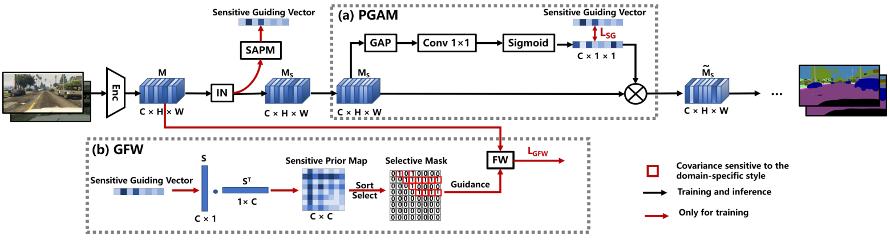
- 
- **To the best of our knowledge**, this is the first work to explore feature sensitivity to the domain-specific style.

## [09 Intra-Source Style Augmentation for Improved Domain Generalization](./domaingeneralization/Intra-Source%20Style%20Augmentation%20for%20Improved%20Domain%20Generalization.pdf)
- Li Y, Zhang D, Keuper M, et al./2023/WACV/-
- **intra-source style augmentation (ISSA)** is based on a novel **masked noise encoder** for StyleGAN2 inversion. The model learns to faithfully reconstruct the image preserving its semantic layout through noise prediction. **Random masking of the estimated noise enables the style mixing capability of our model**, i.e. it allows to alter the global appearance without affecting the semantic layout of an image. Using the proposed masked noise encoder to randomize **style and content** combinations in the training set, ISSA effectively increases the **diversity of training data and reduces spurious correlation**.
- ISSA is **model-agnostic** and **straightforwardly** applicable with CNNs and Transformers. intra-source style augmentation (ISSA) strategy for semantic segmentation, aiming to improve the style diversity in the training set **without extra labeling effort or using extra data sources** (single source domain, we make use of the styles extracted within the source domain and mix them up).
- 
- **M** stands for random noise masking, regularization for the encoder training. Without it, the noise map overtakes the latent codes in encoding the image style, so that the latter cannot make any perceivable changes on the reconstructed image, thus making style mixing impossible.
- To the best of our knowledge, our approach is the first GAN inversion method which can be effectively applied as data augmentation for the semantic segmentation of complex scenes.

## [10 Global and Local Texture Randomization for Synthetic-to-Real Semantic Segmentation](./domaingeneralization/Global%20and%20Local%20Texture%20Randomization%20for%20Synthetic-to-Real%20Semantic%20Segmentation.pdf)
- Peng D, Lei Y, Liu L, et al./2021/TIP/60
- Global Texture Randomization (**GTR**) aims to **alleviate the reliance of the network on texture while promoting the learning of the domain-invariant cues**. In addition, we find the texture difference is not always occurred in **entire image and may only appear in some local areas**. Therefore, we further propose a Local Texture Randomization (**LTR**) mechanism to generate diverse local regions for partially stylizing the source images. Finally, we implement a regularization of Consistency between GTR and LTR (CGL) aiming to **harmonize the two proposed mechanisms during training**. Besides, a strategy namely Texture Complexity based Painting Selection(**TCPS**) is proposed to **ensure the selected paintings are reliable enough** for the above texture randomization mechanisms.
- 
- 
- 
- 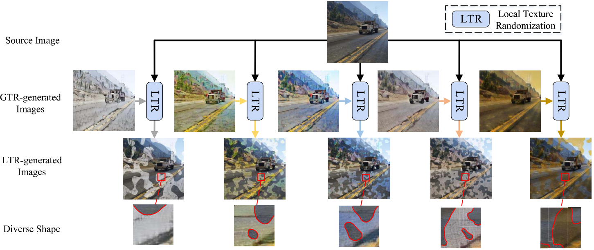
- 
-  , 

## [11 Generalizing Deep Learning for Medical Image Segmentation to Unseen Domains via Deep Stacked Transformation](./domaingeneralization/Generalizing%20Deep%20Learning%20for%20Medical%20Image%20Segmentation%20to%20Unseen%20Domains%20via%20Deep%20Stacked%20Transformation.pdf)
- Zhang L, Wang X, Yang D, et al./2020/IEEE Transactions on Medical Imaging/241
- Common **transfer learning** and **domain adaptation** techniques are proposed to address Domain Shift. However, these solutions **require data** (and annotations) from the target domain to **retrain the model**, and is therefore restrictive in practice for widespread model deployment. Ideally, we wish to have a trained (locked) model that **can work uniformly well across unseen domains without further training**.    
- In this paper, we propose a deep stacked transformation approach for **single source domain generalization**. Specifically, **a series of n=9 stacked transformations are applied to each image during network training**. The underlying **assumption** is that the “expected” domain shift for a specific medical imaging modality could be **simulated** by applying extensive data augmentation on a single source domain, and consequently, a deep model trained on the **augmented “big” data** (BigAug) could generalize well on unseen domains.
- **Transfer learning** is able to overcome some of the aforementioned issues by only requiring a small amount of annotated data in the unseen domain; however, *it is limited in use due to the lack of pre-trained models developed on a large amount of medical imaging data*.
- **Domain Adaptation**: the assumption of a known target domain requires specific image samples need to be collected (or even labeled) and a new model needs to be retrained before deployment. *It is not feasible to obtain a pair of source and target domain images to implement the domain adaptation for every new application*.
- 
- two parameters: 1) the probability p to apply the function and 2) the magnitude m of the function. Image processing functions are mainly used to alter the three
aspects (**image quality, appearance, and spatial configuration**) of medical images.
- 1) **Image Quality**: *sharpness*, *blurriness*, and *noise level* are often associated with different image qualities in medical imaging.
- 2) **Image Appearance**: The appearance difference of medical imaging is related to the statistical characteristics of image intensities, such as variations of *brightness and contrast, and intensity perturbation*, which result from different scanners and scanning protocols.
- 3) **Spatial variations** may include *rotation* (e.g., caused by different patient orientations during scanning), *scaling* (e.g., variation of organ/lesion size), and
*deformation* (e.g., caused by organ motion or abnormality)
- 
- As far as we know, we are the first to investigate data augmentation for unseen domain generalization in medical imaging deep learning.

## [12 Causality-Inspired Single-Source Domain Generalization for Medical Image Segmentation](./domaingeneralization/Causality-Inspired%20Single-Source%20Domain%20Generalization%20for%20Medical%20Image%20Segmentation.pdf)
- Ouyang C, Chen C, Li S, et al./2022/IEEE Transactions on Medical Imaging/27
- For the **single-source domain generalization problem**, we propose a simple **causality-inspired data augmentation** approach to expose a segmentation model to **synthesized domain-shifted training examples**. 
- Specifically, **1)** to make the deep model robust to discrepancies in **image intensities and textures**, we employ **a family of randomly-weighted shallow networks**. They augment training images using diverse appearance transformations. **2)** Further we show that **spurious correlations among objects in an image are detrimental to domain robustness**. These correlations might be taken by the network as domain-specific clues for making predictions, and they may break on unseen domains. We remove these spurious correlations via causal intervention. This is achieved by resampling the appearances of potentially correlated objects independently.
- **Shifted Domain-Dependent Features**: Domain-dependent features include **intensities** and **textures**, which constitute image appearance. However, Deep networks are **susceptible** to shifts in intensity and texture. This is in contrast to human annotators: they can easily find the correspondence of the same anatomical
**structure** across different domains, usually by focusing on the **shape information** that is domain-invariant and is intuitively **causal** to human-defined segmentation masks, compared with intensity/texture.
- **Shifted-Correlation Effect**: Due to a **confounder**, objects in the background might be correlated but **not causally** related to the objects of interest. The
network might take these objects in the background as clues for recognizing the objects of interest.
- 
- We **aim** to **1)** steer the network toward shape information which is domain-invariant and is intuitively causal to segmentation results; **2)** to immunize the segmentation model against the shifted-correlation effect, by removing the confounder that spuriously correlates objects in the background and the objects of interest during training.
- **Cutout** strengthens robustness against the feature missing caused by domain shift, by partially occluding training images. **Mixup** regularizes decision boundaries by interpolating among training samples. **RandConv** drives the network to learn shape information, which is domain-invariant, by randomly altering image textures using linear filtering.
- 
-  , 

## [13 Learning to Diversify for Single Domain Generalization](./domaingeneralization/Learning%20to%20Adapt%20Structured%20Output%20Space%20for%20Semantic%20Segmentation.pdf)
- Wang Z, Luo Y, Qiu R, et al./2021/ICCV/100
- Domain generalization (DG) aims to generalize a model trained on **multiple source domains** to a distributionally different target domain. In contrast to the conventional DG that *strictly requires the availability of multiple source domains*, this paper considers a more **realistic yet challenging** scenario, namely Single Domain Generalization (Single-DG), where only one source domain is available for training.
- In this scenario, the limited diversity may jeopardize the model generalization on unseen target domains. To tackle this problem, we propose a **style-complement module** to enhance the generalization power of the model by synthesizing images from diverse distributions that are complementary to the source ones. More specifically, we adopt a tractable upper bound of mutual information (MI) between the generated and source samples and perform a **two-step optimization iteratively**: (1) by **minimizing** the MI upper bound approximation for each sample pair, *the generated images are forced to be diversified from the source samples*; (2) subsequently, we **maximize** the MI between the samples from the same semantic category, which assists the network to *learn discriminative features from diversestyled images*.
- 

## [14 Self-Challenging Improves Cross-Domain Generalization](./domaingeneralization/Self-Challenging%20Improves%20Cross-Domain%20Generalization.pdf)
- Huang Z, Wang H, Xing E P, et al. /2020/ECCV/383
- Convolutional Neural Networks (CNN) conduct image classification by **activating dominant features that correlated with labels**. Representation Self-Challenging (RSC) iteratively challenges (**discards** the representations associated with the higher gradients at each epoch) the dominant features activated on the training data, and forces the network to activate remaining features that correlates with labels. This process appears to activate feature representations applicable to out-of-domain data **without prior knowledge of new domain and without learning extra network parameters**. 
- The experiments endorse the **simple, effective, and architecture-agnostic** nature of our RSC method.
- *How to train a model that generalizes to an arbitrary domain with only the training samples, but not the corresponding domain information, as these domain information may not be available in the real world.* Our paper builds upon DG set-up and aims to offer a solution that allows the model to be robustly trained without domain information and to empirically perform well on unseen domains.     
- 

## [15 Domain Generalization by Solving Jigsaw Puzzles](./domaingeneralization/Domain%20Generalization%20by%20Solving%20Jigsaw%20Puzzles.pdf)
- Carlucci F M, D'Innocente A, Bucci S, et al./2019/CVPR/688
- Human adaptability relies crucially on the ability to learn and merge knowledge both from **supervised and unsupervised learning**: *the parents point out few important concepts, but then the children fill in the gaps on their own. This is particularly effective, because supervised learning can never be exhaustive and thus learning autonomously allows to discover **invariances** and **regularities** that help to generalize*.
- In this paper we propose to apply a similar approach to the task of object recognition across domains: our model learns the semantic labels in a supervised fashion, and broadens its understanding of the data by learning from self-supervised signals how to solve a jigsaw puzzle on the same images. This secondary task helps the network to learn the concepts of spatial correlation while acting as a regularizer for the classification task.
- 

## [16 Generalizable Cross-modality Medical Image Segmentation via Style Augmentation and Dual Normalization](./domaingeneralization/Generalizable%20Cross-modality%20Medical%20Image%20Segmentation%20via%20Style%20Augmentation%20and%20Dual%20Normalization.pdf)
- Zhou Z, Qi L, Yang X, et al./2022/CVPR/-
- Generalizable Cross-modality Segmentation: a model was only trained using MR images in **source domain**, and its performance to directly segment CT images in **target domain**. It's clinical potential. 
- The **distribution shift** between training (or labeled) and test (or unlabeled) data usually **results in** a severe performance degeneration during the deployment of trained segmentation models. The reason for distribution shift typically come from different aspects, e.g., *different acquisition parameters, various imaging methods* or **diverse modalities**.
- Unsupervised Domain Adaptation (**UDA**) is trained on labeled source domain (i.e., training set) along with unlabeled target domain (i.e., test set), by **reducing their domain gap**. It's assuming that **test or unlabeled data could be observed** (However, the condition is hard to meet).
- Domain Generalization (**DG**) by training models purely on source domains, aims to **directly generalize** to target domains that *could not be observed during the training process*.
- 
- 
- 
- 
- ,
- ,

## [17 Meta-causal Learning for Single Domain Generalization](./domaingeneralization/Meta-causal%20Learning%20for%20Single%20Domain%20Generalization.pdf)
- Chen J, Gao Z, Wu X, et al./2023/CVPR/2
- Existing methods focus on **expanding the distribution** of the training domain to cover the target domains and learning adaptive data normalization, but **without estimating the domain shift** between the source and target domains. This work proposed a new learning paradigm **simulate-analyze-reduce**, which first simulates the domain shift by building an auxiliary domain as the target domain, then learns to analyze the causes of domain shift, and finally learns to reduce the domain shift for model adaptation.
- Under this paradigm, we propose a meta-causal learning method to learn meta-knowledge, that is, how to infer the causes of domain shift between the auxiliary and source domains **during training**. We use the meta-knowledge to analyze the shift between the target and source domains **during testing**.
- 
- 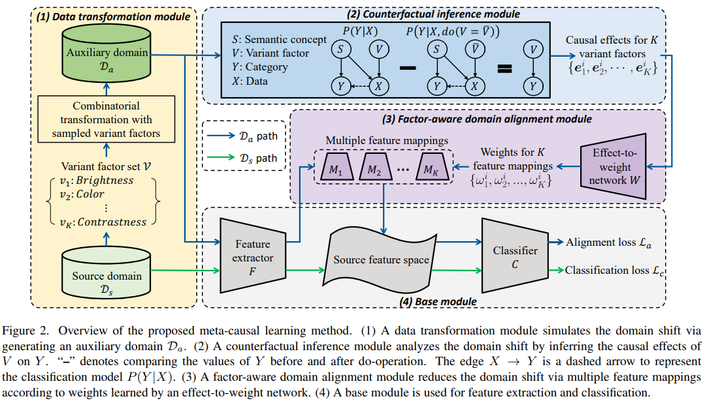
- 

## [18 Domain Generalization with Mixstyle](./domaingeneralization/Domain%20generalization%20with%20mixstyle.pdf)
- Zhou K, Yang Y, Qiao Y, et al./2021/ICLR/415
- Such style information is captured by **the bottom layers of a CNN** where our proposed style-mixing takes place. *Mixing styles of training instances results in novel domains being synthesized implicitly, which increase the domain diversity of the source domains, and hence the generalizability of the trained model.*
- 
- 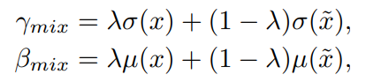 , 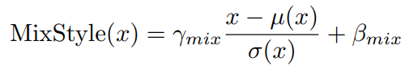
- 

## [19 Adaptive Texture Filtering for Single-Domain Generalized Segmentation](./domaingeneralization/Adaptive%20Texture%20Filtering%20for%20Single-Domain%20Generalized%20Segmentation.pdf)
- Li X, Li M, Wang Y, et al./2023/AAAI/-
- Existing methods diversify images in the source domain by adding complex or even abnormal textures to **reduce the sensitivity to domain-specific features**. However, these approaches depend heavily on **the richness of the texture bank, and training them can be time-consuming**. In contrast to importing textures arbitrarily or augmenting styles randomly, we focus on **the single source domain itself** to achieve generalization.
- Adaptive texture filtering (ATF) mechanism to suppress the influence of texture without using augmentation, thus **eliminating the interference of domain-specific features**. Hierarchical guidance generalization network (HGGN) equipped with structure-guided enhancement modules, which purpose is to **learn the domain-invariant generalized knowledge** under contour supervision.
- 
- The adaptive strength predictor (ASP) predicts the filtering intensity/strength parameter λa by calculating the mean µ and variance σ^2 of the extracted features. The texture filtering generator (TFG) is responsible for generating the **content-dependent** image I_c and **texture-dependent** image I_t.
- 
- Although the filtering operation can preserve the contour of objects, some **internal structure information** of the object would be removed during this processing. However, the internal structure information is also helpful for the segmentation task.
- Many previous works like have proved the effectiveness of IN on style normalization, but **the spatial feature representation might be weakened during IN**. However, in the DG semantic segmentation task, the spatial features after IN need to be highlighted due to **the similar structural information among different domains**.
- 

## [20 Rethinking Data Augmentation for Single-Source Domain Generalization in Medical Image Segmentation](./domaingeneralization/Rethinking%20Data%20Augmentation%20for%20Single-Source%20Domain%20Generalization%20in%20Medical%20Image%20Segmentation.pdf)
- Su Z, Yao K, Yang X, et al./2023/AAAI/3
- For SDG, Previous attempts most conduct **global-only/random augmentation**. Their augmented samples are usually insuffcient in **diversity and informativeness**, thus failing to **cover the possible target domain distribution**.
- Motivated by **the class-level representation invariance and style mutability of medical images**, we hypothesize that* unseen target data can be sampled from a linear combination of C (the class number) random variables*, where each variable follows a location-scale distribution at the class level. Accordingly, data augmented can be readily made by sampling the random variables through a general form.
- A Saliency-balancing Fusion mechanism is further proposed to enrich the informativeness by engaging the gradient information, **guiding augmentation with proper orientation and magnitude**.
- 
- Although previous augmentation methods have led to impressive results in generalization tasks, they suffer from the following **limitations in medical image segmentation**: 1) Global-only augmentation performing transformation on the whole image limits the diversity of augmented images. 2) Random augmentation considers no constraint on the distribution of the augmented samples, which may lead to *over-generalization and cause performance degradation*. 3) General-task-specifc augmentation specially designed for natural image is restricted from medical image tasks.
- 
- 

## [21 Single-Domain Generalization in Medical Image Segmentation via Test-Time Adaptation from Shape Dictionary](./domaingeneralization/Single-Domain%20Generalization%20in%20Medical%20Image%20Segmentation%20via%20Test-Time%20Adaptation%20from%20Shape%20Dictionary.pdf)
- Liu Q, Chen C, Dou Q, et al./2022/AAAI/6 (**Writing**)
- For SDG, this work extracts and integrates the semantic **shape prior information** (learned by Dictionary Learning) of segmentation that are invariant across domains and can be well-captured even from single domain data to facilitate segmentation under distribution shifts. Besides, a **test-time adaptation strategy with dual-consistency regularization** (test sample as a hit) is further devised to promote dynamic incorporation of these shape priors under each unseen domain to improve model generalizability.
- 

# VII. Test Time Adaptation

## [00 DLTTA: Dynamic Learning Rate for Test-Time Adaptation on Cross-Domain Medical Images](./testtimeadaptation/DLTTA%20Dynamic%20Learning%20Rate%20for%20Test-Time%20Adaptation%20on%20Cross-Domain%20Medical%20Images.pdf)
- Yang H, Chen C, Jiang M, et al./2022/IEEE Transactions on Medical Imaging/4 (**Writing**)
- Previous TTA methods have a common limitation of using a **fixed learning rate for all the test samples**. Such a practice would be sub-optimal for TTA, because test data may arrive sequentially therefore **the scale of distribution shift would change frequently**.
- DLTTA, which **dynamically modulates the amount of weights update** for each test image to account for the differences in their distribution shift. Specifically,our DLTTA is equipped with a **memory bank** based estimation scheme to effectively measure **the discrepancy of a given test sample**. Based on this estimated discrepancy, a dynamic learning rate adjustment strategy is then developed to achieve a suitable degree of adaptation for each test sample.
- UDA setting is still problematic for real-world model deployment due to two important reasons. **Firstly**, it is not efficient, if realistic, to wait for the **accumulation of sufficient amount of test samples** (e.g., thousands of instances), since the test data usually arrive sequentially one by one, or batch by batch. However, immediate prediction on a single test sample or a batch of instances is highly desired in clinical practice for timely diagnosis and treatment for patients. **Secondly**, accessing the training dataset at test time is practically difficult, because data sharing across hospitals is prohibitive due to the **privacy concern** for medical data. (TTA Setting Motivation)
- This work's **insight** is to achieve dynamic learning rate adjustment according to a estimated distribution shift. *How to measure the discrepancy solely based on the model parameters and the current test sample in an unsupervised way is challenging and remains unsolved yet*.
- Our proposed **memory bank-based** discrepancy measurement captures **both the model progress and the distribution variation of test data**, thus can provide more up-to-date discrepancy estimation for effective dynamic learning rate adjustment of test-time adaptation.
- 
- 

## [01 Continual Test-Time Domain Adaptation](./testtimeadaptation/Continual%20Test-Time%20Domain%20Adaptation.pdf)
- Wang Q, Fink O, Van Gool L, et al./2022/CVPR/68
- Test-time domain adaptation aims to adapt a **source pretrained model** to a target domain **without using any source data**. Existing works mainly consider the case where the target domain is **static**. However, real-world machine perception systems are running in non-stationary and **continually changing environments** where the target domain distribution can change over time.
- Existing methods, which are mostly based on **self-training and entropy regularization**, can suffer from these non-stationary environments. Due to the distribution shift over time in the target domain, pseudo-labels become unreliable. The noisy pseudo labels can further lead to **error accumulation and catastrophic forgetting**.
- to reduce the **error accumulation** by using **weight-averaged and augmentation-averaged predictions** which are often more accurate; to avoid **catastrophic forgetting**, we propose to **stochastically restore a small part of the neurons** to the source pre-trained weights during each iteration to help preserve source knowledge in the long-term.
- 
- 

## [02 Test-Time Training with Self-Supervision for Generalization under Distribution Shifts](./testtimeadaptation/Test-Time%20Training%20with%20Self-Supervision%20for%20Generalization%20under%20Distribution%20Shifts.pdf)
- Sun Y, Wang X, Liu Z, et al./2020/ICML/325
- We start from a simple observation. The **unlabeled test sample x presented at test time gives us a hint about the distribution from which it was drawn**. 
- 
- The joint training loss: 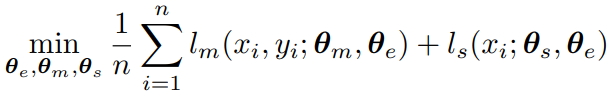
- The standard version of Test-Time Training:
- 
- On each test sample x, we perform the exact same set of random transformations as for data augmentation during training, to **form a batch only containing these augmented copies of x** for Test-Time Training.
- 
- **For the standard version of Test-Time Training**, we take **ten gradient steps**, using batches independently generated by **the same image**. **For online version of Test-Time Training**, we take only **one gradient step** given each new image.

## [03 Tent: Fully test-time adaptation by entropy minimization](./testtimeadaptation/Tent%20Fully%20test-time%20adaptation%20by%20entropy%20minimization.pdf)
- Wang D, Shelhamer E, Liu S, et al./2021/ICLR/370
- A model must adapt itself to generalize to new and different data during testing. In this setting of **fully test-time adaptation** the model has **only the test data and its own parameters**. We propose to adapt by test entropy minimization (Tent): we **optimize the model for confidence as measured by the entropy of its predictions**. In minimizing entropy, the model **adapts itself to feedback from its own predictions**.This is **truly self-supervised self-improvement**.
- Real-world usage motivates fully test-time adaptation by **data, computation, and task needs**:
  1. Availability. A model might be distributed without source data for bandwidth, privacy, or profit.
  2. Efficiency. It might not be computationally practical to (re-)process source data during testing.
  3. Accuracy. A model might be too inaccurate without adaptation to serve its purpose.
- **Entropy is related to error**, as more confident predictions are all-in-all more correct. **Entropy is related to shifts due to corruption**, as more corruption results in more entropy, with a strong rank correlation to the loss for image classification as the level of corruption increases.
- 
- 
- 
- Test-time Entropy:  
- The model parameters θ are a natural choice for test-time optimization. However, θ is the only representation of the training/source data in our setting, and altering θ could **cause the model to diverge from its training**. Furthermore, f can be nonlinear and θ can be high dimensional, making **optimization too sensitive and inefficient for test-time usage**. For stability and efficiency, we instead only update **feature modulations that are linear (scales and shifts), and low-dimensional (channel-wise)**.
- 
- 

## [04 Autoencoder based self-supervised test-time adaptation for medical image analysis](./testtimeadaptation/Autoencoder%20based%20self-supervised%20test-time%20adaptation%20for%20medical%20image%20analysis.pdf)
- He Y, Carass A, Zuo L, et al./2021/Medical Image Analysis/42
- Here, we ask whether we can design a model that, once distributed to users, can quickly adapt itself to each new site without expensive retraining or access to the source training data?  
- **Our model includes three parts**: 1) a task model (T) which performs medical image analysis tasks of synthesis or segmentation, 2) a set of autoencoders (AEs) which are used as a similarity measurement, 3) a set of adaptors (As) which are used to transform test image and features to be similar to the source. The task model and autoencoders are trained on labeled source training data and kept fixed during deployment. 
- 
- 

## [05 Improved Test-Time Adaptation for Domain Generalization](./testtimeadaptation/Improved%20Test-Time%20Adaptation%20for%20Domain%20Generalization.pdf)
- Chen L, Zhang Y, Song Y, et al./2023/CVPR/4
- a Test Time Training (TTT) strategy hinges its performance on two main factors: selecting an **appropriate auxiliary TTT task** for updating and **identifying reliable parameters** to update during the test phase. Both previous arts and our experiments indicate that TTT may not improve but be detrimental to the learned model if those two factors are not properly considered.
- This work addresses those two factors with: First, instead of heuristically defining an auxiliary objective, we propose a learnable consistency loss for the TTT task, which contains learnable parameters that can be adjusted toward **better alignment between our TTT task and the main prediction task**.  Second, we introduce additional adaptive parameters for the trained model, and we suggest **only updating the adaptive parameters during the test phase**.
- , 

## [06 Decorate the Newcomers: Visual Domain Prompt for Continual Test Time Adaptation](./testtimeadaptation/Decorate%20the%20Newcomers%20Visual%20Domain%20Prompt%20for%20Continual%20Test%20Time%20Adaptation.pdf)
- Gan Y, Bai Y, Lou Y, et al./2023/CVPR/13/Outstanding Student Paper
- For CTTA problem, existing methods mainly focus on model-based adaptation in a **self-training manner**, such as predicting pseudo labels for new domain datasets. Since pseudo labels are noisy and unreliable, these methods suffer from **catastrophic forgetting and error accumulation** when dealing with dynamic data distributions. (The domain-specifc prompt and domain-agnostic prompt are dynamically updated a small portion of the input image pixels, parameter matrix, summed up point by point)
- Motivated by the prompt learning in NLP, in this paper, we propose to learn an **image-level visual domain prompt** for target domains while having the source model parameters frozen. During testing, the changing target datasets can be adapted to the source model by **reformulating the input data with the learned visual prompts**. This **transition from the model-dependent paradigm to the model-free** one enables us to bypass the catastrophic forgetting and error accumulation problems.
- The domain-specifc prompt (DSP) aims to **extract current domain knowledge**, while the domain-agnostic prompt (DAP) produces an effect on **maintaining the domain-shared knowledge**.  It is worth noting that the size and position of DSP and DAP are fexible.
- 
- 

# VIII. Others

## [00 Fully Convolutional Networks for Semantic Segmentation](./segmentation/Fully%20Convolutional%20Networks%20for%20Semantic%20Segmentation.pdf)
- Long J, Shelhamer E, Darrell T./2015/CVPR/26993
- FCN use **classification networks**(AlexNet, VGG, GoogleNet & ResNet) as backbone and just change the fully connection layer to convolutional layer (keep the number of parameters). Then define a skip architecture that combines semantic information from **a deep, coarse layer** with appearance information from **a shallow, fine layer** to produce accurate and detailed segmentations.
- 
- 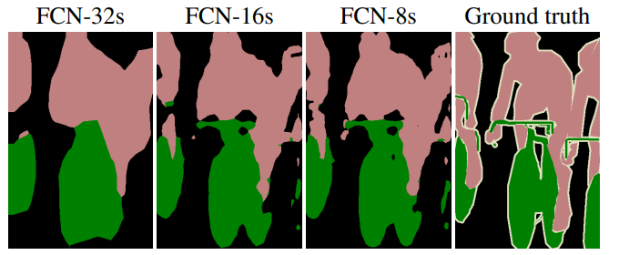
- 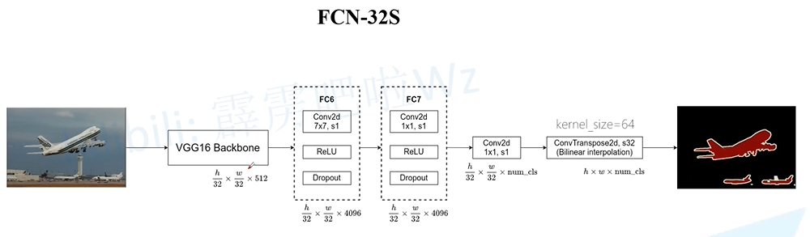
- 
- 

## [01 Pyramid Scene Parsing Network](./segmentation/Pyramid%20Scene%20Parsing%20Network.pdf)
- Zhao H, Shi J, Qi X, et al./2017/CVPR/7411
- Important Observations about FCN in ADE20K: 1) **Mismatched Relationship**: FCN is lack of the ability to **collect contextual information** increases the chance of misclassification. 2) **Confusion Categories**: There are confusing classfication in the ADE20K like field and earth, mountain and hill etc. FCN can not judge them in the segmentation task. This problem can be remedied by utilizing **the relationship between categories**. 3) **Inconspicuous Classes**: Serveral small-size things are hard to find while may be greate importance like streetlights and signboard. However, big objects or stuff may exceed the receptive field of FCN and thus cause discontinuous prediction. To improve performance for remarkably small or large objects, one should **pay much attention to different sub-regions** that contain inconspicuous-category stuff.
- 

## [02 DRANet: Disentangling Representation and Adaptation Networks for Unsupervised Cross-Domain Adaptation](./disentanglement/DRANet%20Disentangling%20Representation%20and%20Adaptation%20Networks%20for%20Unsupervised%20Cross-Domain%20Adaptation.pdf)
- Lee S, Cho S, Im S./2021/CVPR/25
- Unlike the existing domain adaptation methods that **learn associated features sharing a domain**, DRANet **preserves the distinctiveness of each domain’s characteristics**. Our model encodes individual representations of **content (scene structure) and style (artistic appearance)** from both source and target images. Then, it adapts the domain by **incorporating the transferred style factor** into the content factor along with learnable weights specified for each domain. This learning framework allows **bi-/multi-directional domain adaptation** with a single encoder-decoder network and aligns their domain shift. Additionally, we propose a **content-adaptive domain transfer module** (The key idea of this module is to search the target features whose content component is most similar to the source features. Then, the domain transfer is conducted by reflecting more style information from more suitable target features) that helps retain scene structure while transferring style
- 
- Our intuition behind the network design is that **different domains may have different distributions for their contents and styles**, which cannot be effectively handled by the linear separation of latent vectors. Thus, to handle such difference, our network adopts the **non-linear separation and domain-specific scale parameters** that are dedicated to handle such inter-domain difference.
- 

## [03 Learning Topological Interactions for Multi-Class Medical Image Segmentation](./segmentation/Learning%20Non-target%20Knowledge%20for%20Few-shot%20Semantic%20Segmentation.pdf)
- Gupta S, Hu X, Kaan J, et al./2022/arXiv/-
- Deep Learning based methods are limited in their ability to encode **topological interactions among different classes** (e.g., containment and exclusion). These constraints naturally arise in biomedical images and can be crucial in improving segmentation quality. **topological interaction module** to encode the topological interactions into a deep neural network. The implementation is completely convolution-based and thus can be very efficient. This empowers us to incorporate the **constraints** into *end-to-end training and enrich the feature representation of neural networks*.
- 
- 
- Standard deep neural networks cannot learn **global structural constraints** regarding semantic labels, which can often be critical in biomedical domains. While existing works mostly focus on encoding the topology of a **single label** , limited progress has been made addressing the constraints regarding interactions between **different labels**. Even strong methods (e.g., nnUNet) may fail to preserve the constraints as they **only optimize per-pixel accuracy**.
- To encode such **interaction constraints** into convolutional neural networks is **challenging**; it is hard to directly encode hard constraints into kernels while **keeping them learnable**. Traditional methods do not apply to deep neural networks, which *do not rely on a global optimization for the inference*. More importantly, the optimization is **not differentiable and thus cannot be incorporated into training**. A desirable solution should be **efficient and learnable**. 
- The key observation is that a broad class of topological interactions, namely, **enclosing and exclusion**, boils down to **certain impermissible label combinations of adjacent pixels/voxels**. The idea is to go through all pairs of adjacent pixels/voxels and identify the pairs that **violate the desired constraints**. Pixels belonging to these pairs are the ones inducing errors into the topological interaction. We will refer to them as **critical pixels**.
- 
- 

## [04 Large-Kernel Attention for 3D Medical Image Segmentation](./segmentation/Large-Kernel%20Attention%20for%203D%20Medical%20Image%20Segmentation.pdf)
- Li H, Nan Y, Del Ser J, et al./2022/arXiv/-
- In 3D medical images, organs often **overlap and are complexly connected**, characterized by extensive anatomical variation and low contrast. In addition, **the diversity of tumor shape, location, and appearance**, coupled with the dominance of background voxels, makes accurate 3D medical image segmentation difficult.
- The advantages of **convolution** and **self-attention** are combined in the proposed LK attention module, including local contextual information, long-range dependence, and channel adaptation. 
- 
- 

## [05 Two-Stream UNET Networks for Semantic Segmentation in Medical Images](./segmentation/Two-Stream%20UNET%20Networks%20for%20Semantic%20Segmentation%20in%20Medical%20Images.pdf)
- Chen X, Ding K./2022/arXiv/-
- The deeper and larger models are limited to medical segmentation because of the following challenges:
    1. **Properties of medical datasets**. *Size of medical image datasets are tiny*. Privacy of patient information and labelling cost restrict to build large scale image datasets. Also, due to clinical applications, *the number of categories is small*, in general less than five and even only one. As a result, on average, size of the medical datasets is only one tenth or less than that of natural images.
    2. **Properties of medical images themselves**. There are two challenges to train deeper models on medical images. First, medical images have *similar intensities of pixels*. Second, some factors of *medical acquisition* such as sampling artifacts, spatial aliasing, and some of the dedicated noise of modalities cause the indistinct and disconnected boundary's structures. a question arises: *can we design a new architecture, in which multiple low-level features are fed into CNNs models and they can work on these multiple features*?
- GVF is the **vector field** that is produced by a process that smooths and diffuses an input vector field. It is usually used to create a vector field from images that points to **object edges** from a distance. If we consider semantic segmentation as pixel **moving to boundary task**, the **VS is trained to learn how pixels move to the object boundary**, and the **SS is train to learn to recognize objects**. It is obvious that it is an exact process of the image semantic segmentation task. 
- There are two major reasons that two-stream networks are **well-suited** for medical image segmentation: **(1) Each objects (organs) in medical images have their-owned shape. and (2) The relationship among the location of the objects are fixed.**
- 

## [06 Style and Content Disentanglement in Generative Adversarial Networks](./disentanglement/Style%20and%20Content%20Disentanglement%20in%20Generative%20Adversarial%20Networks.pdf)
- Kazemi H, Iranmanesh S M, Nasrabadi N./2019/WACV/52
- Disentangling factors of variation within data has become a very challenging problem for image generation tasks. Current frameworks for training a Generative Adversarial Network (GAN), learn to disentangle the representations of the data in an unsupervised fashion and capture the most significant factors of the data variations. However, these approaches **ignore the principle of content and style disentanglement in image generation, which means their learned latent code may alter the content and style of the generated images at the same time**.
- We assume that **the representation of an image can be decom posed into a content code that represents the geometrical information of the data, and a style code that captures textural properties**. The proposed SC-GAN has two components: **a content code** which is the input to the generator, and **a style code** which modifies the scene style through modification of the Adaptive Instance Normalization (AdaIN) layers’ parameters.
- The proposed SC-GAN takes a **random code z** = (zc, zs) composes of a content code zc and a style code zs as input, and synthesizes an output image, G(z). However, **the network needs a mechanism to learn relating the content of the generated image to the content code and its style to the style code.** In particular, the content of the generated image is supposed to be intact as long as zc remains unaltered, despite the value of zs, and vice versa.
- Total Loss = Content Consistency Loss + Style Consistency Loss + Content Diversity Loss + Style Diversity Loss + MinMax Loss
- 
- The major experiments network: 

## [07 Content and Style Disentanglement for Artistic Style Transfer](./disentanglement/Content%20and%20Style%20Disentanglement%20for%20Artistic%20Style%20Transfer.pdf)
- Kotovenko D, Sanakoyeu A, Lang S, et al./2019/ICCV/102
- Artists rarely paint in a single style throughout their career. More often they change styles or develop variations of it. In addition, artworks in different styles and even within one style depict real content differently. To produce artistically convincing stylizations, style transfer models must be able to reflect these **changes and variations**.
- We present a novel approach which captures particularities of style and the variations within and separates style and content. This is achieved by introducing two novel losses: **a fixpoint triplet style loss** to learn subtle variations within one style or between different styles and **a disentanglement loss** to ensure that the stylization is not conditioned on the real input photo.
- 

