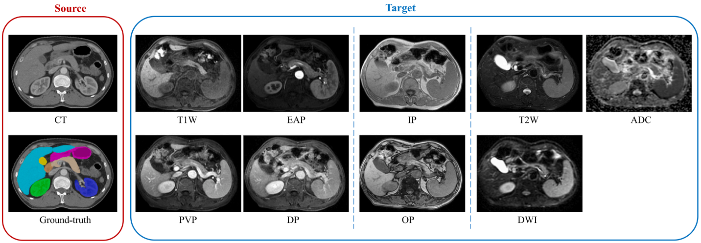

<!-- TOC -->

- [I. multi-organ segmentation with partially supervision or partially labeled datasets](#i-multi-organ-segmentation-with-partially-supervision-or-partially-labeled-datasets)
  - [1. multi-organ segmentation](#1-multi-organ-segmentation)
  - [2. multi-organ segmentation in partially labeled datasets via continue learning](#2-multi-organ-segmentation-in-partially-labeled-datasets-via-continue-learning)
  - [3. multi-organ segmentation \& partially labeled datasets \& federated learning](#3-multi-organ-segmentation--partially-labeled-datasets--federated-learning)
- [II. one-to-multiple unsupervised domain adaptation](#ii-one-to-multiple-unsupervised-domain-adaptation)
  - [1. one-to-multiple unsupervised domain adaptation in federated learning](#1-one-to-multiple-unsupervised-domain-adaptation-in-federated-learning)
  - [2. one-to-multiple unsupervised domain adaptation in source-free fashion](#2-one-to-multiple-unsupervised-domain-adaptation-in-source-free-fashion)
- [III. multi-modal segmentation with modality missing](#iii-multi-modal-segmentation-with-modality-missing)
  - [1.](#1)
- [Others](#others)
  - [1. informed machine learning \& multi-organ segmentation](#1-informed-machine-learning--multi-organ-segmentation)
  - [2. Contrastive pre-training for multi-modal brain tumor segmentation with limited annotations](#2-contrastive-pre-training-for-multi-modal-brain-tumor-segmentation-with-limited-annotations)

<!-- /TOC -->

<!-- ************** Interesting and Practical Medical Tasks/Scenarios ************** -->

<!-- 相关的工作较少 -->
# I. multi-organ segmentation with partially supervision or partially labeled datasets

- 

## 1. multi-organ segmentation
- 
- 

## 2. multi-organ segmentation in partially labeled datasets via continue learning
- 
- 

## 3. multi-organ segmentation & partially labeled datasets & federated learning
- 
- 

<!-- 相关的工作较少 -->
# II. one-to-multiple unsupervised domain adaptation

- 

## 1. one-to-multiple unsupervised domain adaptation in federated learning

## 2. one-to-multiple unsupervised domain adaptation in source-free fashion

<!-- 相关的工作较多 -->
# III. multi-modal segmentation with modality missing

- 

## 1. 

# Others

<!-- 相对位置关系作为先验知识：车不会在天上飞 -->
## 1. informed machine learning & multi-organ segmentation

<!-- 不同模态或序列之间利用对比学习进行预训练，在标签有限的情况下提升模型性能 -->
## 2. Contrastive pre-training for multi-modal brain tumor segmentation with limited annotations
- Target：提升模型在每个模态的分割性能，以及多模态医疗影像最终的分割性能（融合&集成）
- BraTS（T2, Flair, T1, T1ce）& Vestibular Schwannoma (T2, T1ce) **Paird data?**
- 负样本的选取，模态层级（Modality Discrimination, ModDis） & 样本层级（Instance Discrimination, InsDis）
- 多个正样本时如何训练，如BraTS数据集
- MCM为每个视角设计了相应的网络，能否只用一个网络*
