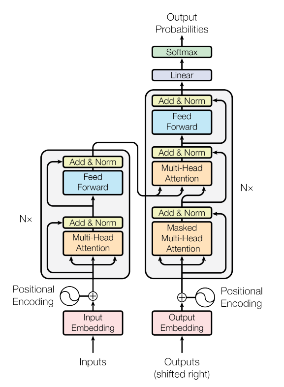
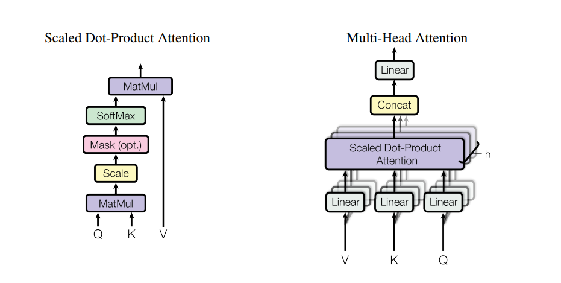
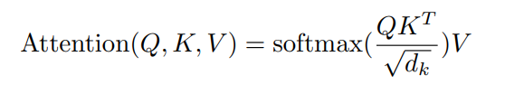
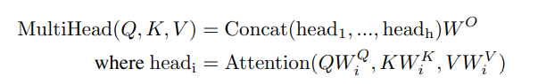
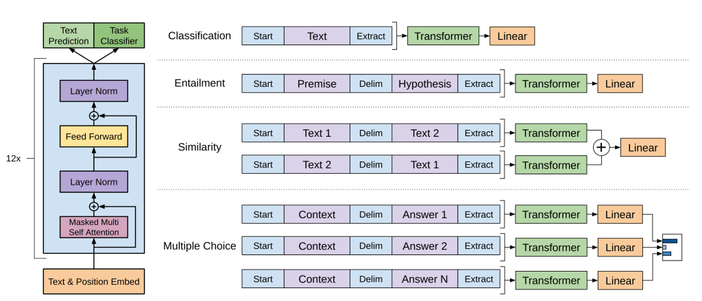
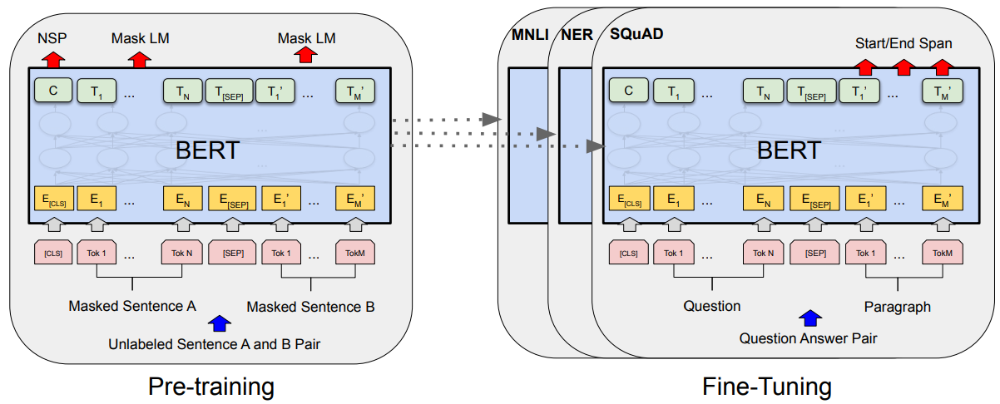
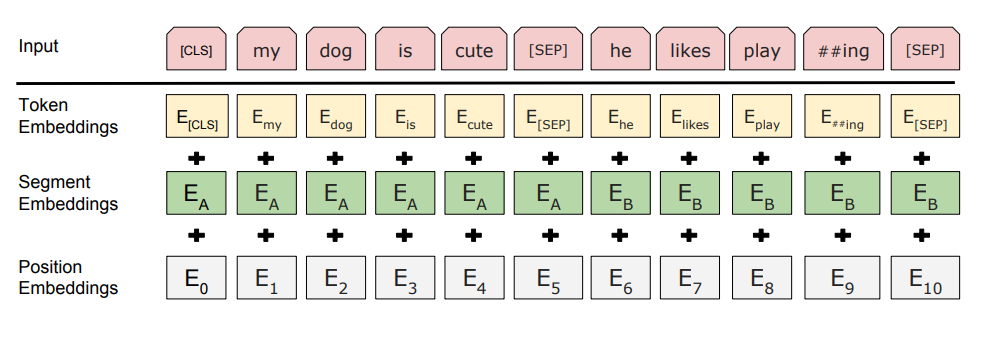

<!-- TOC -->

- [00 Attention Is All You Need](#00-attention-is-all-you-need)
- [01 Improving Language Understanding by Generative Pre-Training](#01-improving-language-understanding-by-generative-pre-training)
- [02 BERT: Pre-training of Deep Bidirectional Transformers for Language Understanding](#02-bert-pre-training-of-deep-bidirectional-transformers-for-language-understanding)

<!-- /TOC -->

## [00 Attention Is All You Need](./Attention%20Is%20All%20You%20Need.pdf)
- Vaswani A, Shazeer N, Parmar N, et al./2017/NIPS/41767
- We propose a **new simple** network architecture, the Transformer, based solely on **attention mechanisms**, which can be described as mapping a **query** and a set of **key-value** pairs to an output, dispensing with recurrence and convolutions entirely.
- 
- 
- To facilitate these residual connections, all sub-layers in the model, as well as the embedding layers, produce outputs of dimension **d_model = 512**. This is not same with the design of CNN (wide & shallow -> narrow & deep). 
- This **masking**, combined with fact that the output embeddings are offset by one position, ensures that the predictions for position i can depend only on the known outputs at positions **less than i**. (**Multi-Head Attention with mask** )
- 
- We suspect that for **large values of d_k**, the dot products grow large in magnitude, pushing the softmax function into regions where it has **extremely small gradients**. To counteract this effect, we scale the dot products by 1/sqrt(d_k). So the attention is called **Scaled Dot-Product Attention**.
- Multi-head attention allows the model to jointly attend to information from different representation subspaces at different positions. We can use **different attention function**(distence function) to compute the weight between the query with every key. (It's same to multi channel in CNN)
- 
- we found it beneficial to linearly project the queries, keys and values h times with different, learned linear projections to dk, dk and dv dimensions, respectively. Multi-head attention allows the model to jointly attend to information from **different representation subspaces at different positions**.

## [01 Improving Language Understanding by Generative Pre-Training](./GPT-1%20Improving%20Language%20Understanding%20by%20Generative%20Pre-Training.pdf)
- Radford A, Narasimhan K, Salimans T, et al./2018/3591
- Leveraging more than word-level information from unlabeled text is challenging for two main reasons. **First**, it is unclear what type of **optimization objectives** are most effective at learning text representations that are useful for transfer. **Second**, there is no consensus on **the most effective way** to transfer these learned representations to the target task.
- We employ a two-stage training procedure. First, we use a language modeling objective on the unlabeled data to learn the initial parameters of a neural network model (**unsupervised pre-training**). Subsequently, we adapt these parameters to a target task using the corresponding supervised objective (**supervised fine-tuning**). Our goal is to learn a **universal representation** that transfers with **little adaptation** to a wide range of tasks. 
- **GPT-2: more parameter & more data with Zero-shot setting / task**
- **GPT-3: more parameter & more data with Few-shot setting / task and without parameter unpdated in fine-tuning stage**
- 

## [02 BERT: Pre-training of Deep Bidirectional Transformers for Language Understanding](./BERT%20Pre-training%20of%20Deep%20Bidirectional%20Transformers%20for.pdf)
- Devlin J, Chang M W, Lee K, et al./2019/arXiv/42594
- The major limitation is that standard language models are **unidirectional** (GPT & ELMo), and this limits the choice of architectures that can be used during pre-training. BERT: **Bidirectional Encoder Representations from Transformers**. BERT alleviates the previously mentioned unidirectionality constraint by using a “**masked language model**” (MLM) pre-training object.  
- The masked language model(**MLM**) randomly **masks some of the tokens** from the input, and the objective is to **predict the original vocabulary id of the masked word** based only on its context. Unlike left-toright language model pre-training, the MLM objective enables the representation to fuse the left and the right context, which allows us to pretrain a deep bidirectional Transformer. In addition to the masked language model, we also use a “**next sentence prediction (NSP)**”  task that jointly pretrains text-pair representations.
- During **pre-training**, the model is trained on **unlabeled data** over **different pre-training tasks**. For **fine tuning**, the BERT model is first **initialized with the pre-trained parameters**, and **all of the parameters** are fine-tuned using labeled data from the downstream tasks.
- 
-  Sentence pairs are packed together into a single sequence. We differentiate the sentences in two ways. First, we separate them with a special token ([SEP]). Second, we add a learned embedding to every token indicating whether it belongs to sentence A or sentence B. The input embeddings are the sum of **the token embeddings**, **the segmentation embeddings** and **the position embeddings**.
- 