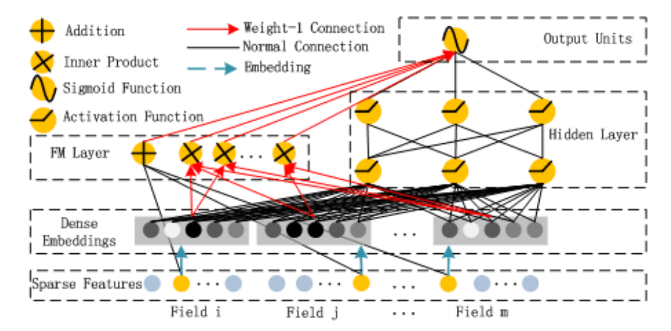
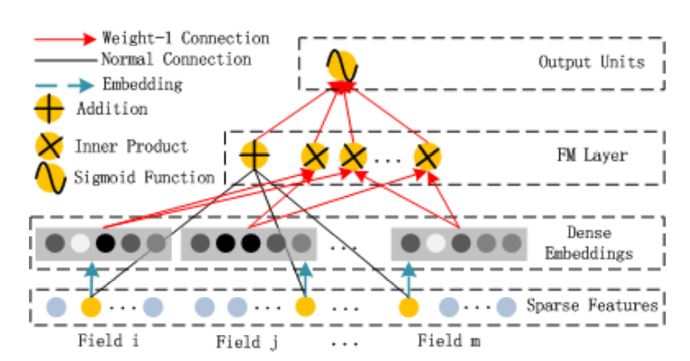
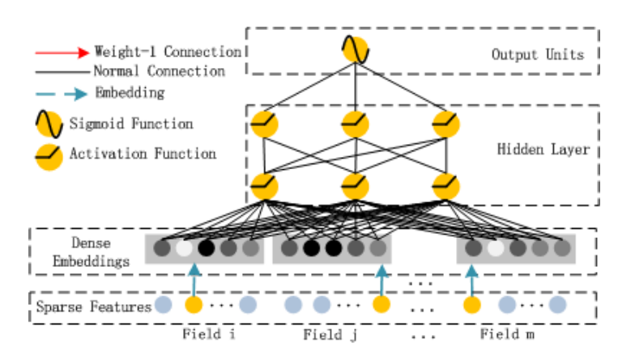
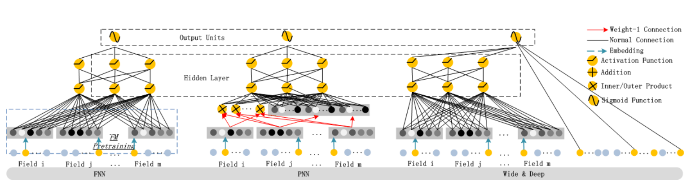
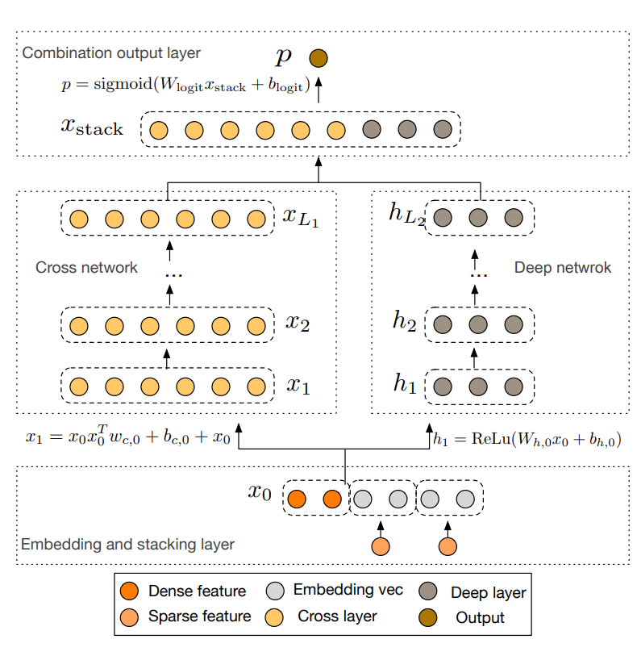
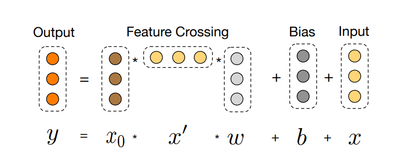

<!-- TOC -->

- [I. DeepLearning Based Recommendation](#i-deeplearning-based-recommendation)
  - [00 Deep Neural Architecture for News Recommendation](#00-deep-neural-architecture-for-news-recommendation)
  - [01 Dynamic Attention Deep Model for Article Recommendation by Learning Human Editors’ Demonstration](#01-dynamic-attention-deep-model-for-article-recommendation-by-learning-human-editors-demonstration)
  - [02 Joint Deep Modeling of Users and Items Using Reviews for Recommendation](#02-joint-deep-modeling-of-users-and-items-using-reviews-for-recommendation)
  - [03 *Wide & Deep Learning for Recommender Systems](#03-wide--deep-learning-for-recommender-systems)
  - [04 xDeepFM: Combining Explicit and Implicit Feature Interactions for Recommender Systems](#04-xdeepfm-combining-explicit-and-implicit-feature-interactions-for-recommender-systems)
  - [05 Product-based Neural Networks for User Response Prediction](#05-product-based-neural-networks-for-user-response-prediction)
  - [06 DeepFM: A Factorization-Machine based Neural Network for CTR Prediction](#06-deepfm-a-factorization-machine-based-neural-network-for-ctr-prediction)
  - [07 Deep & Cross Network for Ad Click Predictions](#07-deep--cross-network-for-ad-click-predictions)
- [II. CollaborativeFiltering Based Recommendation](#ii-collaborativefiltering-based-recommendation)
  - [00 Collaborative Deep Learning for Recommender Systems](#00-collaborative-deep-learning-for-recommender-systems)
  - [01 Collaborative Topic Modeling for Recommending Scientific Articles](#01-collaborative-topic-modeling-for-recommending-scientific-articles)
  - [02 *Neural Collaborative Filtering](#02-neural-collaborative-filtering)
  - [03 Collaborative Translational Metric Learning](#03-collaborative-translational-metric-learning)
  - [04 *Collaborative Metric Learning](#04-collaborative-metric-learning)
  - [05 Latent Relational Metric Learning via Memory-based Attention for Collaborative Ranking](#05-latent-relational-metric-learning-via-memory-based-attention-for-collaborative-ranking)
  - [06 Improving Collaborative Metric Learning with Efficient Negative Sampling](#06-improving-collaborative-metric-learning-with-efficient-negative-sampling)
  - [07 Hierarchical Latent Relation Modeling for Collaborative Metric Learning](#07-hierarchical-latent-relation-modeling-for-collaborative-metric-learning)
  - [08 Improving Pairwise Learning for Item Recommendation from Implicit Feedback](#08-improving-pairwise-learning-for-item-recommendation-from-implicit-feedback)
  - [09 Collaborative Denoising Auto-Encoders for Top-N Recommender Systems](#09-collaborative-denoising-auto-encoders-for-top-n-recommender-systems)
  - [10 GLocal-K Global and Local Kernels for Recommender Systems](#10-glocal-k-global-and-local-kernels-for-recommender-systems)
- [III. GraphNeuralNetwork Based Recommendation](#iii-graphneuralnetwork-based-recommendation)
  - [00 Geometric Matrix Completion with Recurrent Multi-Graph Neural Networks](#00-geometric-matrix-completion-with-recurrent-multi-graph-neural-networks)

<!-- /TOC -->

# I. DeepLearning Based Recommendation 

## [00 Deep Neural Architecture for News Recommendation](./deeplearningbasedrecommendation/Deep%20Neural%20Architecture%20for%20News%20Recommendation.pdf)
- Vaibhav Kumar, Dhruv Khattar, Shashank Gupta, Manish Gupta, Vasudeva Varma/2017/CLEF/42
- Interests of users can be classified into **short term as well as long term interests**. Using **Bidirectional LSTMs** as an encoder helps us to identify interests which the user has taken up recently (short term) as well the long term interests of the user.
- For each user, we have the sequence in which news articles were read by her. We then choose the **first R read articles** for each user and use it as inputs to our bidirectional LSTMs.
- The goal of the **attention mechanism** in such tasksis to derive a context vector that captures relevant source side information to help predict the current target word. In our case, we want to use the sequence of annotations generated by the encoder to come up with a context vector that captures the extent of the user’s interests. 
- 

## [01 Dynamic Attention Deep Model for Article Recommendation by Learning Human Editors’ Demonstration](./deeplearningbasedrecommendation/Dynamic%20%20Attention%20Deep%20Model%20for%20Article%20Recommendation%20by%20Learning%20Human%20Editors%E2%80%99%20Demonstration.pdf)
 - Xuejian Wang, Lantao Yu, Kan Ren, Guanyu Tao, Weinan Zhang, Yong Yu, Jun Wang/2017/KDD/145
 - Our data analysis shows that (i) **editors’ selection criteria are non-explicit**, which are less based only on the keywords or topics,but more depend on the quality and atractiveness of the writing from the candidate article, which is hard to capture based on traditional bag-of-words article representation. And (ii) **editors’ article selection behaviors are dynamic**:articles with different data distribution come into the pool everyday and the editors’ preference varies, which are driven by some underlying periodic or occasional patterns.
 - To address such problems, we propose a **meta-attention model** across multiple deep neural nets to (*i*) automatically catch the editors’ underlying selection criteria via the automatic representation learning of each article and its interaction with the meta data and (*ii*) adaptively capture the change of such criteria via a hybrid attention model. **Model Speciality**: as the data distribution of the incoming candidate articles is different across days, the correspondent trained model has different speciality. **Timeliness**: the editors’ behavior may vary over time since overabundance may cause disturbing and it might also repeatedly present preference over daily fed corpus from recent experiences.
 - Convolutional operation and max-pooling technique can be leveraged to capture **the underlying semantic patterns** within the word sequence, which are helpful for the prediction but may not be explicit to be specified. Recent literatures have shown that CNN-based model can achieve promising performance comparative with or even more competitive than other deep models,e.g. Long Short Term Memory (LSTM) in many NLP tasks.
 - 
 - 
 - 

## [02 Joint Deep Modeling of Users and Items Using Reviews for Recommendation](./deeplearningbasedrecommendation/Joint%20Deep%20Modeling%20of%20Users%20and%20Items%20Using%20Reviews%20for%20Recommendation.pdf)
- Lei Zheng, Vahid Noroozi, Philip S. Yu/2017/WSDM/708
- Present a deep model to learn item properties and user behaviors jointly from review text. The proposed model, named **Deep Cooperative Neural Networks (DeepCoNN)**, consists of two parallel neural networks coupled in the last layers. One of the networks focuses on learning user behaviors exploiting reviews written by the user, and the other one learns item properties from the reviews written for the item. A shared layer is introduced on the top to couple these two networks together.
- DeepCoNN is the first one that jointly models both user and item from reviews using neural networks.(Concatenate $x_u$ and $y_i$ based on *[Factorization Machine](../basemethods/Factorization%20Machines.pdf)*)
- 

## [03 *Wide & Deep Learning for Recommender Systems](./deeplearningbasedrecommendation/Wide%20%26%20Deep%20Learning%20for%20Recommender%20Systems.pdf)
- Heng-Tze Cheng, Levent Koc, Jeremiah Harmsen, Tal Shaked, Tushar Chandra etc./2016/DLRS/2115
- **Memorization** of feature interactions through a wide set of cross-product feature transformations are **effective and interpretable**, while memorization requires more feature engineering effort. With less feature engineering, deep neural networks(**Generalization**) can generalize better to unseen feature combinations through low-dimensional dense embeddings learned for the sparse features.
- **Memorization** can be loosely defined as learning the frequent co-occurrence of items or features and exploiting the correlation available **in the historical data**. **Generalization** is based on transitivity of correlation and explores new feature combinations that have **never or rarely occurred in the past**. Recommendations based on memorization are usually more topical and directly relevant to the items on which users have already performed actions. Compared with memorization, generalization tends to improve the diversity of the recommended items. 
- **The Wide Component**:The feature set includes raw input features and transformed features.One of the most important transformations is **the cross-product transformation**.This captures the interactions between the binary features, and adds nonlinearity to the generalized linear model. **The Deep Component**:For categorical features, the original inputs are feature strings (e.g., “language=en”).
- **Joint Training of Wide & Deep Model**：The wide component and deep component are combined using a weighted sum of their output log odds as the prediction, which is then fed to one common logistic loss function for joint training.
- The wide component and deep component are combined using a **weighted sum of their output log odds** as the prediction, which is then fed to one common logistic loss function for joint training. In an **ensemble**, individual models are trained separately without knowing each other, and their predictions are combined only at inference time but not at training time. In contrast, **joint** training optimizes all parameters simultaneously by taking both the wide and deep part as well as the weights of their sum into account at training time. 
- 
- 
- 
- 

## [04 xDeepFM: Combining Explicit and Implicit Feature Interactions for Recommender Systems](./deeplearningbasedrecommendation/xDeepFM%EF%BC%9ACombining%20Explicit%20and%20Implicit%20Feature%20Interactions%20for%20Recommender%20Systems.pdf)
- Lian J, Zhou X, Zhang F, et al./2018/KDD/496
- 

## [05 Product-based Neural Networks for User Response Prediction](./deeplearningbasedrecommendation/Product%20Based%20Neural%20Networks%20for%20User%20Response%20Prediction.pdf)
- Qu Y, Cai H, Ren K, et al./2016/ICDM/407
- Product-based Neural Networks (PNN) with **1)** an embedding layer to learn a distributed representation of the categorical data,
**2)** a product layer to capture interactive patterns between interfield categories, and further **3)** fully connected layers to explore
high-order feature interactions. We present two types of PNNs, with inner product operations **(IPNN)** and outer product operations **(OPNN)** in the product layer, to efficiently model the interactive patterns. The model learn local dependencies and high-order feature interactions.
- 
- To reduce product layer space complexity and time complexity, as inner product, it takes **matrix factorization** strategy; as outer product, it takes **superposition** strategy. 

## [06 DeepFM: A Factorization-Machine based Neural Network for CTR Prediction](./deeplearningbasedrecommendation/DeepFM%20A%20Factorization-Machine%20based%20Neural%20Network%20for%20CTR%20Prediction.pdf)
- Guo H, Tang R, Ye Y, et al/2017/arXiv/1323
- **DeepFM**, combines the power of **factorization machines** for recommendation and **deep learning for feature learning** in a new neural network architecture. It models **low-order feature** interactions like FM and models **high-order feature** interactions like DNN. DeepFM can be trained end-to-end **without any feature engineering**.
- 
- FM models pairwise feature interactions as **inner product** of respective **feature latent vectors**. Therefore, feature interactions, which are never or rarely appeared in the training data, are better learnt by FM. (In previous approaches, the parameter of an interaction of features i and j can be trained only when feature i and feature j both appear in the same data record). FM component and deep component share the same feature embedding, which brings two important benefits: 1) it learns both low-order and high-order feature interactions from raw features; 2) there is no need for expertise feature engineering of the input.
- 
- 
- 

## [07 Deep & Cross Network for Ad Click Predictions](./deeplearningbasedrecommendation/Deep%20%26%20Cross%20Network%20for%20Ad%20Click%20Predictions.pdf)
- Wang R, Fu B, Fu G, et al/2017/ADKKD/514
- Deep & Cross Network (DCN) which keeps the benefts of a DNN model, and beyond that, it introduces a **novel cross network** that is more effcient in learning certain bounded-degree feature interactions. In particular, DCN explicitly applies feature crossing at each layer, requires **no manual feature engineering**, and adds **negligible extra complexity** to the DNN model. 
- DNN has the promise to capture very complex interactions across features; however, compared to our cross network it requires nearly **an order of magnitude more parameters**, is **unable to form cross features explicitly**, and may **fail to effciently learn some types of feature interactions**. The *Cross Network* structure is suitable to catch the feature interactions.
- Jointly train both networks, as this allows each individual network to be aware of the others during the training.
- 
- 

# II. CollaborativeFiltering Based Recommendation

## [00 Collaborative Deep Learning for Recommender Systems](./collaborativefilteringbasedrecommendation/Collaborative%20Deep%20Learning%20for%20Recommender%20Systems.pdf)
- Hao Wang, Naiyan Wang, Dit-Yan Yeung/2015/KDD/1462
- Nevertheless, the latent representation learned by CTR may not be very effective when **the auxiliary information is very sparse**. To adresss the problem, we jointly performs **deep representation learning** for the content information and **collaborative filtering** for the ratings (feedback) matrix. 
-  **Loosely coupled** methods like process the auxiliary information once and then use it to provide features for the CF models. Since information flow is one-way, the rating information cannot provide feedback to guide the extraction of useful features. For this sub-category, improvement often has to rely on a manual and tedious feature engineering process.
-  **Tightly coupled** methods like allow two-way interaction. On one hand, the rating information can guide the learning of features. On the other hand, the extracted features can further improve the predictive power of the CF models (e.g., based on matrix factorization of the sparse rating matrix). With two-way interaction, tightly coupled methods can automatically learn features from the auxiliary information and naturally balance the influence of the rating and auxiliary information. 
-  CTR = PMF + LDA. But  the latent representation learned is often not effective enough especially when the auxiliary information is very sparse. It is this **representation learning problem** that we will focus on in this paper.
- The hierarchical Bayesian model called **collaborative deep learning**(CDL) using [*SDAE*](../basemethods/Stacked%20Denoising%20Autoencoders%20Learning%20Useful%20Representations%20in%20a%20Deep%20Network%20with%20a%20Local%20Denoising%20Criterion.pdf) for its feature learning component. With this, we then present our CDL model which tightly couples **deep representation learning for the content information** and **collaborative filtering for the ratings (feedback) matrix**, allowing two-way interaction between the two.
- SDAE is a feedforward neural network for learning representations (encoding) of the input data by learning to predict the clean input itself in the output.
- Note that the first L/2 layers of the network act as an encoder and the last L/2 layers act as a decoder.
- 
- 

## [01 Collaborative Topic Modeling for Recommending Scientific Articles](./collaborativefilteringbasedrecommendation/Collaborative%20Topic%20Modeling%20for%20Recommending%20Scientific%20Articles.pdf)
- Chong Wang, David M. Blei/2011/KDD/1792
- **In-matrix prediction:** This refers to the problem of making recommendations about those articles that have been rated by at least one user in the system. This is the task that traditional collaborative filtering can address. **Out-of-matrix prediction:** A recommender system that cannot handle out-of-matrix prediction cannot recommend newly published papers to its users.
- 
- Our approach combines the merits of **traditional collaborative filtering** and **probabilistic topic modeling**. It provides an interpretable latent structure for users and items, and can form recommendations about both existing and newly published articles.
- Each user has a **library of articles** that he or she is interested in, and our goal is to match each user to articles of interest that are **not in his or her library**.
- The rating variable $r_(ij)$ ∈ {0, 1} denotes whether user i includes article j in her library. This differs from some other systems where users explicitly rate items on a scale.
- There are two main disadvantages to matrix factorization for recommendation(probabilistic matrix factorization, PMF). First, the learnt latent space is **not easy to interpret**; second, as mentioned, matrix factorization only uses information from other users—it **cannot generalize to completely unrated items**.
- The simplest topic model is Latent Dirichlet Allocation ([*LDA*](../basemethods/Latent%20Dirichlet%20Allocation.pdf)). Unlike a clustering model, where each document is assigned to one cluster,LDA allows documents to exhibit multiple topics. Our goal is to use topic modeling to give a content-based representation of items in a recommender system. 
- 

## [02 *Neural Collaborative Filtering](./collaborativefilteringbasedrecommendation/Neural%20Collaborative%20Filtering.pdf)
- Xiangnan He, Lizi Liao, Hanwang Zhang etc. /2017/WWW/3337
- By **replacing the inner product with a neural architecture** that can learn an arbitrary function from data, we present a general framework named NCF, short for Neural networkbased Collaborative Filtering. 
- **Pointwise learning** usually follow a regression framework by minimizing the squared loss between y_ui' and its target value y_ui. **Pairwise learning** the idea is that observed entries should be ranked higher than the unobserved ones. As such, instead of minimizing the loss between y_ui' and yui, pairwise learning maximizes the margin between observed entry y_ui' and unobserved entry y_uj'.
- **There is a natural scarcity of negative feedback** in learning from implicit data. Because the user will not have any implicit action on negative samples.
- 
- The above example shows **the possible limitation** of MF caused by the use of a simple and fixed inner product to estimate complex user–item interactions in the **low-dimensional latent space**. We note that one way to resolve the issue is to use a large number of latent factors K. However, it may adversely hurt the generalization of the model especially in sparse settings(**Overfit**). In this work, we address the limitation by learning the interaction function using DNNs from data.
- GMF that applies a linear kernel to model **the latent feature interactions**, and MLP that uses a non-linear kernel to learn **the interaction function from data**.
- 
- 

## [03 Collaborative Translational Metric Learning](./collaborativefilteringbasedrecommendation/Collaborative%20Translational%20Metric%20Learning.pdf)
- Chanyoung Park, Donghyun Kim, Xing Xie, Hwanjo Yu/2018/IEEE/30
- matrix factorization–based recommendation methods have been criticized for the problem raised by **the triangle inequality violation**. Although several metric learning–based approaches have been proposed to overcome this issue,existing approaches typically project each user to a **single point** in the metric space, and thus do not suffice for properly modeling the **intensity( higher ratings imply a higher intensity of user–item relationships)** and the **heterogeneity(various item categories of user's tastes)** of user–item relationships in implicit feedback.
- Inspired by the **translation mechanism** popularized by knowledge graph embedding, we construct user–item specific translation vectors by employing **the neighborhood information** of users and items, and **translate each user toward items** according to the user’s relationships with the items.
- In this way, these approaches(**Metric learning–based methods**) not only expect to propagate positive **user–item relationships** to other unknown user–item pairs, but also to capture the similarity within **user–user and item–item pairs** by satisfying the triangle inequality.
- In our work, we embed users and items as points in a low-dimensional metric space, and additionally introduce **translation vectors** to translate each user to **multiple points**. Recall that the objectives of this work are **1)** to address the limitation of the inner product as a scoring function,which violates the triangle inequality, and **2)** to model the intensity and the heterogeneity of user–item relationships in implicit feedback.and **3)** to handle the complex nature of CF(**user to items is one to many mapping**, traditional Metric learning–based methods can't deal with it).
- 
- 

## [04 *Collaborative Metric Learning](./collaborativefilteringbasedrecommendation/Collaborative%20Metric%20Learning.pdf)
- Cheng-Kang Hsieh, Longqi Yang, Yin Cui etc./2017/WWW/369
- **Metric learning** algorithms produce distance metrics that capture the important relationships among data. We propose Collaborative Metric Learning (CML) which learns a joint metric space to encode not only **users’ preferences** but also the **user-user and item-item similarity**. Beyond the improvement in accuracy, an exciting property of CML is its capability of uncovering **fine-grained relationships** among users’ preferences.
- For items the user likes, their gradients move inward to create a smaller radius(*pull loss*). For impostor items, which are the items the user did not like but which invade the perimeter, their gradients move outward from the user until they are pushed out of the perimeter by a safe margin(*push loss*).([*LMNN*](../basemethods/Distance%20Metric%20Learning%20for%20Large%20Margin%20Nearest%20Neighbor%20Classification.pdf))
- 
- 

## [05 Latent Relational Metric Learning via Memory-based Attention for Collaborative Ranking](./collaborativefilteringbasedrecommendation/Latent%20Relational%20Metric%20Learning%20via%20Memory-based%20Attention%20for%20Collaborative%20Ranking.pdf)
- Yi Tay, Luu Anh Tuan, Siu Cheung Hui/2018/WWW/224
- Instead of simple **push-pull mechanisms** between user and item pairs, we propose to **learn latent relations** that describe each user item interaction. This helps to alleviate **the potential geometric inflexibility** of existing metric learning approaches. 
- we employ a **augmented memory module** and learn to attend over these memory blocks to construct latent relations. The memory-based attention module is controlled by **the user-item interaction**, making the learned relation vector **specific** to each user-item pair.
- The shortcoming of CML as follow: 1) the scoring function of CML is geometrically restrictive since the objective function tries to fit each user-item pair into the same point in vector space. 2) CML is an **ill-posed algebraic system**(the solution of problem is not *unique and stable* which further reinforces and aggravates the problem of geometric inflexibility.
- 

## [06 Improving Collaborative Metric Learning with Efficient Negative Sampling](./collaborativefilteringbasedrecommendation/Improving%20Collaborative%20Metric%20Learning%20with%20Efficient%20Negative%20Sampling.pdf)
- Viet-Anh Tran, Romain Hennequin, Jimena Royo-Letelier, Manuel Moussallam./2019/SIGIR/12
- CML requires **large batches** to work reasonably well because of a **too simplistic uniform negative sampling strategy** for selecting triplets. Due to **memory limitations**,this makes it difficult to scale in **high-dimensional scenarios**. 
- We proposed a **2-stage sampling strategy** that enables the CML model to perform efficiently with batch size an order of magnitude smaller than what would be needed with the default uniform sampling. At its heart, *1)* a set of samples is first selected based on their popularity. Then, *2)* informative ones are drawn from this set based on their inner product weights with anchors. 

## [07 Hierarchical Latent Relation Modeling for Collaborative Metric Learning](./collaborativefilteringbasedrecommendation/Hierarchical%20Latent%20Relation%20Modeling%20for%20Collaborative%20Metric%20Learning.pdf)
- Viet-Anh Tran, Guillaume Salha-Galvan, Romain Hennequin, Manuel Moussallam/2021/RecSys/1
- CML nonetheless suffers from an inherent limitation: each user is represented by a single vector, which does not fit the many-to-many nature of real-world recommendation problems.In particular, *1) standard CML fails to capture the heterogeneity in user-item relations* (user-item relations). *2) CML does not model the fact that a user’s preference for an item depends, not only on its intrinsic characteristics, but also on items they previously interacted with.* (item-item relations)
- More specifically, our work builds upon the assumption that there exists a **hierarchical structure in different relation types**, and that *user-item relations are built on top of item-item relations*.
- 
- 

## [08 Improving Pairwise Learning for Item Recommendation from Implicit Feedback](./collaborativefilteringbasedrecommendation/Improving%20Pairwise%20Learning%20for%20Item%20Recommendation.pdf)
- Steffen Rendle, Christoph Freudenthaler/2014/WSDM/302
- We show that convergence of such SGD learning algorithms **slows down** considerably if the **item popularity has a tailed distribution**. We propose a **non-uniform item sampler** to overcome this problem. The proposed sampler is **context-dependent and oversamples informative pairs** to speed up convergence.
-  In this paper, it is shown that **uniform sampling pairs** results in slow convergence, especially if **the pool of items is large and the overall item-popularity is tailed**. *Uniform sampling*: equivalent to the common BPR algorithm; *Static oversampling* which samples negative items from the **global popularity distribution (Global & Static)**. *Adaptive oversampling* which samples negative items with respect to **the estimated ranking for this context (Context-dependent & Adaptive)**.

## [09 Collaborative Denoising Auto-Encoders for Top-N Recommender Systems](./collaborativefilteringbasedrecommendation/Collaborative%20Denoising%20Auto-Encoders%20for%20Top-N%20Recommender%20Systems.pdf)
- Yao Wu, Christopher DuBois, Alice X. Zheng, Martin Ester/2016/WSDM/765
- In this paper, we present a new model-based collaborative filtering (CF) method for top-N recommendation called **Collaborative Denoising Auto-Encoder (CDAE)**. CDAE assumes that whatever user-item interactions are observed are a **corrupted version of the user’s full preference set**. In other words, **during training**, we feed the model a subset of a user’s item set and train the model to **recover** the whole item set; at **prediction time**, the model recommends new items to the user given the existing preference set as input.
- 
- The main components of the proposed CDAE model include **the types of the mapping functions**(identity, Sigmoid, Tanh), **the loss function**(Square Loss, Log Loss, Hinge Loss, Cross Entropy Loss) and **the level of corruption**(the probability of each dimensions of $x$). Different choices of these components result in different variants of the model that make different top-N recommendations.

## [10 GLocal-K Global and Local Kernels for Recommender Systems](./collaborativefilteringbasedrecommendation/GLocal-K%20Global%20and%20Local%20Kernels%20for%20Recommender%20Systems%20.pdf)
- Soyeon Caren Han, Taejun Lim, Siqu Long etc./2021/CIKM/2
- **Matrix completion** is a very challenging task to predict one’s interest based on millions of other users having each seen a small subset of thousands of items. In this research, we apply two types of kernels that have strong ability in feature extraction. 1) The first kernel, named “**local kernel**”, is known to give optimal separating surfaces by its ability to perform the data transformation from high-dimensional space. 2) The second, named “**global kernel**” is from convolutional neural network(CNN) architectures.
- **G**lobal-**Local** **K**ernel-based(**GLocal-K**) matrix completion framework:1) *pre-training* (with the local kernelised weight matrix) the auto-encoder using a local kernelised weight matrix, and 2) *fine-tuning*(with the global-kernel based matrix) with the global kernel-based rating matrix.(*with no side information*)
- 

# III. GraphNeuralNetwork Based Recommendation

## [00 Geometric Matrix Completion with Recurrent Multi-Graph Neural Networks](./graphneuralnetworkbasedrecommendation/Geometric%20Matrix%20Completion%20with%20Recurrent%20Multi-Graph%20Neural%20Networks.pdf)
- Federico Monti, Michael M. Bronstein, Xavier Bresson./2017/NIPS/394
- 

